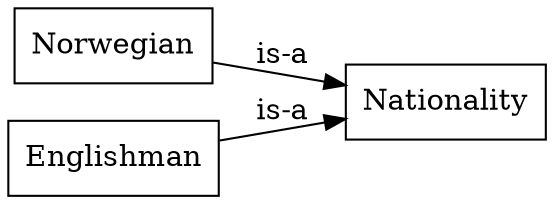
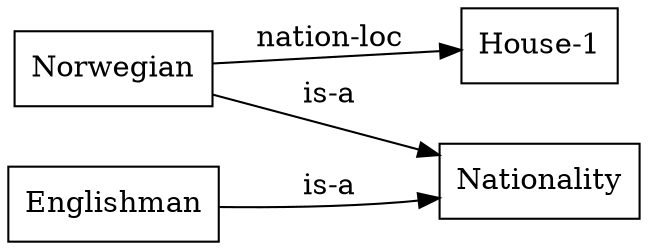

# 1 — Objects & relations

Every Ein model is built from three things: **objects**, **relations**, and
**facts**. This chapter introduces each one *three ways at once* — in plain
English, in **ein-lang** (the text you write), and as a **graph** (what Ein
reasons over). That NL ↔ ein-lang ↔ graph triad is the habit the rest of
the guide leans on.

We'll use a two-house slice of the Zebra puzzle.

## Objects — the things

An **object** is just a named thing: a house, a person, a colour. You don't
declare objects; they exist the moment you name them.

- **English:** "the Norwegian", "House-1".
- **ein-lang:** the bare names `Norwegian`, `House-1`.
- **graph:** each is a node with no outgoing arrows — a thing other facts
  point *at*.

Names that group objects are objects too. `Nationality` is the *type* of
`Norwegian`; you say so with an `is-a` fact:

```lisp
(is-a Norwegian Nationality)
(is-a Englishman Nationality)
```



(The precise model — names vs. nodes, "atoms" vs. "objects" — is
[`ir/01-ein-graph/03_ein_model.md`](../kernel/ir/01-ein-graph/03_ein_model.md);
the [glossary](../kernel/glossary.md) defines *Levi-bipartite*.)

## Relations — how things connect

A **relation** says *what kind of link* can hold between objects. You
declare it once, naming the types of its slots:

- **English:** "a nationality lives in a house."
- **ein-lang:**
  ```lisp
  (relation nation-loc Nationality House)
  ```
- **graph:** a relation node with one outgoing arrow per slot (here, to
  `Nationality` and to `House`).

  ```dot
  digraph { rankdir=LR;
    "nation-loc" [shape=ellipse];
    "nation-loc" -> Nationality [label="slot 1"];
    "nation-loc" -> House       [label="slot 2"];
  }
  ```

`nation-loc` is a relation with two slots; `is-a` (used above) is a
built-in two-slot relation. Relations carry optional rendering text — e.g.
`(relation nation-loc Nationality House :why "the {?1} lives in {?2}")` —
which you'll meet when we print answers.

## Facts — relations applied to objects

A **fact** applies a relation to actual objects. It's the unit of
knowledge:

- **English:** "the Norwegian lives in House-1."
- **ein-lang:**
  ```lisp
  (nation-loc Norwegian House-1)
  ```
- **graph (compact):** a labelled link between the two objects —

  ```dot
  digraph { rankdir=LR; node [shape=box];
    Norwegian -> "House-1" [label="nation-loc"];
  }
  ```

  — which is the readable shorthand for how Ein stores it *canonically*: a
  **node** joining the relation and its two arguments (the **Levi** view;
  see [`03_ein_model.md`](../kernel/ir/01-ein-graph/03_ein_model.md)):

  ```dot
  digraph {
    rankdir=LR; node [shape=box];
    fact [label="(nation-loc Norwegian House-1)", shape=ellipse];
    fact -> "nation-loc" [label="rel"];
    fact -> "Norwegian"  [label="1"];
    fact -> "House-1"    [label="2"];
  }
  ```

A fact can record where it came from, which shows up in explanations:

```lisp
(nation-loc Norwegian House-1 :source "condition (10)")
```

## Three layers of fact

Ein sorts facts into three populations (you rarely set this by hand — the
loader infers it):

| layer | what it holds |
|-------|---------------|
| **ontology** | background setup: the `(relation …)` schema, the `is-a` type tree |
| **fact** | the puzzle's stated clues (each `:source "(N)"`) |
| **reasoning** | everything Ein *derives* — the subject of the next chapters |

That's the whole vocabulary. Put together, a tiny model reads:

```lisp
(relation nation-loc Nationality House)   ; ontology: the schema
(is-a Norwegian Nationality)              ; ontology: the type tree
(is-a Englishman Nationality)
(nation-loc Norwegian House-1 :source "condition (10)")   ; a fact
```

Drawn compactly, that whole tiny model is just:



So far nothing is *derived* — these are all things we stated. In
[Chapter 2](02_first_rules.md) we add **rules**, and Ein starts producing
new facts on its own.

> **Reference:** the full grammar is
> [`ir/03-ein-lang/01_grammar.md`](../kernel/ir/03-ein-lang/01_grammar.md);
> the kernel forms (`relation`, `rule`, `query`, …) are
> [`06_reserved_names.md`](../kernel/ir/03-ein-lang/06_reserved_names.md).
