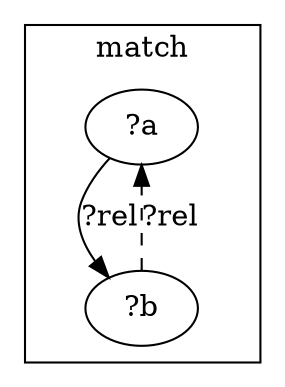
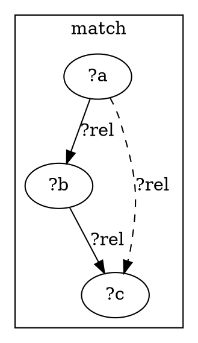
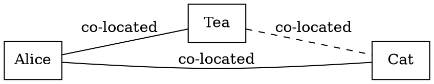

# 2 — First rules

A **rule** watches for a pattern of facts and, when it matches, asserts new
facts. That's the whole engine in one sentence: *rules rewrite the graph,
adding edges until nothing new can be added* (a fixpoint). This chapter
meets the three gentlest rules, each with the graph **before** and **after**
it fires — and each runnable in one command.

A rule has a `:match` (the pattern to find) and an `:assert` (what to add):

```lisp
(rule NAME (params…)
  :match  <pattern over existing facts>
  :assert <fact(s) to add>
  :why    "human-readable reason"
  :priority N)
```

## `symmetric` — if A relates to B, then B relates to A

**English:** "next-to works both ways: if House-1 is next to House-2, then
House-2 is next to House-1."

**ein-lang** (from [`examples/saturation/symmetric/neighbours.ein`](../../examples/saturation/symmetric/neighbours.ein)):

```lisp
(rule symmetric (?rel)
  :match  (?rel ?a ?b)
  :assert (?rel ?b ?a)
  :why    "{?rel} is symmetric: {?a} ↔ {?b}."
  :priority 100)

(relation next-to T T)
(symmetric next-to)                       ; ← tag: "apply `symmetric` to next-to"
(next-to House-1 House-2 :source "demo")
(query :goal (next-to House-2 House-1))
```

The `?rel` / `?a` / `?b` (a leading `?`) are **variables** the matcher
binds. `(symmetric next-to)` is the *activator* fact that turns the generic
rule on for `next-to`.

**graph** — the rule's own shape (`match` cluster ⟹ `assert` cluster), from
`ein render rule`:



**before → after** on the concrete fact:

```
before:  House-1 ──next-to──▶ House-2
after:   House-1 ──next-to──▶ House-2
         House-1 ◀──next-to── House-2     (added by `symmetric`)
```

**Run it:**

```sh
$ ein solve examples/saturation/symmetric/neighbours.ein
  solutions (k)   1
  verdict         Solution
    query facts                rendered
    (next-to House-2 House-1)  (next-to House-2 House-1)
```

The goal fact wasn't stated — `symmetric` derived it.

## `transitive` — chain links together

**English:** "is-a chains: a Cat is a Mammal, a Mammal is an Animal, so a
Cat is an Animal."

**ein-lang** (from [`examples/saturation/transitive/taxonomy.ein`](../../examples/saturation/transitive/taxonomy.ein)):

```lisp
(rule transitive (?rel)
  :match  (and (?rel ?a ?b) (?rel ?b ?c) (neq ?a ?c))
  :assert (?rel ?a ?c)
  :why    "{?rel} is transitive."
  :priority 200)

(transitive is-a)
(is-a Cat Mammal)  (is-a Mammal Animal)
(query :goal (is-a Cat Animal))
```

Two new pieces: `(and …)` matches *several* facts at once, and `(neq ?a ?c)`
is a **guard** — a built-in predicate that only matches when the two differ
(here, so a thing isn't declared a subtype of itself).



```
before:  Cat ──is-a──▶ Mammal ──is-a──▶ Animal
after:   …  + Cat ──is-a──▶ Animal          (added by `transitive`)
```

**Run it:**

```sh
$ ein solve examples/saturation/transitive/taxonomy.ein
  verdict         Solution
    query facts        rendered
    (is-a Cat Animal)  (is-a Cat Animal)
```

## `co-located` — the first puzzle-shaped rule

The Zebra puzzle's engine is **co-located**: two attributes that share a
house imply each other's placement. It's the bridge from these toy rules to
the real puzzle.

**English:** "if the Norwegian and Water are in the same house, then placing
one places the other."

**ein-lang** (the shape, from [`examples/branching/05_mini_zebra.ein`](../../examples/branching/05_mini_zebra.ein) — a 3-attribute mini Zebra):

```lisp
(rule co-located (?rel)
  :match  (?rel ?a ?b)
  :assert (?rel ?b ?a)          ; co-located is symmetric…
  :why "{?rel} sym" :priority 100)
;; …+ transitive, so co-located forms equivalence classes across attributes
```

In `mini_zebra.ein`, `co-located`'s symmetric + transitive closure links
Nationality ⇄ Drink ⇄ Pet into one equivalence class, and a `guess`
*hypothesis rule* proposes the cross-attribute pairings the facts don't pin
directly:



**Run it** (its header documents the unique answer):

```sh
$ ein solve examples/branching/05_mini_zebra.ein
# → the Coffee-drinker is Bob, and Bob owns the Dog.
```

That `guess` step — proposing a fact, then checking it for contradictions —
is the **hypothesis loop**, the engine's search. You don't write it; you
just declare what may be guessed. The full Zebra puzzle needs a few more
rules to keep the guessing rare. That's [Chapter 3](03_rule_families.md).

> **Reference:** rule semantics —
> [`ir/01-ein-graph/02_rules.md`](../kernel/ir/01-ein-graph/02_rules.md);
> drawing rules — `ein render rule --name <R> <file>` (P1.6).
