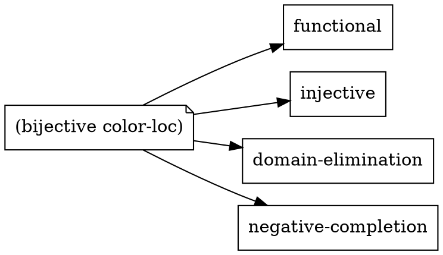
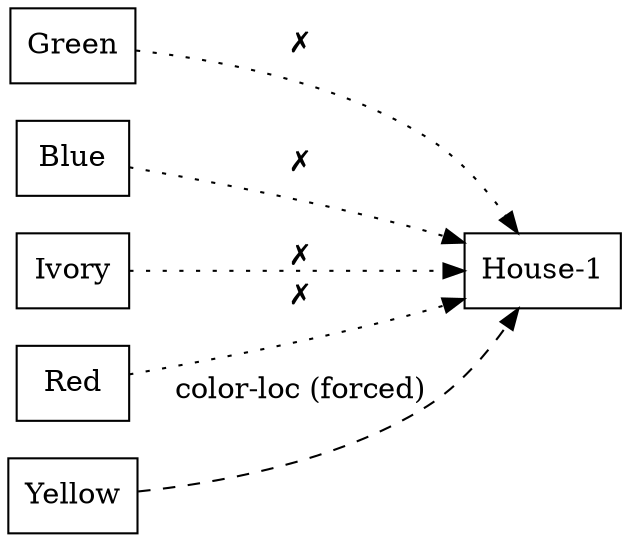
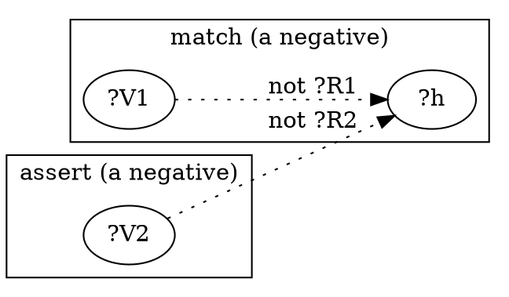
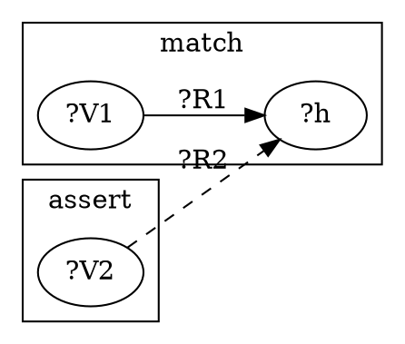
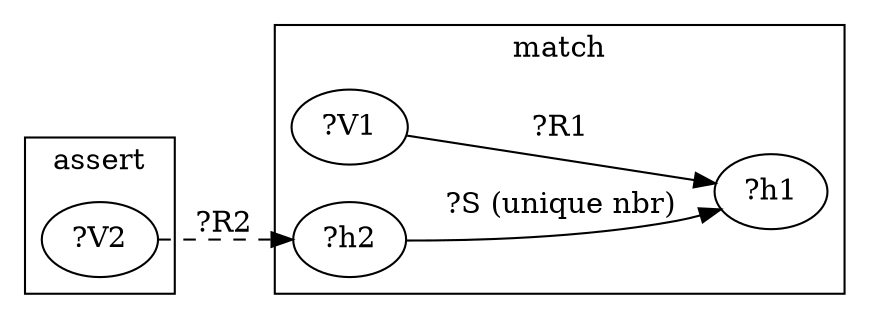
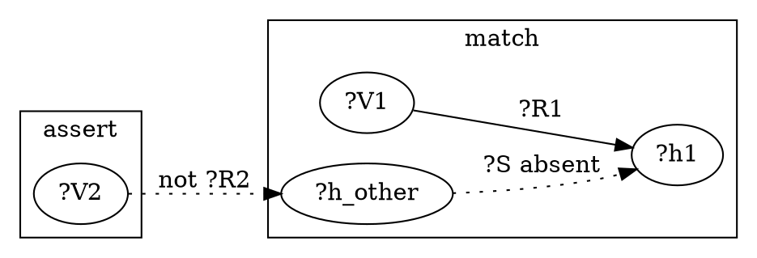

# 3 — The rule families

The toy rules in Chapter 2 found one new fact each. The real Zebra puzzle
needs rules that *eliminate* possibilities fast enough to avoid blind
guessing. They split into two layers — and the split is the most useful
lesson you'll take to your own puzzles:

| layer | you… | examples |
|-------|------|----------|
| **stdlib property machinery** | *tag* a relation and *import* the logic | `(symmetric next-to)`, `(transitive is-a*)`, `(bijective color-loc)` |
| **puzzle-specific rules** | *write* the rules unique to this puzzle | `co-located`, `adjacent-via-*`, `disjunctive-prune-*` |

`zebra2.ein` opens with imports —

```lisp
(import std.algebra   :symbols (symmetric transitive includes))
(import std.bijection :symbols (bijective-properties bijective-setup typecheck-setup))
```

— and then *activates* them per relation:

```lisp
(symmetric  next-to)        ; next-to works both ways
(transitive is-a*)          ; is-a* is the transitive closure of is-a
(bijective  color-loc)      ; each colour ↔ exactly one house (and back)
(bijective  nation-loc) (bijective drink-loc) (bijective smoke-loc) (bijective pet-loc)
```

One tag pulls in a whole family of imported logic:



You never wrote `symmetric`/`bijective`'s logic — the stdlib did
([`07_stdlib_api.md`](../kernel/ir/03-ein-lang/07_stdlib_api.md)). Each
`(bijective R)` pulls in four cardinality properties and the inference they
license: **negative-completion** and **domain-elimination**.

## domain-elimination — "must be, because nothing else can"

The workhorse. On a bijective relation, once every value but one is
excluded at a slot, the survivor is *forced*.

**English:** "House-1 isn't green, ivory, blue or red — therefore it's
yellow."

This rule ships in `std.bijection` (activated by `(bijective color-loc)`);
you don't write it. In the [walkthrough](../kernel/inference/zebra_walkthrough.md)
it fires as `(domain-elimination color-loc)`:

```
before:  (not (color-loc Green  House-1))   (not (color-loc Blue  House-1))
         (not (color-loc Ivory  House-1))   (not (color-loc Red   House-1))
after:   + (color-loc Yellow House-1)        ← the only survivor, forced
```



This is the single **load-bearing** lever for proving the solution unique —
[`features.md`](../kernel/inference/features.md) measures that disabling its
backing (`enable_singleton_writeback`) blows the exhaustive search up ≥7×.
Domain-elimination needs negatives to eat, which is where the next family
comes in.

## negative-completion — turning one positive into many negatives

A bijective relation is exclusive both ways, so a single placement forbids a
lot. `(bijective R)` gives the *property* side; zebra2 adds
`co-located-negative` to carry those negatives across shared houses:

```lisp
(rule co-located-negative (?R1 ?V1 ?R2 ?V2)
  :match  (not (?R1 ?V1 ?h))
  :assert (not (?R2 ?V2 ?h))
  :why    "co-located: (not ({?R1} {?V1} {?h})) ⟹ (not ({?R2} {?V2} {?h}))."
  :priority 200)
```



**English:** "the Norwegian is in House-1, so the Englishman isn't; the
Englishman is the red house, so House-1 isn't red." Each `(not …)` it
produces is fuel for domain-elimination above.

## co-located — propagate a partner through a shared house

The positive counterpart, and the rule you met in Chapter 2, now in its real
two-attribute form ([`zebra2.ein`](../../examples/zebra2.ein)):

```lisp
(rule co-located (?R1 ?V1 ?R2 ?V2)
  :match  (?R1 ?V1 ?h)
  :assert (?R2 ?V2 ?h)
  :why    "co-located: ({?R1} {?V1} {?h}) ⟹ ({?R2} {?V2} {?h})."
  :priority 200)
```



Driven by an activator like `(co-located nation-loc Englishman color-loc Red)`
("the Englishman lives in the red house"), it copies a known placement of
one attribute onto its partner: place the Englishman, and Red lands in the
same house.

## adjacent-via — "next to" / "right of"

Spatial clues run over an adjacency relation `?S` (`next-to` or `right-of`).
One rule covers both, with a twist — it only fires the positive when the
neighbour is **unique**:

```lisp
(rule adjacent-via-fwd (?S ?R1 ?V1 ?R2 ?V2)
  :match  (and (?R1 ?V1 ?h1)
               (?S ?h2 ?h1)
               (absent (and (?S ?h_o ?h1) (neq ?h_o ?h2))))
  :assert (?R2 ?V2 ?h2)
  :priority 200)
```



`(absent …)` is **negation-as-failure**: the clause matches only when *no*
such fact is present. Here it means "fire only if `?h1` has a single
`?S`-neighbour" — true for `right-of` always, and for `next-to` only at the
row's ends. That's how the same rule handles a deterministic clue and a
two-way one safely.

## disjunctive-prune — exclude the impossible up front

`adjacent-via` only asserts a positive when it's certain; `disjunctive-prune`
fires in *every* case, pre-emptively excluding houses a spatial clue rules
out:

```lisp
(rule disjunctive-prune-fwd (?S ?R1 ?V1 ?R2 ?V2)
  :match  (and (?R1 ?V1 ?h1) (relation ?R2 ?A ?B)
               (is-a ?h_other ?B) (neq ?h_other ?h1)
               (absent (?S ?h_other ?h1)))
  :assert (not (?R2 ?V2 ?h_other))
  :priority 250)
```



**English:** "if V2 must be a `?S`-neighbour of V1, then every house that
*isn't* a neighbour is excluded for V2." Those negatives feed
negative-completion and domain-elimination — the families chain.

## The takeaway

Solving a new puzzle with Ein is mostly **declaring properties** — tag each
relation `bijective` / `symmetric` / `transitive`, import the stdlib — and
writing only the handful of rules that are genuinely specific to your
puzzle's structure (here, the spatial `adjacent-via` / `disjunctive-prune`
family). The generic logic is library code you reuse.

In [Chapter 4](04_solving_the_whole_puzzle.md) we assemble the whole thing
and watch these families solve it.

> **Reference:** the stdlib per-symbol —
> [`07_stdlib_api.md`](../kernel/ir/03-ein-lang/07_stdlib_api.md); each
> family firing in context — [the walkthrough](../kernel/inference/zebra_walkthrough.md).
