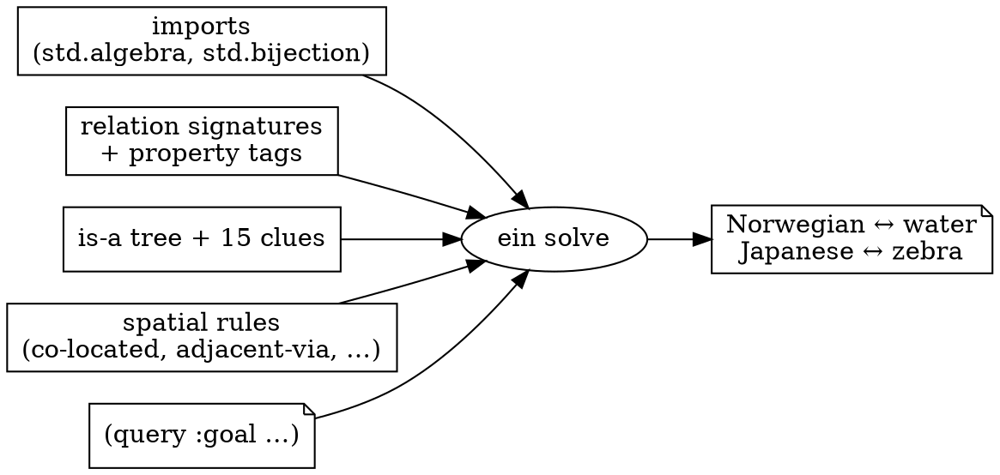

# 4 — Solving the whole puzzle

You've met objects and facts (Ch.1), how a rule derives new facts (Ch.2),
and the rule families that prune the search (Ch.3). Now we assemble the real
puzzle, solve it, and hand off to the full trace.

## What `zebra2.ein` is made of

Open [`examples/zebra2.ein`](../../examples/zebra2.ein) — it's just the
pieces from this guide, in layers:

```lisp
(config :enable-pre-branch-lookahead true)        ; an engine knob (Ch.3 stdlib aside)

(import std.algebra   :symbols (symmetric transitive includes))   ; the library logic
(import std.bijection :symbols (bijective-properties …))

(relation nation-loc Nationality House :why "the {?1} lives in {?2}")   ; the schema
(relation color-loc  Color       House :why "{?2} is painted {?1}")
… (drink-loc, smoke-loc, pet-loc, right-of, next-to)

(symmetric next-to) (transitive is-a*)              ; activate the properties
(bijective color-loc) (bijective nation-loc) …

(rule co-located …) (rule adjacent-via-fwd …) (rule disjunctive-prune-fwd …) …  ; the spatial rules

(is-a Norwegian Nationality) …                      ; the type tree
(nation-loc Norwegian House-1 :source "condition (10)")   ; the 15 clues
(co-located nation-loc Englishman color-loc Red :source "condition (2)")
…

(query                                              ; the question
  :goal (and (drink-loc Water ?h_water)  (nation-loc ?who_water ?h_water)
             (pet-loc   Zebra ?h_zebra)  (nation-loc ?who_zebra ?h_zebra))
  :goal-text "The {?who_water} drinks water in {?h_water}; the {?who_zebra} owns zebra in {?h_zebra}")
```

The pieces, and how `ein solve` turns them into the answer:



Nothing here is new — it's Chapters 1–3 at full size. The `(query …)` is the
only piece we haven't used: a `:goal` pattern Ein matches against the solved
KB, and a `:goal-text` template that renders the headline answer.

## Solve it

```sh
$ ein solve examples/zebra2.ein
solve · examples/zebra2.ein
  solutions (k)   1   (not certified — pass --exhaustive)
  verdict         Solution

  query bindings
    ?h_water    = House-1        ?who_water  = Norwegian
    ?h_zebra    = House-5        ?who_zebra  = Japanese

    query facts                     rendered
    (drink-loc Water House-1)       Water is drunk in House-1
    (nation-loc Norwegian House-1)  the Norwegian lives in House-1
    (pet-loc Zebra House-5)         the Zebra is kept in House-5
    (nation-loc Japanese House-5)   the Japanese lives in House-5

  result
    The Norwegian drinks water in House-1; the Japanese owns zebra in House-5
```

Every word of that answer came from the puzzle's own `:why` / `:goal-text`
templates — Ein has no built-in vocabulary. The verdict is **read from the
result**: `k = 1` distinct model = a solution (`k = 0` would print an unsat
core; `k > 1`, an ambiguity).

## Three next moves

```sh
ein solve examples/zebra2.ein --exhaustive    # certify the solution is UNIQUE (k stays 1)
ein solve examples/zebra2.ein --trace out.md  # write a full markdown derivation trace
ein solve examples/zebra2.ein --stats         # + engine counters (enterings, layers, wall)
```

`--exhaustive` keeps searching after the first model to *prove* there's no
other; `--trace` emits the step-by-step "it follows that…" narrative with
inline graphs.

## Where to go next

- **The full human-style solution, step by step** —
  [`docs/kernel/inference/zebra_walkthrough.md`](../kernel/inference/zebra_walkthrough.md).
  This guide taught the pieces; the walkthrough shows all of them firing on
  the real puzzle, line by line against the Wikipedia solution. **Read it
  now** — it's the natural sequel to this chapter.
- **Drive Ein from your own Python** — [`docs/api/`](../api/) (load a
  `.ein`, call `solve`, read the verdict and trace).
- **How the engine actually searches** (saturation, the hypothesis loop,
  the commitment lattice) — [`docs/kernel/inference/`](../kernel/inference/).
  This guide deliberately never opened that box; the reference docs do.


