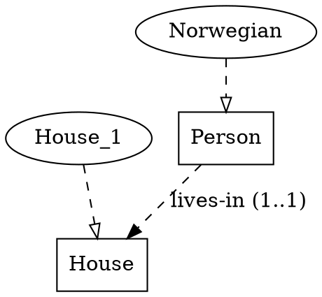
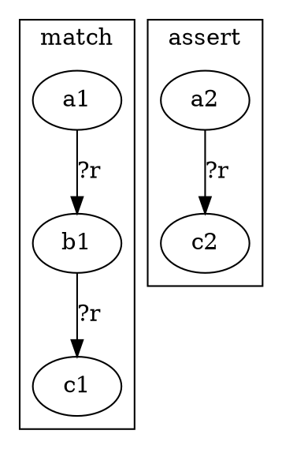
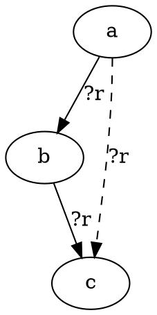
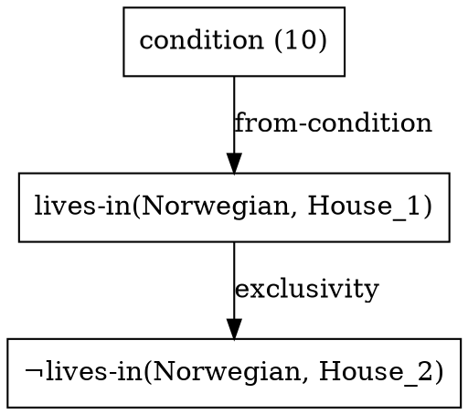

# ein-bot IR — kernel specification

The IR is the central artefact of the project: parser, graph engine,
rule registry, trace renderer, NL frontend (M2) and SMT emitter (M3)
all read and write it. This document specifies the kernel — every
form that parses, what it means, and how it renders.

> **Source of truth for syntax**:
> [`src/ein_bot/ir/grammar.lark`](../src/ein_bot/ir/grammar.lark).
> This document explains intent, examples, and rendering; the grammar
> file is canonical for what parses.

Stage: S1.1.1 of M1 ([plan](../plans/m1_core_graph_reasoning/p1.1_ir_language/s1.1.1_grammar_design.md)).
Cross-cutting questions resolved here:
[Q3](../plans/open_questions.md#q3--surface-ir-syntax)
(surface syntax),
[Q4](../plans/m1_core_graph_reasoning/open_questions.md#q4)
(rule presentation),
[Q21](../plans/m1_core_graph_reasoning/open_questions.md#q21)
(IR ↔ DOT isomorphism).

---

## §1 Lexical rules

| terminal   | regex                          | examples                                | role                                              |
|------------|--------------------------------|-----------------------------------------|---------------------------------------------------|
| `SYMBOL`   | `[A-Za-z][A-Za-z0-9_-]*`       | `has-color`, `next-to`, `House_1`        | atoms; list heads in patterns; rule / type / step names |
| `VAR`      | `\?[A-Za-z][A-Za-z0-9_-]*`     | `?a`, `?house`, `?T`, `?Type`            | pattern variables — bound by `:match`, reused in `:assert`. Uppercase allowed for type-shaped vars (`?T`). |
| `KEYWORD`  | `:[a-z][A-Za-z0-9_-]*`         | `:rule`, `:where`, `:cardinality`        | argument markers; **always** followed by a value  |
| `WILDCARD` | `_`                            | `_`                                      | head / arg wildcard in patterns                   |
| `INT`      | `-?[0-9]+`                     | `0`, `42`, `-7`                          | integer atoms (e.g. `:priority 10`)               |
| `RANGE`    | `[0-9]+\.\.([0-9]+|\*)`        | `0..1`, `1..1`, `1..*`                  | UML-style cardinality                             |
| `STRING`   | `"…"` with `\\` escape          | `"condition (10)"`, `"{?r} is transitive"` | source-sentence provenance + `:why` templates only |

**Comments** — SMT-LIB-compatible: `; line` to end of line, `#| block |#`
non-nesting.

**Naming convention** — hyphenated lowercase for relations and rule
names (`has-color`, `triangle-composition`); PascalCase or `Foo_N`
for types and instances (`Person`, `House_1`, `Norwegian`). Convention
only; the grammar accepts either.

---

## §2 Top-level forms

The kernel has **6 reserved heads**. Anything else at the top level
fails to parse. Three of them — `ontology`, `facts`, `reasoning` —
are the *three knowledge layers* from `plans/README.md` glossary; the
block name carries the **provenance** of the contained items.

| head        | layer / role                                                 | reserved sub-form heads                              |
|-------------|--------------------------------------------------------------|------------------------------------------------------|
| `ontology`  | **implicit** assumptions: schema + reader-supplied context   | `type` · `relation` · `a-priori` · any fact form     |
| `facts`     | **explicit** problem statements (numbered conditions)        | `=` · `instance` · `not` + generic `(NAME args*)`    |
| `reasoning` | **derived** facts — engine working memory after a solve      | same as `facts`; provenance is `:rule` / `:using`    |
| `rules`     | inference-rule definitions (meta over ontology + facts)      | `rule`                                               |
| `query`     | what to ask the engine                                       | keyword-args only (`:mode`, `:goal`)                 |
| `trace`     | engine output — derivation log + branches                    | `step` · `branch-open` · `branch-close` · `contradiction` · `symmetry-class` |

### Ontology — schema + implicit assumptions

```lisp
(ontology
  ;; Schema —
  (type <Name> [<Parent>])                         ; declare a type, optional parent
  (relation <name> (<T1> <T2> [<T3> ...])          ; relation signature, arity ≥ 2
    [:cardinality <RANGE>] [...])                   ; optional metadata kw-pairs
  (a-priori <name> (<T1> <T2> [...])               ; structural / spatial relation
    :pattern <pattern>)

  ;; Implicit assumptions —
  (instance <Ent> <Type>)                          ; instance enumeration
  (<rule-name> <relation> ...)                     ; rule-application meta-facts
  (<relation> <args> ... [:source "..."])           ; pairwise structural facts derived
                                                    ;   from background context
  )
```

The ontology accepts **two populations**:

1. **Schema** — `type`, `relation`, `a-priori`. Describes the universe
   of discourse.
2. **Implicit-but-true assertions** — anything the puzzle treats as
   background truth without literally stating it. Three recurring
   shapes: instance enumeration, rule-application meta-facts, and
   pairwise structural facts derived from a cardinality / ordering
   statement.

The split between *ontology* and *facts* is **by provenance**: did the
puzzle's text say it, or did the reader supply it from context? An
explicit numbered condition goes in `facts` with `:source "(N)"`; a
reader-supplied assumption goes in `ontology`.

Rule-application facts (`(symmetric co-located)`, `(implies right-of
next-to)`) live in `ontology` because the puzzle text never says
"co-located is symmetric" — that's universal context. They are the
*meta* of the relation, while `rules` is the meta of the *engine*.

Example:

```lisp
(ontology
  (type Attribute)
  (type House Attribute) (type Color Attribute)
  (relation co-located (Attribute Attribute))
  (instance Norwegian Nationality)
  (instance House_1 House)
  (symmetric  co-located)
  (transitive co-located)
  (right-of House_2 House_1 :source "condition (1)"))   ; from "five in a row"
```

### Facts — `(NAME args*)`, with reserved heads

```lisp
(facts
  (= <expr> <expr> :source <STRING>)                  ; equality condition   (reserved)
  (instance <Ent> <Type> :source <STRING>)            ; instance assertion   (reserved, arity 2)
  (not <expr> :source <STRING>)                       ; negative condition   (reserved, arity 1)
  (<name> <arg>* :source <STRING>))                   ; relation condition
```

The `facts` block holds **explicit problem statements** — one entry
per numbered puzzle condition, each annotated with
`:source "condition (N)"`. Implicit assumptions (instance enumerations,
rule-application meta-facts, structural facts derived from background
context) live in `(ontology …)` instead.

Three heads are **shape-pinned reserved words** at the grammar level:
`=`, `instance`, `not`. Wrong arity is a parse error, not a validator
error. `and`, `or`, `neq` are also reserved kernel meta-primitives
but they belong inside `:match` patterns / `:where` clauses, not at
the fact level — the grammar rejects them in `(facts …)`.

Domain relations (`co-located`, `lives-in`, `next-to`) stay generic
`(SYMBOL value*)` and are open-world: anyone can introduce a new
relation by declaring it in the ontology and using it in facts.

Three kinds of facts share the same syntactic family at the explicit-
condition level:

| kind | example | semantics |
|---|---|---|
| **relation instance** | `(co-located Englishman Red :source "(2)")` | a relation holds between specific entities |
| **equality**          | `(= (color House_1) Red :source "(?)")` | equational form |
| **negative**          | `(not (drinks Spaniard Coffee) :source "(?)")` | the wrapped fact does *not* hold |

`all-different` is **not** a kernel primitive; pairwise distinctness
within a category is derived by `type-exclusivity` from the
`(instance X T)` facts. Genuinely puzzle-specific structural shapes
(parity, budget, …) just take their own head: `(budget-total X Y)`.

### Reasoning — derived facts (engine working memory)

```lisp
(reasoning
  (<name> <arg>* :rule <RuleName> :using (<premise-id>+))
  (not <expr>   :rule <RuleName> :using (<premise-id>+))
  ...)
```

The `reasoning` block holds facts the engine has *derived* at runtime.
Same syntactic shapes as `(facts …)`; the provenance kw-pair is
`:rule` (which rule fired) + `:using` (which premises it consumed),
instead of `:source` (which puzzle condition originated it).

Hand-authored puzzle files typically leave this block empty — it's
populated by the engine after `solve`. The block is parseable IR, so
engine dumps round-trip through `parse` / `dump`.

`all-different` is **not** a kernel primitive; pairwise distinctness
within a category is derived by `type-exclusivity` from the
`(instance X T)` facts. Genuinely puzzle-specific structural shapes
(parity, budget, …) just take their own head: `(budget-total X Y)`.

Example:

```lisp
(facts
  (instance Norwegian Nationality)
  (instance House_1   House)
  (symmetric  co-located)
  (transitive co-located)
  (implies    right-of next-to)
  (lives-in   Norwegian House_1 :source "condition (10)"))
```

### Rules

```lisp
(rules
  (rule <name> (<param-vars>*)    ; parameter list — mandatory, `()` for non-generic
    :match <pattern>              ; LHS — structural pattern (§3)
    :assert <conclusion>          ; RHS — what to derive
    :why <STRING>                 ; reason template for trace
    [:priority <INT>]))           ; rule ordering — lower = earlier
```

Each rule has one `:match` and one `:assert`. The pattern sub-language
is §3. `:priority` resolves
[Q15](../plans/m1_core_graph_reasoning/open_questions.md#q15) (rule
ordering): static per-rule, cheap-propagation rules at lower numbers.

The **parameter list** is mandatory. Two cases:

| parameters | rule kind | how it fires |
|---|---|---|
| **non-empty** `(?p1 ?p2 …)` | **generic** | fires only when bound to a rule-application fact, e.g. `(symmetric co-located)` binds `?rel = co-located` for the `symmetric` rule |
| **empty `()`** | **non-generic** | fires universally on every match; free vars in `:match` are bound by the matcher itself |

A generic rule with no matching application facts never fires — the
parameters are the gate. Non-generic rules need no application fact.

Concrete: the rule

```lisp
(rule symmetric (?rel)
  :match  (?rel ?a ?b)
  :assert (?rel ?b ?a)
  :why    "{?rel} is symmetric." :priority 1)
```

is applied via the fact `(symmetric co-located)`, which substitutes
`?rel = co-located` and then matches `(co-located ?a ?b)` against
working memory. One generic rule per property replaces N per-relation
property-rules.

### Query

```lisp
(query
  :mode (solve | gaps | contradictions)   ; task class — idea 03
  :goal <expr>)                            ; what to find / verify
```

The three modes correspond to the three task classes from
[`docs/ideas/03-three-task-classes.md`](ideas/03-three-task-classes.md):

- `solve` — derive a unique model.
- `gaps` — what cannot be derived from the given facts.
- `contradictions` — find inconsistencies + provenance.

### Trace

```lisp
(trace
  (step <id> :rule <name>                  ; engine derivation step
             :using (<premise-ids>)
             :derives <expr>
             [:source <ref> | :assumes <expr>])
  (branch-open <id> :on <expr>             ; open a hypothesis-driven split
                    :choices (<sub-ids>))
  (branch-close <id> :choose <sub-id>)     ; commit to a branch
  (contradiction <id> :using (<step-ids>)  ; record a contradiction
                      :assumption <step-id>)
  (symmetry-class <id> :over (<entities>)  ; mark engine-arbitrary choices
                       :note <STRING>))
```

Per [Q21](../plans/m1_core_graph_reasoning/open_questions.md#q21),
`(trace …)` is the **same IR** as input — same parser, same AST, same
dumper. The engine can reason about its own traces; rules can match
`(step …)` forms ([TMS/ATMS analogue](index/09-cognitive-architectures-neurosymbolic.md)).
Per [Q18](../plans/m1_core_graph_reasoning/open_questions.md#q18) each
derived edge's provenance tuple `(rule, premise_edges, source)` is
literally a `(step …)` form — provenance and trace are the same data
structure under different views.

---

## §3 Pattern sub-language

`:match` and `:assert` clauses use an embedded pattern language.
**Kernel meta-primitives** (`and`, `or`, `not`, `neq`, `instance`)
are shape-pinned in the grammar — wrong arity is a parse error, not a
validator error. Relation patterns (`(?r ?a ?b)`, `(co-located ?a ?b)`)
stay generic at the grammar level; the validator (S1.1.2) enforces
well-formedness against the rules below.

### Closure

The pattern language is **positive conjunctive** + `:where` filters +
a registry of **named structural predicates** (the rewrite-DSL + named
fallback from [Q4](../plans/m1_core_graph_reasoning/open_questions.md#q4)).

| construct                | example                                | reserved? | meaning                                         |
|--------------------------|----------------------------------------|-----------|-------------------------------------------------|
| variables                | `?a`, `?house`                          | —         | bound by the match; reused across sub-clauses   |
| ground atoms             | `Red`, `House_1`                        | —         | match literally                                 |
| relation pattern         | `(?r ?a ?b [?c …])`                     | —         | VAR head binds the relation name; args bind positions |
| named relation pattern   | `(co-located ?a ?b)`                    | —         | match a specific relation's instances                  |
| head wildcard            | `(_ ?a ?b)`                             | —         | match any binary list head                      |
| **conjunction**          | `(and <p1> <p2> …)`                     | ✓ AND    | conjunctive match (kernel primitive)             |
| **disjunction**          | `(or  <p1> <p2> …)`                     | ✓ OR     | disjunctive match (grammar-reserved; engine semantics in P1.3) |
| **negation**             | `(not <p>)`                             | ✓ NOT    | wrapped premise must not hold                    |
| **equality**             | `(= ?a ?b)`                             | ✓ EQ     | bind / match equality                            |
| **instance check**       | `(instance ?a ?T)`                      | ✓ INSTANCE | instance-of pattern                            |
| `:where` filter          | `:where (transitive ?r) (neq ?a ?b)`    | NEQ inside | type / inequality / structural-predicate filters |
| named structural pred.   | `(unique-remaining ?slot ?type)`        | —         | aggregate-style premise; in §Predicate registry  |

The ✓-marked heads have dedicated grammar rules with fixed arities;
typos like `(instnce ?a ?T)` or `(neq ?a)` are caught at parse time.

### What is NOT in the pattern language

- **Negation-as-failure outside `:where`** — at premise level, use a
  named structural predicate (`no-remaining-option`,
  `forbidden-by-exclusion`) so the trace planner can name the firing.
  `(not <p>)` is permitted as an *assertion* (rule conclusion) but
  acts as a positive negative fact, not as failure-to-prove.
- **Universal quantifiers / aggregates as expressions** — lift to
  named structural predicates.

The line is governed by trace fidelity: anything the matcher can see,
the trace planner can name. Opaque Python fallbacks would render as
black-box firings, failing the [M1 acceptance §3](../plans/m1_core_graph_reasoning/README.md)
explanation-completeness criterion.

### Predicate registry (initial)

Names and Python implementations are registered in P1.3 S1.3.1. The
M1 starter set:

| predicate                       | meaning                                       |
|---------------------------------|-----------------------------------------------|
| `(transitive ?r)`               | the named relation is transitive              |
| `(symmetric ?r)`                | the named relation is symmetric               |
| `(neq ?a ?b)`                   | the bindings refer to distinct entities       |
| `(unique-remaining ?slot ?type)` | only one slot of `?type` is unassigned        |
| `(no-remaining-option ?x)`      | every candidate value for `?x` is excluded    |
| `(forbidden-by-exclusion ?a ?b ?r)` | `?r(?a, ?b)` is excluded by an `allDifferent`-style constraint |

### Triangle rule (explicit form, with `:where` guard)

```lisp
(rule triangle-composition ()
  :match (and (?r ?a ?b)
              (?r ?b ?c)
              :where (transitive ?r))
  :assert (?r ?a ?c)
  :why "From {0} and {1}, since {?r} is transitive, {?a} {?r} {?c}."
  :priority 10)
```

Non-generic (`()` params), fires universally; the `:where` guard
restricts to transitive relations. The structural predicate
`(transitive ?r)` introspects whether `?r` has a corresponding
`(transitive ?r)` application fact.

Equivalent **generic property-rule form** — gated by parameter
substitution from application facts:

```lisp
(rule transitive (?rel)
  :match (and (?rel ?a ?b)
              (?rel ?b ?c)
              :where (neq ?a ?c))
  :assert (?rel ?a ?c)
  :why "{?rel} is transitive."
  :priority 5)
```

Applied via `(transitive co-located)` in facts; fires only on
relations explicitly tagged.

---

## §4 Inspirations + diversions

| source                                                          | what we took                                                                  | what we diverged on                                                          |
|-----------------------------------------------------------------|-------------------------------------------------------------------------------|------------------------------------------------------------------------------|
| **SMT-LIB 2**                                                   | S-exprs, `;` + `#| … |#` comments, `:keyword` arg markers, atom-heavy semantics | rules in-band (no `(define-fun-rec …)` distinction); no theory annotations; no `(check-sat)` |
| **miniKanren**                                                  | relational atom shape, `?var` convention, conjunctive patterns                 | no first-class `fresh` / unification syntax — the validator handles binding  |
| **AtomSpace**                                                   | explicit `(type …)` / `(instance …)` declarations; atom typing                | no probabilistic truth values; no built-in node weights                       |
| **Datalog / Soufflé**                                           | rule shape `head :- body` as inspiration for `:match` / `:assert` separation  | S-expressions over infix; `:why` templates for human-readable firings        |
| **DPO graph rewriting** ([idea 07](ideas/07-categorical-formulation.md)) | `:match` / `:assert` as before / after sub-graphs                              | not yet expressed as `L ← K → R` span — DPO render mode (§6) is opt-in       |

---

## §5 Examples

### The four-token Zebra sentence

> *"The Norwegian lives in the first house."*

```lisp
(facts
  (lives-in Norwegian House_1 :source "condition (10)"))
```

### A larger Zebra fragment

```lisp
(rules
  (rule transitive (?rel)
    :match  (and (?rel ?a ?b) (?rel ?b ?c) :where (neq ?a ?c))
    :assert (?rel ?a ?c)
    :why    "{?rel} is transitive."))

(ontology
  ;; Schema
  (type Attribute)
  (type House Attribute) (type Color Attribute) (type Nationality Attribute)
  (relation co-located (Attribute Attribute))
  (relation right-of   (Attribute Attribute))
  (a-priori position   (House House) :pattern (right-of ?a ?b))
  ;; Implicit: instance enumeration
  (instance House_1 House) (instance House_2 House) (instance House_3 House)
  (instance Red Color) (instance Green Color) (instance Ivory Color)
  (instance Norwegian Nationality) (instance Englishman Nationality)
  ;; Implicit: rule-application meta-facts
  (transitive co-located))

(facts
  ;; Explicit puzzle conditions only.
  (co-located Englishman Red    :source "condition (2)")
  (right-of   Green Ivory       :source "condition (6)")
  (co-located Norwegian House_1 :source "condition (10)"))

(query :mode solve :goal (co-located ?nationality Water))
```

The complete puzzle — 15 conditions + ten rule families — lives in
[`examples/zebra.ein`](../examples/zebra.ein) (created alongside this
spec; see [M1 acceptance §1-2](../plans/m1_core_graph_reasoning/README.md)).

---

## §6 Rendering — IR ↔ DOT

Per [Q21](../plans/m1_core_graph_reasoning/open_questions.md#q21), the
IR has a **structurally isomorphic** DOT view: every kernel form has
a fixed DOT shape. Only **graph structure** is fixed by this schema;
layout (positions, rank, unspecified style choices) is free —
`random_layout` is permitted.

Render is mandatory (`ein_bot.ir.to_dot`,
[S1.1.4](../plans/m1_core_graph_reasoning/p1.1_ir_language/s1.1.4_ir_to_dot.md));
reverse parse (`ein_bot.ir.from_dot`) is required for Q21
completeness but lands in P1.2 alongside the typed-hypergraph data
model.

### Node-shape legend

| IR element                | DOT shape                          |
|---------------------------|------------------------------------|
| `type` declaration        | `box`                              |
| `instance` declaration    | `oval` (ellipse)                   |
| ground atom               | `rectangle`                        |
| hyperedge (Levi-bipartite) | `octagon`                          |
| equality class            | `doublecircle`                     |
| pattern variable `?x`     | `diamond`                          |
| wildcard `_`              | `diamond` with `style=dashed`      |
| relation schema           | dashed labelled edge               |
| derived edge (fact)       | solid labelled edge                |
| hypothetical edge         | solid edge with `style=dashed`     |

### Hyperedge encoding — Levi-bipartite

DOT has no native hyperedges. Every n-ary relation fact `(name a b c)`
is encoded **Levi-bipartite**: one `octagon` node for the hyperedge
itself, with directed edges to each participant labelled by role index
(or role name when declared). The hyperedge's node identity is what
[Q18](../plans/m1_core_graph_reasoning/open_questions.md#q18)
provenance tuples reference; this anchors
[Q1](../plans/open_questions.md#q1--what-kind-of-graph-is-the-ir)'s
typed-hypergraph + equality-class-ID answer visually.

### Ontology — UML-ish



### Rule rendering — three modes, configurable

Default: **(a)** for `rules.ein` documentation, **(c)** for trace
output. **(b)** is opt-in.

**(a) Side-by-side LHS | RHS** — explicit; readable for rule libraries.



**(b) DPO span `L ← K → R`** — categorical reading
([idea 07](ideas/07-categorical-formulation.md)). Three sub-clusters
share the interface graph K (the bindings preserved by the rule); the
left morphism deletes nothing for our pattern language (positive
conjunctive), the right morphism adds the RHS.

**(c) Overlay** — most compact; LHS in solid, RHS additions in dashed.
Default at rule-firing time inside traces:



### Trace rendering — three views, configurable

Default: **(a)** — matches
[M1 acceptance §2](../plans/m1_core_graph_reasoning/README.md)'s
`zebra/` snapshot folder.

**(a) Per-step DOT** — one file per step under `<trace-name>/sNN.dot`;
each shows working memory immediately after the step's `:derives` is
committed.

**(b) Aggregate** — single file, final state, edges coloured by step
number (early = blue, late = red). For overviews and paper figures.

**(c) Derivation DAG** — nodes are derived facts (one per `:derives`),
edges connect each derived fact to its `:using` premises. The natural
"explanation graph" view per
[idea 08](ideas/08-human-style-deductive-trace.md):



### Branch rendering

- **Search-tree view** (P1.5 forward-reference): nodes are states
  bracketed by `branch-open` / `branch-close`; edges are `:choices`.
  Default for the `--search-tree` flag.
- **Per-state snapshots**: each branch becomes a `cluster_branch_<id>`
  sub-graph inside the working-memory DOT.

### Reverse parse (`from_dot`)

Required by Q21 but not blocking on P1.1. The schema fixed by this
chapter is the contract `from_dot` will follow when implemented in
P1.2. Generic DOT files outside this schema are NOT round-trippable;
the API will reject non-conforming inputs rather than guess.

---

## Cross-references

- Grammar source of truth: [`src/ein_bot/ir/grammar.lark`](../src/ein_bot/ir/grammar.lark).
- Stage plan: [`plans/m1_core_graph_reasoning/p1.1_ir_language/s1.1.1_grammar_design.md`](../plans/m1_core_graph_reasoning/p1.1_ir_language/s1.1.1_grammar_design.md).
- Idea origins: [01](ideas/01-self-modifying-constraint-language.md)
  (homoiconic Lisp/SMT-LIB style),
  [02](ideas/02-graph-as-formal-substrate.md) (graph as primary memory),
  [03](ideas/03-three-task-classes.md) (`:mode` task classes),
  [04](ideas/04-nlp-to-graph-to-solver-pipeline.md) (NL → IR target),
  [06](ideas/06-inference-rules-completeness.md) (rule families),
  [07](ideas/07-categorical-formulation.md) (DPO rendering),
  [08](ideas/08-human-style-deductive-trace.md) (trace fidelity),
  [09](index/09-cognitive-architectures-neurosymbolic.md) (TMS/ATMS).
- Open questions (M1 + global) resolved by this stage:
  [Q3](../plans/open_questions.md#q3--surface-ir-syntax),
  [Q4](../plans/m1_core_graph_reasoning/open_questions.md#q4),
  [Q21](../plans/m1_core_graph_reasoning/open_questions.md#q21).
