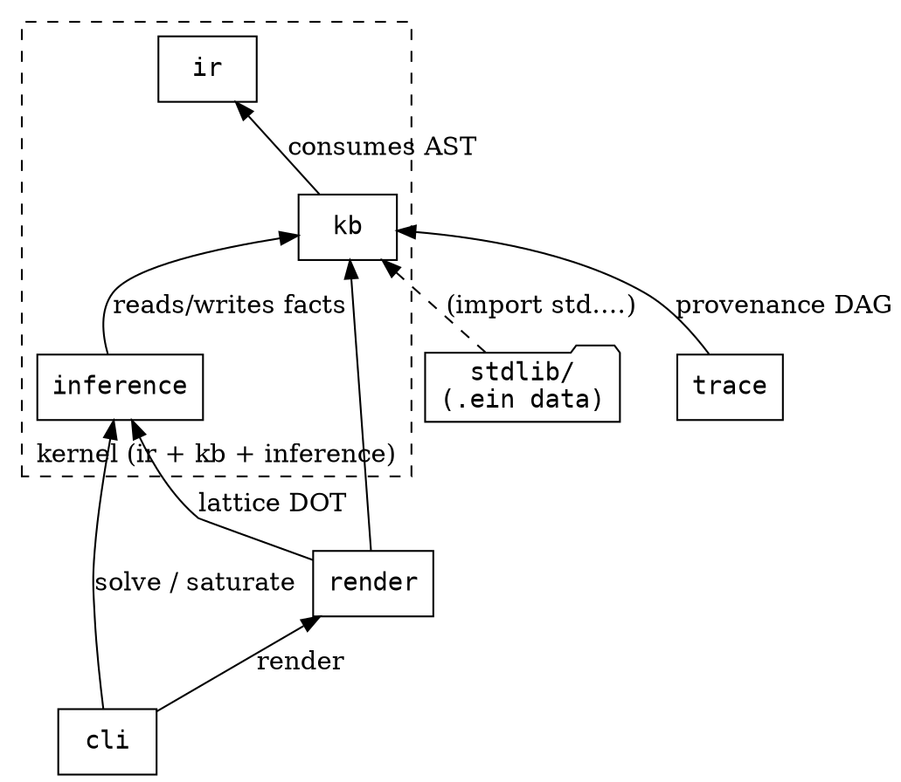
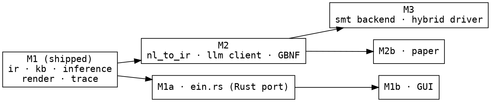

# Ein — architecture overview

The **structural** map of the codebase: *where* each concern lives and how a
`.ein` file becomes an answer. This complements
[`README.md`](README.md) — the *reading-order* doc (what to read in what
order) — by answering "where do I look to change X?".

> **Audience: engine contributors.** Puzzle authors want
> [`ir/03-ein-lang/`](ir/03-ein-lang/) (the surface language) instead.

## Data flow — `.ein` source → answer

```dot
digraph dataflow {
  rankdir=LR;
  node [shape=box, fontname="monospace"];

  src   [label=".ein source", shape=note];
  ast   [label="typed AST\n(SForm tuple)"];
  kb    [label="KnowledgeBase\n(facts + indexes)"];
  sat   [label="reasoning facts\n(saturation fixpoint)"];
  verd  [label="verdict\nSolution / Ambiguity / Contradiction"];
  out   [label="stdout table\n+ markdown trace", shape=note];

  src  -> ast  [label="ir.parse"];
  ast  -> kb   [label="kb.from_ir"];
  kb   -> sat  [label="inference:\nEngine.compile_all\n→ Saturator.saturate"];
  sat  -> verd [label="hypgen → apriori →\ncommitment → monotonic.solve"];
  verd -> out  [label="trace/ + cli/"];
}
```

Each arrow names the **package** that owns the transform:
[`ir/`](../../ein.py/src/ein/ir/) parses, [`kb/`](../../ein.py/src/ein/kb/)
loads + stores, [`inference/`](../../ein.py/src/ein/inference/) saturates and
searches, [`trace/`](../../ein.py/src/ein/trace/) + `cli/` render. The verdict is
read from the model count `k` — never chosen by a flag (see [`README.md`](README.md)).
Each arrow is a public Python call: driving this pipeline from another
project is the **embedding contract** in [`docs/api/`](../api/) (`parse` →
`KnowledgeBase.from_ir` → `Saturator.saturate` → `monotonic.solve` →
`trace.linearize`).

## Package dependency map

- **`ir/`** depends on nothing else (pure parse/AST/dump/DOT).
- **`kb/`** consumes the AST; owns entities, the 7 indexes, provenance, imports.
- **`inference/`** is the only writer of reasoning-layer facts; depends on `kb`.
- **`render/` + `trace/`** read `kb` (+ `inference` for the lattice view).
- **`cli/`** orchestrates; **`stdlib/`** is `.ein` *data* the loader pulls in.

The **kernel boundary** (`ir` + `kb` + `inference`) is what every milestone
builds on; everything else (`cli`, `render`, `trace`, tests) is the surface.

## Milestone boundaries — which modules each adds

- **M1** (this kernel) — the engine described in `docs/kernel/`. **Shipped**:
  `zebra2.ein` solves end-to-end; its solution / gaps / contradiction all read
  off one run.
- **M2** — NL → IR: an LLM extractor under GBNF constraint produces IR; no new
  *kernel* module, a new front-end consuming it.
- **M3** — SMT slice: `IR → SMT-LIB`, a hybrid driver handing `(hard-slice …)`
  to Z3/clingo with explanation recovery back to IR.
- **M1a / M1b / M2b** — Rust port / GUI / paper (out of the kernel tree).

Roadmap detail: [`plans/`](../../plans/README.md).

## "Where do I look?" — change cookbook

| I want to…                          | files to touch |
|-------------------------------------|----------------|
| add/adjust a **puzzle** rule        | the `.ein` file itself, or import from [`stdlib/`](../../ein.py/src/ein/stdlib/) |
| add a **stdlib** rule/module        | `ein.py/src/ein/stdlib/<m>.ein` + a `tests/` exercise; document in [`ir/03-ein-lang/07_stdlib_api.md`](ir/03-ein-lang/07_stdlib_api.md) |
| add a **kernel primitive** (`absent`-like) | `inference/primitives.py` or `predicates.py` + `compile.py` + `match.py` + tests |
| add a **top-level IR form**         | `ir/grammar.lark` + `ir/ast.py` + `kb/from_ir.py` (routing) + tests; update [`ir/03-ein-lang/06_reserved_names.md`](ir/03-ein-lang/06_reserved_names.md) |
| change **saturation order**         | `inference/saturator.py` (priority bands) |
| change **search / verdict**         | `inference/monotonic/solver.py` + `inference/verdict.py` |
| add a **config knob**               | `inference/config.py` (`SolverConfig`) + its read site |
| add a **contradiction shape**       | `inference/contradiction.py` |
| add a **render target**             | `render/` + wire into `cli/render.py` |
| add a **CLI subcommand**            | `cli/<cmd>.py` + dispatch in `cli/__init__.py` |

The per-module detail behind these is
[`inference/python_impl.md`](inference/python_impl.md) (engine) and
[`ir/02-data-model/`](ir/02-data-model/) (KB).

## See also

- [`README.md`](README.md) — the reading-order companion to this structural doc.
- [`inference/architecture_and_algorithms.md`](inference/architecture_and_algorithms.md)
  — the engine's algorithmic (O1–O9) view.
- [`inference/python_impl.md`](inference/python_impl.md) — the engine's file map.
- [`../api/`](../api/) — the Python embedding contract (this pipeline as a library API).
- [`glossary.md`](glossary.md) — kernel vocabulary.
- [`plans/README.md`](../../plans/README.md) — the milestone roadmap.
