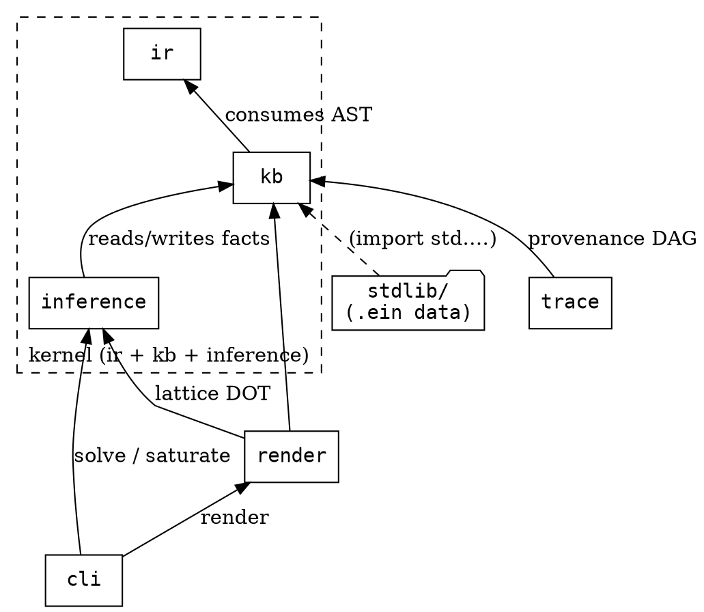
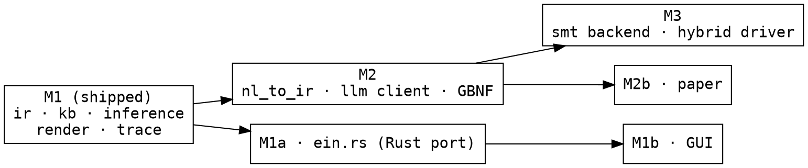

# Ein — architecture overview

The **structural** map of the codebase: *where* each concern lives and how a
`.ein` file becomes an answer. This complements
[`README.md`](README.md) — the *reading-order* doc (what to read in what
order) — by answering "where do I look to change X?".

> **Audience: engine contributors.** Puzzle authors want
> [`ir/03-ein-lang/`](ir/03-ein-lang/) (the surface language) instead.

## Data flow — `.ein` source → answer


```dot
digraph dataflow {
  rankdir=LR;
  node [shape=box, fontname="monospace"];

  src   [label=".ein source", shape=note];
  ast   [label="typed AST\n(SForm tuple)"];
  kb    [label="KnowledgeBase\n(facts + indexes)"];
  sat   [label="reasoning facts\n(saturation fixpoint)"];
  verd  [label="verdict\nSolution / Ambiguity / Contradiction"];
  out   [label="stdout table\n+ markdown trace", shape=note];

  src  -> ast  [label="ir.parse"];
  ast  -> kb   [label="kb.from_ir"];
  kb   -> sat  [label="inference:\nEngine.compile_all\n→ Saturator.saturate"];
  sat  -> verd [label="hypgen → apriori →\ncommitment → monotonic.solve"];
  verd -> out  [label="trace/ + cli/"];
}
```

Each arrow names the **package** that owns the transform:
[`ir/`](../../ein.py/src/ein/ir/) parses, [`kb/`](../../ein.py/src/ein/kb/)
loads + stores, [`inference/`](../../ein.py/src/ein/inference/) saturates and
searches, [`trace/`](../../ein.py/src/ein/trace/) + `cli/` render. The verdict is
read from the model count `k` — never chosen by a flag (see [`README.md`](README.md)).
Each arrow is a public Python call: driving this pipeline from another
project is the **embedding contract** in [`docs/api/`](../api/) (`parse` →
`KnowledgeBase.from_ir` → `Saturator.saturate` → `monotonic.solve` →
`trace.linearize`).

## Package dependency map


```dot
digraph deps {
  rankdir=BT;
  node [shape=box, fontname="monospace"];
  subgraph cluster_kernel {
    label="kernel (ir + kb + inference)"; style=dashed;
    ir; kb; inference;
  }
  stdlib [label="stdlib/\n(.ein data)", shape=folder];
  render; trace; cli;

  kb        -> ir        [label="consumes AST"];
  inference -> kb        [label="reads/writes facts"];
  render    -> kb;
  render    -> inference [label="lattice DOT"];
  trace     -> kb        [label="provenance DAG"];
  cli       -> inference [label="solve / saturate"];
  cli       -> render    [label="render"];
  stdlib    -> kb        [label="(import std.…)", style=dashed];
}
```

- **`ir/`** depends on nothing else (pure parse/AST/dump/DOT).
- **`kb/`** consumes the AST; owns entities, the 7 indexes, provenance, imports.
- **`inference/`** is the only writer of derived facts; depends on `kb`.
- **`render/` + `trace/`** read `kb` (+ `inference` for the lattice view).
- **`cli/`** orchestrates; **`stdlib/`** is `.ein` *data* the loader pulls in.

The **kernel boundary** (`ir` + `kb` + `inference`) is what every milestone
builds on; everything else (`cli`, `render`, `trace`, tests) is the surface.

## Milestone boundaries — which modules each adds


```dot
digraph milestones {
  rankdir=LR; node [shape=box, fontname="monospace"];
  M1 [label="M1 (shipped)\nir · kb · inference\nrender · trace"];
  M2 [label="M2\nnl_to_ir · llm client · GBNF"];
  M3 [label="M3\nsmt backend · hybrid driver"];
  M1 -> M2 -> M3;
  M1a [label="M1a · ein.rs (Rust port)"];
  M1b [label="M1b · GUI"];
  M2b [label="M2b · paper"];
  M1 -> M1a -> M1b; M2 -> M2b;
}
```

- **M1** (this kernel) — the engine described in `docs/kernel/`. **Shipped**:
  `zebra2.ein` solves end-to-end; its solution / gaps / contradiction all read
  off one run.
- **M2** — NL → IR: an LLM extractor under GBNF constraint produces IR; no new
  *kernel* module, a new front-end consuming it.
- **M3** — SMT slice: `IR → SMT-LIB`, a hybrid driver handing `(hard-slice …)`
  to Z3/clingo with explanation recovery back to IR.
- **M1a / M1b / M2b** — Rust port / GUI / paper (out of the kernel tree).

Roadmap detail: [`plans/`](../../plans/README.md).

## The closure/worlds seam

> **Status: shipped 2026-08-17** — until then a parked target picture.
> Recorded from
> REVIEW_M1-01 §6 by
> P1.21 R6 (investigation:
> `r6_seam.md`),
> then **built** by
> P1.21 S1.21.8
> (purely-positive closure + boundary NAF re-eval). The *as-built* two-layer
> picture stays in
> [`inference/architecture_and_algorithms.md` §2](inference/architecture_and_algorithms.md#2-architecture-and-the-main-steps);
> this section records the seam itself, which modules own its nodes, and the
> places the layout still **leaks** across it — **L2–L4 stand**; L1 is
> closed, L5 resolved, L6 half.

The seam, as built:

```text
                 ┌───────────────┐
                 │   ein-lang    │
                 └───────┬───────┘
                         │
                    typed IR
                         │
                 ┌───────▼───────┐
                 │      KB       │
                 │ ground atoms  │
                 └───────┬───────┘
                         │
       ┌─────────────────┴─────────────────┐
       │                                   │
┌──────▼──────┐   NAF sits on this  ┌──────▼──────┐
│ monotone    │◄─── boundary ──────►│ assumptions │
│ closure     │   world.World       │ / worlds    │
│ Datalog-ish │   (shipped S1.21.8) │ lattice     │
└──────┬──────┘                     └──────┬──────┘
       │                                   │
       └───────────────┬───────────────────┘
                       │
                 complete model
                       │
                 canonical key   ← canon.StateKey (shipped, P1.21 R1)
                       │
             models / refutations
```

This was never an aspiration — it is a near-literal description of the
as-built package layout, and since S1.21.8 the boundary itself is a *module*
([`inference/world.py`](../../ein.py/src/ein/inference/world.py)) rather than
an emergent property of evaluation order. Every seam node maps onto one or
two modules; the residual debt is the **leak list** below, where the two
layers still interpenetrate.

### Module mapping

| seam node | modules (`ein.py/src/ein/`) | state |
|---|---|---|
| ein-lang → typed IR | [`ir/`](../../ein.py/src/ein/ir/) (`parser.py`, `ast.py`, `types.py`, `macros.py`) | **clean** — `ir/` depends on nothing (dependency map above) |
| typed IR → KB (ground atoms) | [`kb/from_ir.py`](../../ein.py/src/ein/kb/from_ir.py), [`kb/store.py`](../../ein.py/src/ein/kb/store.py), `kb/entities.py`, [`kb/provenance.py`](../../ein.py/src/ein/kb/provenance.py) | **leaks L2** — the ground-atom store carries worlds-layer state; provenance now also carries a firing's *negative* dependence (`absent_premises`, S1.21.8 — **L6** half) |
| monotone closure (Datalog-ish) | [`inference/compile.py`](../../ein.py/src/ein/inference/compile.py), [`match.py`](../../ein.py/src/ein/inference/match.py), [`saturator.py`](../../ein.py/src/ein/inference/saturator.py), [`engine.py`](../../ein.py/src/ein/inference/engine.py), `firing.py`, [`contradiction.py`](../../ein.py/src/ein/inference/contradiction.py), `predicates.py`, `primitives.py`, `resolve.py` | **clean since S1.21.8** — `JoinPlan.steps` is the purely positive residue left by `compile.split_naf`; the closure runs to quiescence consulting no negation (**L1** closed) |
| the NAF boundary itself | [`inference/world.py`](../../ein.py/src/ein/inference/world.py) (`World.absent` / `admits` / `first_failing` / `negative_premises`), [`compile.split_naf`](../../ein.py/src/ein/inference/compile.py) + `NafGuard`, [`saturator._admit_from_boundary`](../../ein.py/src/ein/inference/saturator.py), [`match.run_guarded`](../../ein.py/src/ein/inference/match.py) | **new, clean (S1.21.8)** — the one place `(absent …)` is answered, and only against a positive fixpoint |
| assumptions / worlds lattice | [`monotonic/`](../../ein.py/src/ein/inference/monotonic/) (`solver.py`, `_helpers.py`, `_state.py`, `lattice.py`), [`commitment.py`](../../ein.py/src/ein/inference/commitment.py), [`apriori.py`](../../ein.py/src/ein/inference/apriori.py), [`nogoods.py`](../../ein.py/src/ein/inference/nogoods.py), [`hypgen.py`](../../ein.py/src/ein/inference/hypgen.py), [`lookahead.py`](../../ein.py/src/ein/inference/lookahead.py), `hrule.py`, `closed.py`, [`naf_deps.py`](../../ein.py/src/ein/inference/naf_deps.py) | **clean core, leaking rim** — `try_commitment_set` is a pure fork-write-saturate world transition and `apriori`/`nogoods` are pure set arithmetic; the rim still leaks **L3**, and **L6** is only half-closed (recorded, not interpreted) |
| complete model | [`solution.py`](../../ein.py/src/ein/inference/solution.py) (`complete` / `open_hypotheses` / `is_solution_node`) | **leaks L4** — defined *operationally through the worlds-layer generator*; evaluating it can mutate the KB under test (its NAF half — the lookahead's world — is fixed, D3) |
| canonical key | [`canon.py`](../../ein.py/src/ein/inference/canon.py) (`state_key` → `StateKey`) | **clean since P1.21 R1** — identity is the sorted canonical fact tuple itself, never a hash; but L4 taints its *input* |
| models / refutations | [`verdict.py`](../../ein.py/src/ein/inference/verdict.py), [`monotonic/_state.py`](../../ein.py/src/ein/inference/monotonic/_state.py) (`verdict_of`), [`frontier.py`](../../ein.py/src/ein/inference/frontier.py), [`trace/`](../../ein.py/src/ein/trace/) | **clean** — the verdict is read off the deduped model count `k`; the query `:goal` only projects afterwards |

### Leak list

The six places the layers interpenetrate (P1.21 R6 census; the headline
closed by S1.21.8, one resolved by R2, one half-closed, three standing):

- **L1 — NAF inside the closure matcher** (the headline) — ✅ **closed
  2026-08-17** by S1.21.8. `(absent …)` used to compile to an `AbsentGuard`
  opcode *inside* `JoinPlan.steps`, be evaluated by the matcher against the
  transient mid-saturation KB, be re-evaluated at fire time
  (`absents_still_pass`, `Saturator.naf_dropped`) and force a full re-match
  of any plan watching a delta through a guard (`_absent_relations`) — so
  the closure's output depended on what its world *lacked*. Now:
  [`compile.split_naf`](../../ein.py/src/ein/inference/compile.py) lifts
  every top-level guard out into `JoinPlan.naf_guards` (one tuple per
  `or`-disjunct, paired by `JoinPlan.disjuncts()`), leaving a purely
  positive Scan/Join/Guard plan; the saturator runs that closure to
  quiescence and only then judges parked candidates against the resulting
  world ([`world.World`](../../ein.py/src/ein/inference/world.py),
  `Saturator._admit_from_boundary`, one admission per round); the fire-time
  re-check and the absent-flip full-match split are **deleted, not
  bypassed**, leaving `naf_dropped` structurally 0 beside the new
  `naf_rounds` / `naf_admitted` / `naf_retired` observables. Contract and
  consequences: [`absent_semantics.md`](inference/absent_semantics.md) and
  [§NAF at the boundary](#naf-at-the-boundary--how-it-works) below.
- **L2 — worlds state stored inside the KB** — **still open.**
  `KnowledgeBase._nogoods` lives in the ground-atom store and is
  **fork-shared by reference**
  ([`store.fork`](../../ein.py/src/ein/kb/store.py); `snapshot` copies);
  `_negated_facts` doubles as a closure index (contradiction detection,
  matcher) *and* the search's dead-hypothesis cache
  ([`hypgen`](../../ein.py/src/ein/inference/hypgen.py)); `kb.config` rides
  along in the store.
- **L3 — worlds → root writebacks keyed by magic provenance strings** —
  **still open** (S1.21.8 did not touch it).
  `<monotonic-unconditional>` (singleton-nogood death),
  `<lookahead-dies-immediately>` (kill cache), `<forced-positive>`
  (promotion) — each individually sound
  ([`monotonic/_helpers.py`](../../ein.py/src/ein/inference/monotonic/_helpers.py),
  [`hypgen.py`](../../ein.py/src/ein/inference/hypgen.py)), but each is an
  unannounced world transition whose closure consequences are re-derived by
  ad-hoc re-saturations rather than by a declared boundary re-eval point.
  What did improve: each of those re-saturations is now a fresh two-phase
  run, so every guard is re-asked against the post-writeback fixpoint
  instead of against whatever the old KB happened to hold — but the
  transition is still silent, and facts already derived through an absence
  the writeback invalidates are not retracted (no truth maintenance, E3).
- **L4 — `complete()` re-enters the worlds layer and can mutate the model
  under test** — **still open.** `complete(kb)` ≡ "hypgen proposes nothing"
  ([`solution.py`](../../ein.py/src/ein/inference/solution.py));
  `generate_hypotheses` runs the one-step lookahead and, with the
  **default-on** `enable_lookahead_kill_cache`
  ([`config.py`](../../ein.py/src/ein/inference/config.py)), writes
  `(not h)` facts into the KB being checked — *before* `_record_node`
  takes that same KB's `state_key`
  ([`monotonic/solver.py`](../../ein.py/src/ein/inference/monotonic/solver.py)).
  S1.21.8 fixed the NAF half of the sharp edge (divergence **D3**:
  [`lookahead.py`](../../ein.py/src/ein/inference/lookahead.py) now evaluates
  a rule's guards in the world *with* `h` — no match in `kb` **and** `h`
  creates none — and skips a disjunct whose nested absent it cannot decide,
  losing a kill rather than guessing). The writeback itself stands.
- **L5 — docs claimed the retired root-merge** — **resolved 2026-08-16**:
  P1.21 R2 retired the `unconditional_facts` extraction and synced the docs
  ([README §Unconditional facts — retired](inference/README.md#unconditional-facts--retired-s157--p121-r2)).
- **L6 — no negative provenance** — **half-closed 2026-08-17.** The missing
  object now exists: a firing admitted at the boundary records the queries
  that had to fail in
  [`Provenance.absent_premises`](../../ein.py/src/ein/kb/provenance.py)
  (built by `World.negative_premises`, passed through `firing.fire`), so
  `Deps(Y) = PositiveDeps(Y) ∪ NegativeDeps(Y)` is finally *representable*.
  What is **not** done is the other half: no walk interprets it.
  `KnowledgeBase.unsat_core` and the trace's "using" line still read
  positive premises only, so the two consequences this leak caused —
  `unconditional_facts` (retired as unsound, R2) and deletion-based MUS
  minimisation ([`frontier.py`](../../ein.py/src/ein/inference/frontier.py),
  corollary C3) — are now **revisit-able, not revisited**. Recording makes
  NAF-dependence visible; honouring it is future work
  ([`absent_semantics.md`](inference/absent_semantics.md) C2/C3).

### NAF at the boundary — how it works

The review's normative point, now the implementation: **NAF sits on the
closure/world boundary**, not disguised as a positive-premise variant inside
the closure. A guard used to be judged against *"the KB as of this dequeue"*,
which is not a world at all; it is now judged only against a **saturated
world** `W`, which makes the epistemic reading `W ⊭ ∃x̄.Pθ` literal rather
than approximated. [`inference/absent_semantics.md`](inference/absent_semantics.md)
is that boundary's **contract** — re-grounded by S1.21.8, and the place to
read what `(absent …)` means: there is now exactly **one** evaluation point
(E1, at the boundary), E2 (fire-time re-check) and corollaries C4/C5 are
retired, and C2 is re-grounded on the recorded negative premises.

The four moving parts, and where each lives:

| step | module | what it does |
|---|---|---|
| compile split | [`compile.split_naf`](../../ein.py/src/ein/inference/compile.py) → `NafGuard` (`scope` / `watched` / `monotone`), `JoinPlan.naf_guards`, `JoinPlan.disjuncts()` | lifts every top-level `(absent …)` out of each disjunct, leaving a purely positive closure plan; `scope` re-projects the bindings at evaluation time, so lifting is exactly as strong as evaluating in place. A *nested* absent (what `forall` desugars to) is not lifted — it is part of the negative query |
| the boundary type | [`world.World`](../../ein.py/src/ein/inference/world.py) (`holds` / `absent` / `admits` / `first_failing`), `project`, `root_world` | a read-only view of the KB at a quiescence point plus its commitment — not a snapshot; the saturator builds a fresh one per round |
| two-phase saturation | [`Saturator.step`](../../ein.py/src/ein/inference/saturator.py) (`_closure_step` → `_admit_from_boundary`), mirrored by the queue-less [`Engine.step`](../../ein.py/src/ein/inference/engine.py) | closure fires to quiescence consulting no negation; parked candidates are then judged against that fixpoint and **one** is admitted, so it fires into an empty queue against exactly the world it was judged in. A candidate rejected by a purely positive guard is *retired* (that guard can never pass again); a `forall`-shaped one stays parked, re-asked only when a relation in its `watched` set has grown |
| negative provenance | [`World.negative_premises`](../../ein.py/src/ein/inference/world.py) → [`Provenance.absent_premises`](../../ein.py/src/ein/kb/provenance.py) via `firing.fire` | records what the firing depended on *not* holding — see **L6**: recorded, not yet interpreted |

Three consequences worth knowing before writing rules. Priority-band
discipline is **advisory**: on a stratified program the result no longer
depends on rule priority, only the firing *order* does. A rule that used to
fire because its watched fact had not been derived *yet* no longer does —
the closure is complete before any guard is asked. And a non-stratified
program is still answered by operational order (now boundary-admission
order): the engine reports one model where several exist and does not say
so, which is why [`naf_deps`](../../ein.py/src/ein/inference/naf_deps.py) /
`DerivedNafWarning` survive — re-grounded from a soundness warning into a
*stratification* one. A static stratification checker remains future work.

Shipped and measured as
P1.21 S1.21.8:
acceptance 17/17 with verdicts unchanged, 1342 unit tests and **zero**
xfails (the D5 `xfail(strict=True)` now passes), `naf_dropped` structurally
0 — and *faster*, because dropping the absent-flip full-match split more
than pays for the boundary evaluations (exhaustive `zebra2` solve ~10.4s →
~8.5s; acceptance gate 130s → 91s).

### M3 implication

Each seam side has an obvious SMT counterpart (closure → quantified Horn
axioms / pre-grounding; worlds lattice → assumption literals +
`check-sat-assuming`, nogoods → learned clauses; `StateKey` → blocking
clauses for model enumeration) — and the NAF boundary is *the* reason the
seam had to be explicit before M3: SMT has no NAF, and `(absent P)`
translates soundly only under a Clark-completion axiom scoped to the
boundary's world. That scope is now a nameable object — the `World` a guard
was judged in, with the queries it depended on failing recorded on the
conclusion — rather than an implicit moment in the saturation order.
Recorded as
[M3 Q30](../../plans/m3_smt_integration/open_questions.md#q30--seam--smt-mapping-clark-completion-at-the-naf-boundary);
the edge-by-edge table is in
`r6_seam.md` §3.

## "Where do I look?" — change cookbook

| I want to…                          | files to touch |
|-------------------------------------|----------------|
| add/adjust a **puzzle** rule        | the `.ein` file itself, or import from [`stdlib/`](../../ein.py/src/ein/stdlib/) |
| add a **stdlib** rule/module        | `ein.py/src/ein/stdlib/<m>.ein` + a `tests/` exercise; document in [`ir/03-ein-lang/07_stdlib_api.md`](ir/03-ein-lang/07_stdlib_api.md) |
| add a **kernel primitive** (`absent`-like) | `inference/primitives.py` or `predicates.py` + `compile.py` + `match.py` + tests; a *negative* one also touches `world.py` + the saturator's boundary phase |
| add a **top-level IR form**         | `ir/grammar.lark` + `ir/ast.py` + `kb/from_ir.py` (routing) + tests; update [`ir/03-ein-lang/06_reserved_names.md`](ir/03-ein-lang/06_reserved_names.md) |
| change **saturation order**         | `inference/saturator.py` (priority bands) |
| change **search / verdict**         | `inference/monotonic/solver.py` + `inference/verdict.py` |
| add a **config knob**               | `inference/config.py` (`SolverConfig`) + its read site |
| add a **contradiction shape**       | `inference/contradiction.py` |
| add a **render target**             | `render/` + wire into `cli/render.py` |
| add a **CLI subcommand**            | `cli/<cmd>.py` + dispatch in `cli/__init__.py` |

The per-module detail behind these is
[`inference/python_impl.md`](inference/python_impl.md) (engine) and
[`ir/02-data-model/`](ir/02-data-model/) (KB).

## See also

- [`README.md`](README.md) — the reading-order companion to this structural doc.
- [`inference/architecture_and_algorithms.md`](inference/architecture_and_algorithms.md)
  — the engine's algorithmic (O1–O9) view.
- [`inference/python_impl.md`](inference/python_impl.md) — the engine's file map.
- [`../api/`](../api/) — the Python embedding contract (this pipeline as a library API).
- [`glossary.md`](glossary.md) — kernel vocabulary.
- [`plans/README.md`](../../plans/README.md) — the milestone roadmap.
