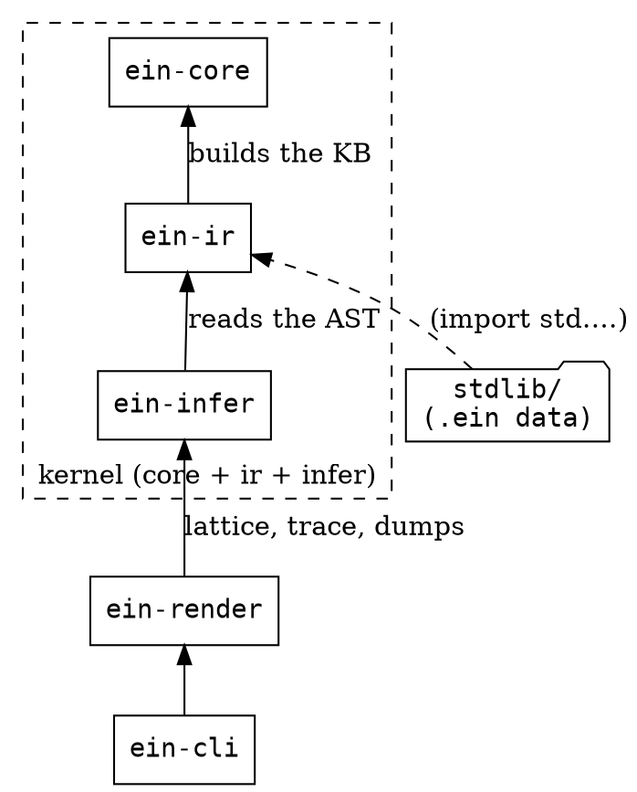
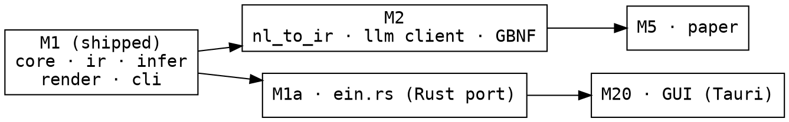

# Ein — architecture overview

The **structural** map of the codebase: *where* each concern lives and how a
`.ein` file becomes an answer. This complements
[`README.md`](README.md) — the *reading-order* doc (what to read in what
order) — by answering "where do I look to change X?".

> **Audience: engine contributors.** Puzzle authors want
> [`ir/03-ein-lang/`](ir/03-ein-lang/) (the surface language) instead.

## Data flow — `.ein` source → answer


```dot
digraph dataflow {
  rankdir=LR;
  node [shape=box, fontname="monospace"];

  src   [label=".ein source", shape=note];
  ast   [label="typed AST\n(SForm tuple)"];
  kb    [label="KnowledgeBase\n(facts + indexes)"];
  sat   [label="reasoning facts\n(saturation fixpoint)"];
  verd  [label="verdict\nSolution / Ambiguity / Contradiction"];
  out   [label="stdout table\n+ markdown trace", shape=note];

  src  -> ast  [label="ein_ir::parse"];
  ast  -> kb   [label="ein_ir::from_ir"];
  kb   -> sat  [label="ein_infer:\nEngine::compile_all\n→ Saturator::saturate"];
  sat  -> verd [label="hypgen → apriori →\ncommitment → solve"];
  verd -> out  [label="ein_render + ein_cli"];
}
```

Each arrow names the **crate** that owns the transform:
[`ein-ir`](../../ein.rs/crates/ein-ir/) parses and loads,
[`ein-core`](../../ein.rs/crates/ein-core/) stores,
[`ein-infer`](../../ein.rs/crates/ein-infer/) saturates and searches,
[`ein-render`](../../ein.rs/crates/ein-render/) + `ein-cli` render. The verdict
is read from the model count `k` — never chosen by a flag (see
[`README.md`](README.md)).

> **Driving this pipeline from another program** means one of two things.
> From **Rust**, link the crates — the surface M20's Tauri backend and M10's
> `ein-bench` use, documented by
> [S1a.9.4](../history/m1a_rust/README.md#s1a94--documentation).
> From **anything else**, run the `ein` binary and read
> `--json-summary` / [`--events`](inference/events.md). The Python embedding
> contract in [`docs/api/`](../api/) is **a record, not a live surface**: its
> PyO3 successor was deferred on 2026-08-21
> ([Q-M1a.23](../history/m1a_rust/open_questions.md#q-m1a23--when-does-the-engine-need-a-python-binding)).

## Crate dependency map


```dot
digraph deps {
  rankdir=BT;
  node [shape=box, fontname="monospace"];
  subgraph cluster_kernel {
    label="kernel (core + ir + infer)"; style=dashed;
    core [label="ein-core"]; ir [label="ein-ir"]; infer [label="ein-infer"];
  }
  stdlib [label="stdlib/\n(.ein data)", shape=folder];
  render [label="ein-render"]; cli [label="ein-cli"];

  ir     -> core   [label="builds the KB"];
  infer  -> ir     [label="reads the AST"];
  render -> infer  [label="lattice, trace, dumps"];
  cli    -> render;
  stdlib -> ir     [label="(import std.…)", style=dashed];
}
```

The stack is **linear**: each crate depends on every crate below it and on
nothing above.

- **`ein-core`** depends on nothing (workspace-internally): interning, `Value`
  / `FactId`, the layered COW KB, provenance, the two CPython-compatibility
  renderers, and — since M1d S1d.2.4 — `:why` template substitution
  (`render_why`), which lived in `ein-render` until the obligation pass needed
  to render a sentence from *below* it.
- **`ein-ir`** parses, expands macros, resolves imports, and loads — it builds
  the KB directly rather than handing an AST to a separate loader, which is
  why it sits *above* the data model where the Python `ir/` sat beside it.
- **`ein-infer`** is the only writer of derived facts.
- **`ein-render`** owns every rendering: the DOT views, the markdown trace, the
  state and lattice dumps, the JSON summary. `ein_render::render_why` is a
  re-export of `ein-core`'s and still the name to use.
- **`ein-cli`** orchestrates; **`stdlib/`** is `.ein` *data* the loader pulls in.

Two more crates are **dev-only** and no shipped binary links them: `ein-corpus`
(the manifest, the fixture helpers, the bench set) and `ein-parity` (the one
implementation of what counts as a derivation's *narration* rather than its
content).

The **kernel boundary** (`ein-core` + `ein-ir` + `ein-infer`) is what every
milestone builds on; everything else (`ein-cli`, `ein-render`, tests) is the
surface.

## Milestone boundaries — which crates each adds


```dot
digraph milestones {
  rankdir=LR; node [shape=box, fontname="monospace"];
  M1 [label="M1 (shipped)\ncore · ir · infer\nrender · cli"];
  M2 [label="M2\nnl_to_ir · llm client · GBNF"];
  M1 -> M2;
  M1a [label="M1a · ein.rs (Rust port)"];
  M20 [label="M20 · GUI (Tauri)"];
  M5 [label="M5 · paper"];
  M1 -> M1a -> M20; M2 -> M5;
}
```

- **M1** (this kernel) — the engine described in `docs/kernel/`. **Shipped**:
  `zebra2.ein` solves end-to-end; its solution / gaps / contradiction all read
  off one run.
- **M2** — NL → IR: an LLM extractor under GBNF constraint produces IR; no new
  *kernel* module, a new front-end consuming it.
- **M1a / M20 / M5** — Rust port / GUI / paper (out of the kernel tree).
- **M3** (SMT slice: `IR → SMT-LIB` with a hybrid driver) was **dropped
  2026-08-18**. There is no solver back-end and no planned one; the kernel
  is the whole reasoner.

Roadmap detail: [`plans/`](../../plans/README.md).

## The closure/worlds seam

> **Status: shipped 2026-08-17** — until then a parked target picture.
> Recorded from
> REVIEW_M1-01 §6 by
> P1.21 R6 (investigation:
> `r6_seam.md`),
> then **built** by
> P1.21 S1.21.8
> (purely-positive closure + boundary NAF re-eval). The *as-built* two-layer
> picture stays in
> [`inference/architecture_and_algorithms.md` §2](inference/architecture_and_algorithms.md#2-architecture-and-the-main-steps);
> this section records the seam itself, which modules own its nodes, and the
> places the layout still **leaks** across it — **L2–L4 stand**; L1 is
> closed, L5 resolved, L6 half.

The seam, as built:

```text
                 ┌───────────────┐
                 │   ein-lang    │
                 └───────┬───────┘
                         │
                    typed IR
                         │
                 ┌───────▼───────┐
                 │      KB       │
                 │ ground atoms  │
                 └───────┬───────┘
                         │
       ┌─────────────────┴─────────────────┐
       │                                   │
┌──────▼──────┐   NAF sits on this  ┌──────▼──────┐
│ monotone    │◄─── boundary ──────►│ assumptions │
│ closure     │  the admission      │ / worlds    │
│ Datalog-ish │  phase (S1.21.8)    │ lattice     │
└──────┬──────┘                     └──────┬──────┘
       │                                   │
       └───────────────┬───────────────────┘
                       │
                 complete model
                       │
                 canonical key   ← canon::state_key (shipped, P1.21 R1)
                       │
             models / refutations
```

This was never an aspiration — it is a near-literal description of the
as-built layout, and since S1.21.8 the boundary itself is a *phase* — the one
place `(absent …)` is answered — rather than an emergent property of
evaluation order. Every seam node maps onto one or two modules; the residual
debt is the **leak list** below, where the two layers still interpenetrate.

### Module mapping

| seam node | modules | state |
|---|---|---|
| ein-lang → typed IR | [`ein-ir`](../../ein.rs/crates/ein-ir/src/) (`lex.rs`, `parse.rs`, `ast.rs`, `macros.rs`) | **clean** — the frontend reads no engine state |
| typed IR → KB (ground atoms) | [`ein-ir/from_ir.rs`](../../ein.rs/crates/ein-ir/src/from_ir.rs), [`ein-core/kb.rs`](../../ein.rs/crates/ein-core/src/kb.rs), `ein-core/entities.rs`, [`ein-core/prov.rs`](../../ein.rs/crates/ein-core/src/prov.rs) | **leaks L2** — the ground-atom store carries worlds-layer state; provenance now also carries a firing's *negative* dependence (the boundary queries, S1.21.8 — **L6** half) |
| monotone closure (Datalog-ish) | [`ein-infer/compile.rs`](../../ein.rs/crates/ein-infer/src/compile.rs), [`match_.rs`](../../ein.rs/crates/ein-infer/src/match_.rs), [`saturator.rs`](../../ein.rs/crates/ein-infer/src/saturator.rs), [`engine.rs`](../../ein.rs/crates/ein-infer/src/engine.rs), `firing.rs`, [`contradiction.rs`](../../ein.rs/crates/ein-infer/src/contradiction.rs), `predicates.rs`, `plan.rs` | **clean since S1.21.8** — `Plan::steps` is the purely positive residue compilation leaves after lifting the guards out; the closure runs to quiescence consulting no negation (**L1** closed) |
| the NAF boundary itself | [`saturator.rs`](../../ein.rs/crates/ein-infer/src/saturator.rs) (`admit_from_boundary` / `first_failing` / `negative_premises`), the guard lift in [`compile.rs`](../../ein.rs/crates/ein-infer/src/compile.rs) + [`NafGuard`](../../ein.rs/crates/ein-infer/src/plan.rs), [`Matcher::holds`](../../ein.rs/crates/ein-infer/src/match_.rs) | **new, clean (S1.21.8)** — the one place `(absent …)` is answered, and only against a positive fixpoint. ein.py named it `world.World`; the port asks the KB at quiescence directly, which is the same three questions without the wrapper |
| assumptions / worlds lattice | [`solve.rs`](../../ein.rs/crates/ein-infer/src/solve.rs), [`commitment.rs`](../../ein.rs/crates/ein-infer/src/commitment.rs), [`apriori.rs`](../../ein.rs/crates/ein-infer/src/apriori.rs), [`nogoods.rs`](../../ein.rs/crates/ein-infer/src/nogoods.rs), [`hypgen.rs`](../../ein.rs/crates/ein-infer/src/hypgen.rs), [`lookahead.rs`](../../ein.rs/crates/ein-infer/src/lookahead.rs), `hrule.rs`, `closed.rs`, [`naf_deps.rs`](../../ein.rs/crates/ein-infer/src/naf_deps.rs) | **clean core, leaking rim** — `try_commitment_set` is a pure fork-write-saturate world transition and `apriori`/`nogoods` are pure set arithmetic; the rim still leaks **L3**, and **L6** is only half-closed (recorded, not interpreted) |
| complete model | [`hypgen.rs`](../../ein.rs/crates/ein-infer/src/hypgen.rs) (`complete` / `open_hypotheses` / `is_solution_node`) | **leaks L4** — defined *operationally through the worlds-layer generator*; evaluating it can mutate the KB under test (its NAF half — the lookahead's world — is fixed, D3) |
| canonical key | [`canon.rs`](../../ein.rs/crates/ein-infer/src/canon.rs) (`state_key`) | **clean since P1.21 R1** — identity is the sorted canonical fact list itself, never a hash; but L4 taints its *input* |
| models / refutations | [`verdict.rs`](../../ein.rs/crates/ein-infer/src/verdict.rs), [`solve.rs`](../../ein.rs/crates/ein-infer/src/solve.rs), [`explain.rs`](../../ein.rs/crates/ein-infer/src/explain.rs), [`ein-render/trace/`](../../ein.rs/crates/ein-render/src/trace/) | **clean** — the verdict is read off the deduped model count `k`; the query `:goal` only projects afterwards |

### Leak list

The six places the layers interpenetrate (P1.21 R6 census; the headline
closed by S1.21.8, one resolved by R2, one half-closed, three standing):

- **L1 — NAF inside the closure matcher** (the headline) — ✅ **closed
  2026-08-17** by S1.21.8. `(absent …)` used to compile to a guard opcode
  *inside* the plan's steps, be evaluated by the matcher against the
  transient mid-saturation KB, be re-evaluated at fire time, and force a full
  re-match of any plan watching a delta through a guard — so the closure's
  output depended on what its world *lacked*. Now:
  [compilation](../../ein.rs/crates/ein-infer/src/compile.rs) lifts every
  top-level guard out into the disjunct's
  [`NafGuard`](../../ein.rs/crates/ein-infer/src/plan.rs) list, leaving a
  purely positive Scan/Join/Guard plan; the saturator runs that closure to
  quiescence and only then judges parked candidates against the resulting
  fixpoint
  ([`admit_from_boundary`](../../ein.rs/crates/ein-infer/src/saturator.rs),
  one admission per round); the fire-time re-check and the absent-flip
  full-match split are **deleted, not bypassed**, leaving `naf_dropped`
  structurally 0 beside the `naf_rounds` / `naf_admitted` / `naf_retired`
  observables. Contract and consequences:
  [`absent_semantics.md`](inference/absent_semantics.md) and
  [§NAF at the boundary](#naf-at-the-boundary--how-it-works) below.
- **L2 — worlds state stored inside the KB** — **still open.**
  The no-good store lives in the ground-atom store and is **fork-shared by
  reference** ([`kb.rs`](../../ein.rs/crates/ein-core/src/kb.rs); a snapshot
  copies); the negated-fact index doubles as a closure index (contradiction
  detection, matcher) *and* the search's dead-hypothesis cache
  ([`hypgen`](../../ein.rs/crates/ein-infer/src/hypgen.rs)); the solver config
  rides along in the store.
- **L3 — worlds → root writebacks keyed by magic provenance strings** —
  **still open** (S1.21.8 did not touch it).
  `<monotonic-unconditional>` (singleton-nogood death),
  `<lookahead-dies-immediately>` (kill cache), `<forced-positive>`
  (promotion) — each individually sound
  ([`solve.rs`](../../ein.rs/crates/ein-infer/src/solve.rs),
  [`hypgen.rs`](../../ein.rs/crates/ein-infer/src/hypgen.rs)), but each is an
  unannounced world transition whose closure consequences are re-derived by
  ad-hoc re-saturations rather than by a declared boundary re-eval point.
  What did improve: each of those re-saturations is now a fresh two-phase
  run, so every guard is re-asked against the post-writeback fixpoint
  instead of against whatever the old KB happened to hold — but the
  transition is still silent, and facts already derived through an absence
  the writeback invalidates are not retracted (no truth maintenance, E3).
- **L4 — `complete()` re-enters the worlds layer and can mutate the model
  under test** — **still open.** `complete(kb)` ≡ "hypgen proposes nothing"
  ([`hypgen.rs`](../../ein.rs/crates/ein-infer/src/hypgen.rs)); generation
  runs the one-step lookahead and, with the **default-on**
  `enable_lookahead_kill_cache`
  ([`config.rs`](../../ein.rs/crates/ein-core/src/config.rs)), writes
  `(not h)` facts into the KB being checked — *before* the node record
  takes that same KB's `state_key`
  ([`solve.rs`](../../ein.rs/crates/ein-infer/src/solve.rs)).
  S1.21.8 fixed the NAF half of the sharp edge (divergence **D3**:
  [`lookahead.rs`](../../ein.rs/crates/ein-infer/src/lookahead.rs) now evaluates
  a rule's guards in the world *with* `h` — no match in `kb` **and** `h`
  creates none — and skips a disjunct whose nested absent it cannot decide,
  losing a kill rather than guessing). The writeback itself stands.
- **L5 — docs claimed the retired root-merge** — **resolved 2026-08-16**:
  P1.21 R2 retired the `unconditional_facts` extraction and synced the docs
  ([README §Unconditional facts — retired](inference/README.md#unconditional-facts--retired-s157--p121-r2)).
- **L6 — no negative provenance** — **half-closed 2026-08-17.** The missing
  object now exists: a firing admitted at the boundary records the queries
  that had to fail on its
  [provenance](../../ein.rs/crates/ein-core/src/prov.rs) (built by the
  saturator's `negative_premises`, passed through `fire`), so
  `Deps(Y) = PositiveDeps(Y) ∪ NegativeDeps(Y)` is finally *representable*.
  What is **not** done is the other half: no walk interprets it.
  The unsat core and the trace's "using" line still read
  positive premises only, so the two consequences this leak caused —
  `unconditional_facts` (retired as unsound, R2) and deletion-based MUS
  minimisation ([`explain.rs`](../../ein.rs/crates/ein-infer/src/explain.rs),
  corollary C3) — are now **revisit-able, not revisited**. Recording makes
  NAF-dependence visible; honouring it is future work
  ([`absent_semantics.md`](inference/absent_semantics.md) C2/C3).

### NAF at the boundary — how it works

The review's normative point, now the implementation: **NAF sits on the
closure/world boundary**, not disguised as a positive-premise variant inside
the closure. A guard used to be judged against *"the KB as of this dequeue"*,
which is not a world at all; it is now judged only against a **saturated
world** `W`, which makes the epistemic reading `W ⊭ ∃x̄.Pθ` literal rather
than approximated. [`inference/absent_semantics.md`](inference/absent_semantics.md)
is that boundary's **contract** — re-grounded by S1.21.8, and the place to
read what `(absent …)` means: there is now exactly **one** evaluation point
(E1, at the boundary), E2 (fire-time re-check) and corollaries C4/C5 are
retired, and C2 is re-grounded on the recorded negative premises.

The four moving parts, and where each lives:

| step | module | what it does |
|---|---|---|
| compile split | the guard lift in [`compile.rs`](../../ein.rs/crates/ein-infer/src/compile.rs) → [`NafGuard`](../../ein.rs/crates/ein-infer/src/plan.rs) (`scope_of` / `watched` / `monotone`), per-`Disjunct` | lifts every top-level `(absent …)` out of each disjunct, leaving a purely positive closure plan; `scope_of` re-projects the bindings at evaluation time, so lifting is exactly as strong as evaluating in place. A *nested* absent (what `forall` desugars to) is not lifted — it is part of the negative query |
| the boundary query | [`Matcher::holds`](../../ein.rs/crates/ein-infer/src/match_.rs), and `first_failing` over a guard span | the existential the guard is judged by, asked of the KB **at a quiescence point** under the guard's projected bindings. ein.py wrapped this as a `World` value; the port asks the KB directly, because the boundary phase is the only code that runs there |
| two-phase saturation | [`Saturator::step`](../../ein.rs/crates/ein-infer/src/saturator.rs) (`closure_step` → `admit_from_boundary`), mirrored by the queue-less [`Engine::step`](../../ein.rs/crates/ein-infer/src/engine.rs) | closure fires to quiescence consulting no negation; parked candidates are then judged against that fixpoint and **one** is admitted, so it fires into an empty queue against exactly the world it was judged in. A candidate rejected by a purely positive guard is *retired* (that guard can never pass again); a `forall`-shaped one stays parked, re-asked only when a relation in its `watched` set has grown |
| negative provenance | `Saturator::negative_premises` → the firing's [provenance](../../ein.rs/crates/ein-core/src/prov.rs) via `fire` | records what the firing depended on *not* holding — see **L6**: recorded, not yet interpreted |

Three consequences worth knowing before writing rules. Priority-band
discipline is **advisory**: on a stratified program the result no longer
depends on rule priority, only the firing *order* does. A rule that used to
fire because its watched fact had not been derived *yet* no longer does —
the closure is complete before any guard is asked. And a non-stratified
program is still answered by operational order (now boundary-admission
order): the engine reports one model where several exist and does not say
so, which is why
[`naf_deps`](../../ein.rs/crates/ein-infer/src/naf_deps.rs) and its
derived-NAF warning survive — re-grounded from a soundness warning into a
*stratification* one. A static stratification checker remains future work.

Shipped and measured as
P1.21 S1.21.8:
acceptance 17/17 with verdicts unchanged, 1342 unit tests and **zero**
xfails, `naf_dropped` structurally 0 — and *faster*, because dropping the
absent-flip full-match split more than pays for the boundary evaluations
(exhaustive `zebra2` solve ~10.4 s → ~8.5 s; acceptance gate 130 s → 91 s).

> Those five numbers were **measured on the Python engine**, which is the one
> S1.21.8 changed; they are frozen, and nothing in the tree can re-run them.
> What is live is the *shape* of the claim — `naf_dropped` structurally 0, and
> the verdicts — both of which `cargo test --workspace` still checks.

### Why the seam is worth naming (ex-"M3 implication")

Written when M3 (SMT integration) was scheduled: each seam side has an
obvious SMT counterpart (closure → quantified Horn axioms /
pre-grounding; worlds lattice → assumption literals +
`check-sat-assuming`, nogoods → learned clauses; `StateKey` → blocking
clauses for model enumeration), and the NAF boundary was *the* reason the
seam had to be explicit before any such translation: classical logic has
no NAF, and `(absent P)` is sound only under a Clark-completion axiom
scoped to the boundary's world.

**M3 was dropped 2026-08-18**, so no translation is planned — but the
argument outlives its motivation, because it is really a statement about
the kernel: the scope of a negative conclusion is a *nameable object*
here — the saturated world a guard was judged in, with the failing queries
it depended on recorded on the conclusion — rather than an implicit moment
in the saturation order. That is what makes the engine's negation
explainable at all, whatever consumes it. The edge-by-edge table is in
`r6_seam.md` §3 (and the dropped milestone's Q30 in git history).

## "Where do I look?" — change cookbook

| I want to…                          | files to touch |
|-------------------------------------|----------------|
| add/adjust a **puzzle** rule        | the `.ein` file itself, or import from [`stdlib/`](../../stdlib/) |
| add a **stdlib** rule/module        | `stdlib/<m>.ein` + a `tests/` exercise; document in [`ir/03-ein-lang/07_stdlib_api.md`](ir/03-ein-lang/07_stdlib_api.md) |
| add a **kernel primitive** (`absent`-like) | `ein-core/src/terms.rs` (the reserved atom) or `ein-infer/src/predicates.rs` + `compile.rs` + `match_.rs` + tests; a *negative* one also touches the saturator's boundary phase |
| add a **top-level IR form**         | `ein-ir/src/{lex,parse,ast}.rs` + `from_ir.rs` (routing) + tests; update [`ir/03-ein-lang/00_ebnf.md`](ir/03-ein-lang/00_ebnf.md) and [`06_reserved_names.md`](ir/03-ein-lang/06_reserved_names.md) |
| change **saturation order**         | `ein-infer/src/saturator.rs` (priority bands) |
| change **search / verdict**         | `ein-infer/src/solve.rs` + `verdict.rs` |
| add a **config knob**               | `ein-core/src/config.rs` (`SolverConfig`) + its read site + the CLI flag in `ein-cli/src/cmdline.rs` |
| add a **contradiction shape**       | `ein-infer/src/contradiction.rs` |
| add a **render target**             | `ein-render/src/` + wire into `ein-cli/src/render.rs` |
| add a **CLI subcommand**            | `ein-cli/src/<cmd>.rs` + dispatch in `cmdline.rs` |

Every one of these also lands in `cargo test --workspace`, which is the whole
gate: the corpus sweep through the CLI, the shape digests, the goldens and the
manifest's own invariants.

The per-module detail behind these is
[`inference/implementation.md`](inference/implementation.md) (engine) and
[`ir/02-data-model/`](ir/02-data-model/) (KB).

## See also

- [`README.md`](README.md) — the reading-order companion to this structural doc.
- [`inference/architecture_and_algorithms.md`](inference/architecture_and_algorithms.md)
  — the engine's algorithmic (O1–O9) view.
- [`inference/implementation.md`](inference/implementation.md) — the engine's module map.
- [`defined_behaviour.md`](defined_behaviour.md) — the thirteen behaviours the
  Python source used to be the only statement of.
- [`../api/`](../api/) — the Python embedding contract (this pipeline as a
  library API; **implemented by [P1a.9](../history/m1a_rust/README.md#p1a9--release)**, not yet by anything).
- [`glossary.md`](glossary.md) — kernel vocabulary.
- [`plans/README.md`](../../plans/README.md) — the milestone roadmap.
