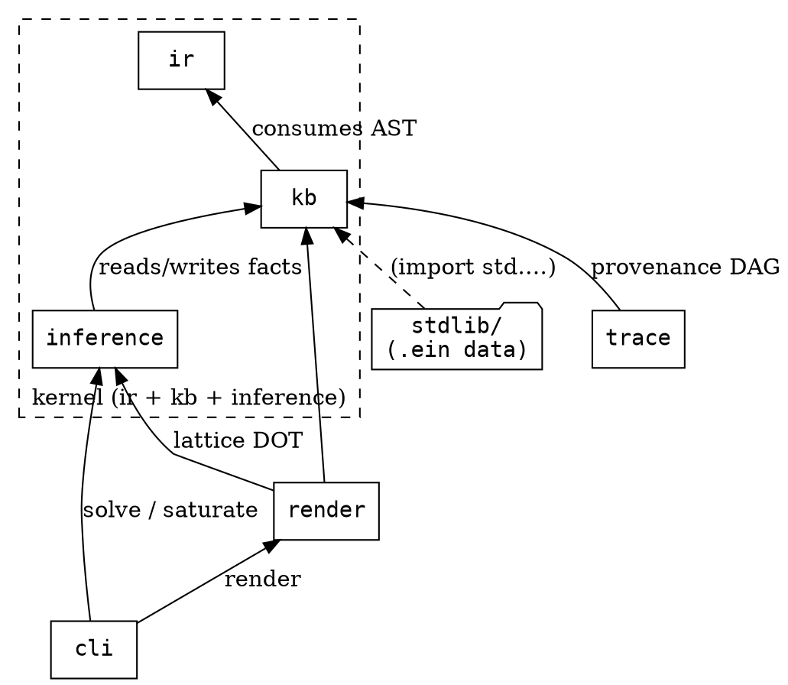
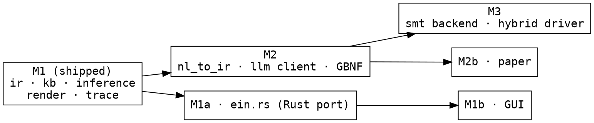

# Ein — architecture overview

The **structural** map of the codebase: *where* each concern lives and how a
`.ein` file becomes an answer. This complements
[`README.md`](README.md) — the *reading-order* doc (what to read in what
order) — by answering "where do I look to change X?".

> **Audience: engine contributors.** Puzzle authors want
> [`ir/03-ein-lang/`](ir/03-ein-lang/) (the surface language) instead.

## Data flow — `.ein` source → answer


```dot
digraph dataflow {
  rankdir=LR;
  node [shape=box, fontname="monospace"];

  src   [label=".ein source", shape=note];
  ast   [label="typed AST\n(SForm tuple)"];
  kb    [label="KnowledgeBase\n(facts + indexes)"];
  sat   [label="reasoning facts\n(saturation fixpoint)"];
  verd  [label="verdict\nSolution / Ambiguity / Contradiction"];
  out   [label="stdout table\n+ markdown trace", shape=note];

  src  -> ast  [label="ir.parse"];
  ast  -> kb   [label="kb.from_ir"];
  kb   -> sat  [label="inference:\nEngine.compile_all\n→ Saturator.saturate"];
  sat  -> verd [label="hypgen → apriori →\ncommitment → monotonic.solve"];
  verd -> out  [label="trace/ + cli/"];
}
```

Each arrow names the **package** that owns the transform:
[`ir/`](../../ein.py/src/ein/ir/) parses, [`kb/`](../../ein.py/src/ein/kb/)
loads + stores, [`inference/`](../../ein.py/src/ein/inference/) saturates and
searches, [`trace/`](../../ein.py/src/ein/trace/) + `cli/` render. The verdict is
read from the model count `k` — never chosen by a flag (see [`README.md`](README.md)).
Each arrow is a public Python call: driving this pipeline from another
project is the **embedding contract** in [`docs/api/`](../api/) (`parse` →
`KnowledgeBase.from_ir` → `Saturator.saturate` → `monotonic.solve` →
`trace.linearize`).

## Package dependency map


```dot
digraph deps {
  rankdir=BT;
  node [shape=box, fontname="monospace"];
  subgraph cluster_kernel {
    label="kernel (ir + kb + inference)"; style=dashed;
    ir; kb; inference;
  }
  stdlib [label="stdlib/\n(.ein data)", shape=folder];
  render; trace; cli;

  kb        -> ir        [label="consumes AST"];
  inference -> kb        [label="reads/writes facts"];
  render    -> kb;
  render    -> inference [label="lattice DOT"];
  trace     -> kb        [label="provenance DAG"];
  cli       -> inference [label="solve / saturate"];
  cli       -> render    [label="render"];
  stdlib    -> kb        [label="(import std.…)", style=dashed];
}
```

- **`ir/`** depends on nothing else (pure parse/AST/dump/DOT).
- **`kb/`** consumes the AST; owns entities, the 7 indexes, provenance, imports.
- **`inference/`** is the only writer of reasoning-layer facts; depends on `kb`.
- **`render/` + `trace/`** read `kb` (+ `inference` for the lattice view).
- **`cli/`** orchestrates; **`stdlib/`** is `.ein` *data* the loader pulls in.

The **kernel boundary** (`ir` + `kb` + `inference`) is what every milestone
builds on; everything else (`cli`, `render`, `trace`, tests) is the surface.

## Milestone boundaries — which modules each adds


```dot
digraph milestones {
  rankdir=LR; node [shape=box, fontname="monospace"];
  M1 [label="M1 (shipped)\nir · kb · inference\nrender · trace"];
  M2 [label="M2\nnl_to_ir · llm client · GBNF"];
  M3 [label="M3\nsmt backend · hybrid driver"];
  M1 -> M2 -> M3;
  M1a [label="M1a · ein.rs (Rust port)"];
  M1b [label="M1b · GUI"];
  M2b [label="M2b · paper"];
  M1 -> M1a -> M1b; M2 -> M2b;
}
```

- **M1** (this kernel) — the engine described in `docs/kernel/`. **Shipped**:
  `zebra2.ein` solves end-to-end; its solution / gaps / contradiction all read
  off one run.
- **M2** — NL → IR: an LLM extractor under GBNF constraint produces IR; no new
  *kernel* module, a new front-end consuming it.
- **M3** — SMT slice: `IR → SMT-LIB`, a hybrid driver handing `(hard-slice …)`
  to Z3/clingo with explanation recovery back to IR.
- **M1a / M1b / M2b** — Rust port / GUI / paper (out of the kernel tree).

Roadmap detail: [`plans/`](../../plans/README.md).

## The closure/worlds seam (target architecture)

> **Status: target picture, parked — not shipped behaviour.** Recorded from
> [REVIEW_M1-01 §6](../../plans/m1_core_graph_reasoning/REVIEW_M1-01.md) by
> P1.21 R6 (investigation:
> [`r6_seam.md`](../../plans/m1_core_graph_reasoning/p1.21_review_response/reports/r6_seam.md)).
> The *as-built* two-layer picture stays in
> [`inference/architecture_and_algorithms.md` §2](inference/architecture_and_algorithms.md#2-architecture-and-the-main-steps);
> this section records where the engine is **heading**, the places today's
> layout **leaks** across the seam, and the parked engineering track
> ([P1.21 S1.21.8](../../plans/m1_core_graph_reasoning/p1.21_review_response/s1.21.8_boundary_naf.md))
> that would close the gap.

The review's target seam:

```text
                 ┌───────────────┐
                 │   ein-lang    │
                 └───────┬───────┘
                         │
                    typed IR
                         │
                 ┌───────▼───────┐
                 │      KB       │
                 │ ground atoms  │
                 └───────┬───────┘
                         │
       ┌─────────────────┴─────────────────┐
       │                                   │
┌──────▼──────┐   NAF sits on this  ┌──────▼──────┐
│ monotone    │◄─── boundary ──────►│ assumptions │
│ closure     │                     │ / worlds    │
│ Datalog-ish │                     │ lattice     │
└──────┬──────┘                     └──────┬──────┘
       │                                   │
       └───────────────┬───────────────────┘
                       │
                 complete model
                       │
                 canonical key   ← canon.StateKey (shipped, P1.21 R1)
                       │
             models / refutations
```

This is not an aspiration — it is a near-literal description of the as-built
package layout. Every seam node maps onto one or two modules; the debt is
the **leak list** below, where the two layers interpenetrate.

### Module mapping

| seam node | modules (`ein.py/src/ein/`) | state |
|---|---|---|
| ein-lang → typed IR | [`ir/`](../../ein.py/src/ein/ir/) (`parser.py`, `ast.py`, `types.py`, `macros.py`) | **clean** — `ir/` depends on nothing (dependency map above) |
| typed IR → KB (ground atoms) | [`kb/from_ir.py`](../../ein.py/src/ein/kb/from_ir.py), [`kb/store.py`](../../ein.py/src/ein/kb/store.py), `kb/entities.py`, [`kb/provenance.py`](../../ein.py/src/ein/kb/provenance.py) | **leaks L2** — the ground-atom store carries worlds-layer state |
| monotone closure (Datalog-ish) | [`inference/compile.py`](../../ein.py/src/ein/inference/compile.py), [`match.py`](../../ein.py/src/ein/inference/match.py), [`saturator.py`](../../ein.py/src/ein/inference/saturator.py), [`engine.py`](../../ein.py/src/ein/inference/engine.py), `firing.py`, [`contradiction.py`](../../ein.py/src/ein/inference/contradiction.py), `predicates.py`, `primitives.py`, `resolve.py` | **leaks L1** — NAF is evaluated *inside* the closure; it is not purely positive |
| assumptions / worlds lattice | [`monotonic/`](../../ein.py/src/ein/inference/monotonic/) (`solver.py`, `_helpers.py`, `_state.py`, `lattice.py`), [`commitment.py`](../../ein.py/src/ein/inference/commitment.py), [`apriori.py`](../../ein.py/src/ein/inference/apriori.py), [`nogoods.py`](../../ein.py/src/ein/inference/nogoods.py), [`hypgen.py`](../../ein.py/src/ein/inference/hypgen.py), [`lookahead.py`](../../ein.py/src/ein/inference/lookahead.py), `hrule.py`, `closed.py`, [`naf_deps.py`](../../ein.py/src/ein/inference/naf_deps.py) | **clean core, leaking rim** — `try_commitment_set` is a pure fork-write-saturate world transition and `apriori`/`nogoods` are pure set arithmetic; the rim leaks **L3**, **L6** |
| complete model | [`solution.py`](../../ein.py/src/ein/inference/solution.py) (`complete` / `open_hypotheses` / `is_solution_node`) | **leaks L4** — defined *operationally through the worlds-layer generator*; evaluating it can mutate the KB under test |
| canonical key | [`canon.py`](../../ein.py/src/ein/inference/canon.py) (`state_key` → `StateKey`) | **clean since P1.21 R1** — identity is the sorted canonical fact tuple itself, never a hash; but L4 taints its *input* |
| models / refutations | [`verdict.py`](../../ein.py/src/ein/inference/verdict.py), [`monotonic/_state.py`](../../ein.py/src/ein/inference/monotonic/_state.py) (`verdict_of`), [`frontier.py`](../../ein.py/src/ein/inference/frontier.py), [`trace/`](../../ein.py/src/ein/trace/) | **clean** — the verdict is read off the deduped model count `k`; the query `:goal` only projects afterwards |

### Leak list

The six places the layers interpenetrate (P1.21 R6 census; two already
closed by sibling P1.21 tasks):

- **L1 — NAF inside the closure matcher** (the headline). `(absent P)`
  compiles to an `AbsentGuard` opcode *inside* `JoinPlan.steps`
  ([`compile.py`](../../ein.py/src/ein/inference/compile.py)); the matcher
  evaluates it against the transient mid-saturation KB
  ([`match._run_steps`](../../ein.py/src/ein/inference/match.py)); the
  saturator re-evaluates at fire time (`absents_still_pass`,
  `Saturator.naf_dropped`) and must full-match any plan watching a delta
  through a guard
  ([`saturator._absent_relations`](../../ein.py/src/ein/inference/saturator.py)).
  The closure's output on a branch therefore depends on what the branch's
  world *lacks* — it is not purely positive. Every other leak's cost is
  downstream of this placement.
- **L2 — worlds state stored inside the KB.** `KnowledgeBase._nogoods`
  lives in the ground-atom store and is **fork-shared by reference**
  ([`store.fork`](../../ein.py/src/ein/kb/store.py); `snapshot` copies);
  `_negated_facts` doubles as a closure index (contradiction detection,
  matcher) *and* the search's dead-hypothesis cache
  ([`hypgen`](../../ein.py/src/ein/inference/hypgen.py)); `kb.config` rides
  along in the store.
- **L3 — worlds → root writebacks keyed by magic provenance strings.**
  `<monotonic-unconditional>` (singleton-nogood death),
  `<lookahead-dies-immediately>` (kill cache), `<forced-positive>`
  (promotion) — each individually sound
  ([`monotonic/_helpers.py`](../../ein.py/src/ein/inference/monotonic/_helpers.py),
  [`hypgen.py`](../../ein.py/src/ein/inference/hypgen.py)), but each is an
  unannounced world transition whose closure consequences are re-derived by
  ad-hoc re-saturations rather than by a declared boundary re-eval point.
- **L4 — `complete()` re-enters the worlds layer and can mutate the model
  under test.** `complete(kb)` ≡ "hypgen proposes nothing"
  ([`solution.py`](../../ein.py/src/ein/inference/solution.py));
  `generate_hypotheses` runs the one-step lookahead and, with the
  **default-on** `enable_lookahead_kill_cache`
  ([`config.py`](../../ein.py/src/ein/inference/config.py)), writes
  `(not h)` facts into the KB being checked — *before* `_record_node`
  takes that same KB's `state_key`
  ([`monotonic/solver.py`](../../ein.py/src/ein/inference/monotonic/solver.py)).
- **L5 — docs claimed the retired root-merge** — **resolved 2026-08-16**:
  P1.21 R2 retired the `unconditional_facts` extraction and synced the docs
  ([README §Unconditional facts — retired](inference/README.md#unconditional-facts--retired-s157--p121-r2)).
- **L6 — no negative provenance.** `Provenance` records positive premises
  only, so NAF-dependence is invisible to every provenance walk
  ([`absent_semantics.md`](inference/absent_semantics.md) corollary C2) —
  the root cause that made `unconditional_facts` unsound (retired, R2) and
  keeps deletion-based MUS minimisation unsound (C3,
  [`frontier.py`](../../ein.py/src/ein/inference/frontier.py)). The missing
  object is S1.21.8's `Deps(Y) = PositiveDeps(Y) ∪ NegativeDeps(Y)`.

### NAF's target position — the closure/world boundary

The review's normative point, adopted as the target: **NAF sits on the
closure/world boundary**, not disguised as a positive-premise variant
inside the closure. Today a guard is judged against *"the KB as of this
dequeue"* (evaluation points E1–E3); at the target the closure is purely
positive and monotone, and `(absent P)` is judged only against a
**saturated world** `W` at the boundary — making the fire-time-epistemic
reading `W ⊭ ∃x̄.Pθ` literal.
[`inference/absent_semantics.md`](inference/absent_semantics.md) (P1.21 R4)
is that boundary's **contract**: the worlds model, evaluation points E1–E3,
and corollaries C1–C7 are exactly the obligations a boundary implementation
must keep.

The engineering steps — compile split (`AbsentGuard`s lifted out of
`JoinPlan.steps` into per-plan `naf_guards`), alternating two-phase
saturation (positive inner loop to quiescence; parked guards judged against
the stalled world; outer loop to fixpoint), a `World` boundary contract
type, negative provenance, declared re-eval points at world transitions,
and the `naf_dropped → 0` measurement gate — are recorded, **parked, not
scheduled**, as
[P1.21 S1.21.8](../../plans/m1_core_graph_reasoning/p1.21_review_response/s1.21.8_boundary_naf.md).

### M3 implication

Each seam side has an obvious SMT counterpart (closure → quantified Horn
axioms / pre-grounding; worlds lattice → assumption literals +
`check-sat-assuming`, nogoods → learned clauses; `StateKey` → blocking
clauses for model enumeration) — and the NAF boundary is *the* reason the
seam must be explicit before M3: SMT has no NAF, and `(absent P)`
translates soundly only under a Clark-completion axiom scoped to the
boundary's world. Recorded as
[M3 Q30](../../plans/m3_smt_integration/open_questions.md#q30--seam--smt-mapping-clark-completion-at-the-naf-boundary);
the edge-by-edge table is in
[`r6_seam.md` §3](../../plans/m1_core_graph_reasoning/p1.21_review_response/reports/r6_seam.md).

## "Where do I look?" — change cookbook

| I want to…                          | files to touch |
|-------------------------------------|----------------|
| add/adjust a **puzzle** rule        | the `.ein` file itself, or import from [`stdlib/`](../../ein.py/src/ein/stdlib/) |
| add a **stdlib** rule/module        | `ein.py/src/ein/stdlib/<m>.ein` + a `tests/` exercise; document in [`ir/03-ein-lang/07_stdlib_api.md`](ir/03-ein-lang/07_stdlib_api.md) |
| add a **kernel primitive** (`absent`-like) | `inference/primitives.py` or `predicates.py` + `compile.py` + `match.py` + tests |
| add a **top-level IR form**         | `ir/grammar.lark` + `ir/ast.py` + `kb/from_ir.py` (routing) + tests; update [`ir/03-ein-lang/06_reserved_names.md`](ir/03-ein-lang/06_reserved_names.md) |
| change **saturation order**         | `inference/saturator.py` (priority bands) |
| change **search / verdict**         | `inference/monotonic/solver.py` + `inference/verdict.py` |
| add a **config knob**               | `inference/config.py` (`SolverConfig`) + its read site |
| add a **contradiction shape**       | `inference/contradiction.py` |
| add a **render target**             | `render/` + wire into `cli/render.py` |
| add a **CLI subcommand**            | `cli/<cmd>.py` + dispatch in `cli/__init__.py` |

The per-module detail behind these is
[`inference/python_impl.md`](inference/python_impl.md) (engine) and
[`ir/02-data-model/`](ir/02-data-model/) (KB).

## See also

- [`README.md`](README.md) — the reading-order companion to this structural doc.
- [`inference/architecture_and_algorithms.md`](inference/architecture_and_algorithms.md)
  — the engine's algorithmic (O1–O9) view.
- [`inference/python_impl.md`](inference/python_impl.md) — the engine's file map.
- [`../api/`](../api/) — the Python embedding contract (this pipeline as a library API).
- [`glossary.md`](glossary.md) — kernel vocabulary.
- [`plans/README.md`](../../plans/README.md) — the milestone roadmap.
