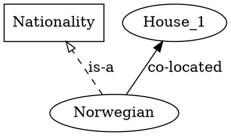
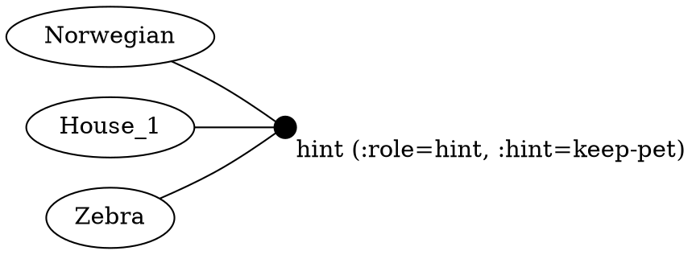
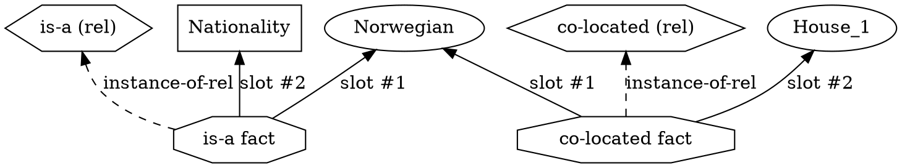
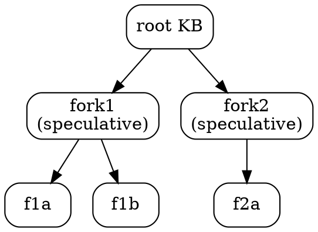
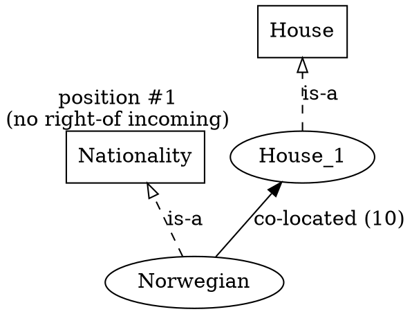
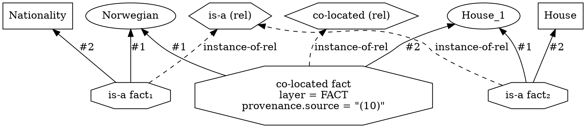

# Knowledge base — the graph

> **No language, no Python here.** This document describes what
> ein-bot's knowledge base *is*, in graph terms. The S-expression
> surface that authors it is in [`../03-ein-lang/`](../03-ein-lang/);
> the Python dataclasses that hold it are in
> [`../02-data-model/`](../02-data-model/). Read those after this.

A **knowledge base** is a typed labelled hypergraph — the substrate
the engine reasons over. It has five kinds of nodes and one kind of
labelled hyperedge. There are two equivalent renderings of it: a
**compact** view for readability, and a **detailed** Levi-bipartite
view that is the canonical form.

---

## 1. Kinds of nodes

Every part of the knowledge base is a node. This is the load-bearing
design choice — relations, types, and rules are not *labels on
edges*, they're first-class graph nodes, equal in standing with the
objects they classify. See the project's [graph-canonical
principle](../../../../docs/ideas/) and
[F4 Q34](../../../../plans/followups/f4_cross_cutting.md).

| kind         | what it represents                                                     | typical shape (compact view) |
|--------------|------------------------------------------------------------------------|-------------------------------|
| **Object**   | a concrete entity in the puzzle (Norwegian, House_1, Red)              | ellipse                       |
| **Type**     | a category that classifies objects (Nationality, House, Color)         | box                           |
| **Relation** | a named predicate that relates objects (`co-located`, `right-of`)      | round-rect (detailed view) / edge label (compact view) |
| **Rule**     | a graph rewriting rule (see [02_rules.md](02_rules.md))                | hexagon                       |
| **Fact**     | an *assertion* — an instance of a relation applied to specific objects | octagon (detailed view) / edge (compact view) |

The first three (objects, types, relations) populate the **ontology**
of the puzzle. Rules populate the engine's rewriting machinery.
Facts populate every layer (ontology / fact / reasoning — see §3).

## 2. Two views of the same graph

The same knowledge base can be drawn two ways, with different
trade-offs.

### 2.1 Compact view — for readers

In the compact view, **binary** facts collapse into single labelled
arrows. This is the rendering humans want when they're skimming a
puzzle: it looks like a small graph diagram, one node per object or
type, one arrow per relation instance.

Rules of the compact view:

- **Objects** drawn as ellipses (`╭ ╮`).
- **Types** drawn as boxes (`┌ ┐`).
- **`is-a` / instance-of** edges are dashed with an open arrowhead.
- **Binary relation facts** are labelled solid arrows between
  participants. The label is the relation's name; the relation node
  itself is *implicit* — collapsed into the arrow.
- **Relations are not drawn as nodes** in this view, only as edge
  labels.
- **Layer styling**: ontology = plain solid; fact-layer = solid
  coloured + the source-id badge ("(2)"); reasoning-layer = dashed
  with the rule name as label.

#### Hyperedges (arity ≥ 3) — partial compact

Ternary and higher facts can't be a single arrow. The compact view
keeps the *direct* binary arrows but introduces a small intermediate
node for n-ary cases:

Ein-bot's M1 use-cases are predominantly binary; n-ary facts are
exceptional and the diagram falls back to the **detailed view**
when arity > 2.

### 2.2 Detailed view — Levi-bipartite, canonical

In the **detailed view**, everything is a node and every fact gets
its own hyperedge-node with numbered edges to its participants. This
is the form the engine actually reasons over. It's verbose but
canonical: hyperedge participation is uniform, relations are
manipulable as nodes, and rule patterns (matchings of subgraphs) are
trivially expressible.

The same `Norwegian co-located House_1` fact in the detailed view:

Rules of the detailed view:

- **Every relation declaration** (`is-a`, `co-located`, `right-of`,
  …) is a node — round-rectangle, distinct from object nodes.
- **Every fact** is an **octagon** node. The fact's "head" — which
  relation it instantiates — is an edge from the fact-node to the
  relation node (the *instance-of-relation* edge, kept implicit in
  the compact view).
- **Each argument** of the fact is an edge from the fact-node to the
  argument's node, labelled by **slot number** (`#1`, `#2`, …) or by
  **role name** if the relation declares slot names.
- **Type membership** is itself a fact node (an `is-a` fact), with
  slot #1 = the object and slot #2 = the type.
- **Layer** is a property of the fact node (a colour or a region in
  the layout), not of the edges.

The detailed view is the **Levi-bipartite encoding** of the typed
hypergraph: graph nodes are partitioned into "entities" (objects,
types, relations, rules) and "incidences" (facts), with edges only
crossing the partition.

### 2.3 The two views are projections of each other

The compact view is a **lossy projection** of the detailed view:
- Collapse every fact-node + its slot edges into a single labelled
  arrow when the fact's arity is 2.
- Hide the relation-declaration node; promote its name to the
  arrow's label.
- For arity > 2, keep the fact-node (now a small bullet) with
  slot-labelled edges.

The detailed view is **canonical** because:
- The collapse is well-defined only for binary facts; everything
  larger needs the fact-node anyway.
- Rule patterns (subgraph isomorphism over the fact-and-argument
  structure) are easier to state in the detailed view.
- The engine can attach data to fact-nodes (provenance, layer, …);
  in the compact view there's no node to hang it on for binary cases.

The two views are **interchangeable** for binary-only fragments
(which is what most of Zebra is), and the engine renders either on
demand.

---

## 3. Three layers — populations of the same graph

The graph is partitioned into three populations by **provenance**.
Each fact carries a layer tag; the partition forms three sub-graphs
that share node identity.

| layer       | what's in it                                                                          | identity within the layer |
|-------------|---------------------------------------------------------------------------------------|---------------------------|
| **ontology** | implicit assumptions: type/relation/rule declarations, instance enumerations, rule-application meta-facts, pairwise structural facts derived from background context | uniqueness by `(relation, args)` |
| **fact**     | explicit problem statements — the puzzle's numbered conditions                       | uniqueness by `(relation, args)` |
| **reasoning** | derived facts produced by rule firings + hypothesised facts in speculative branches | uniqueness by `(relation, args)` |

A single proposition (e.g. *Norwegian is co-located with House_1*)
lives **once** in the graph. Its layer records where it came from.
Two propositions with the same `(relation, args)` collapse — the
engine's first-seen layer wins, provenance tracks the rest.

The same nodes (objects, types, relations) span all three layers.
Only **facts** are layer-tagged.

### 3.1 Three views

The engine can ask for any one layer in isolation, any two combined,
or all three:

- `ontology` view: schema + reader-supplied context, without the
  numbered puzzle conditions.
- `facts` view: just the puzzle's explicit statements.
- `reasoning` view: just the engine's derivations.
- `all-layers` view: the working memory at any point.

The compact and detailed views above apply to any layer subset.

## 4. Fact identity and dedup

The identity of a fact is its `(relation, args)` tuple. Two facts
with the same head and arguments are the *same* fact, regardless of
layer or provenance. A puzzle that declares
`(co-located Norwegian House_1)` in the FACT layer and then derives
the same proposition in the REASONING layer collapses them into one
node; the dedup rule is *first-seen layer wins*.

This is what makes the graph **conservative**: no spurious duplication
across layers, no ambiguity about which copy of a fact you mean.

## 5. Provenance — every fact knows where it came from

Each fact carries a **provenance record** with one of four shapes:

| kind         | typical content                                            | when                            |
|--------------|------------------------------------------------------------|---------------------------------|
| `source`     | a source-sentence id (e.g. "condition (10)") + IR location | ontology / fact layer at load   |
| `rule`       | the rule that fired + premise references + bindings        | reasoning layer (rule firing)   |
| `hypothesis` | a branch id                                                | reasoning layer (speculative)   |
| `rejected`   | a branch id (the assumption was contradicted)              | reasoning layer (after retract) |

Provenance is **per fact**, not per rule application. The full
**derivation DAG** of a derived fact is recovered by following each
`rule`-kind fact's premise references transitively until terminating
at `source` or `hypothesis` facts. Those terminals are the
*frontier* — what the engine treats as given. The frontier is what
the *contradictions* task class returns to the user when a clash is
found.

## 6. Hypothesis branches — graph forks

A **hypothesis branch** is a *fork* of the knowledge base: the
ontology and fact layers are shared (by reference); only the
reasoning-layer additions in the branch are isolated. Multiple
forks can exist simultaneously (the search tree). When a branch is
contradicted, its reasoning-layer additions are tagged `rejected`
in the trace; when a branch is committed, its additions promote
into the parent's reasoning layer.

Forking is **cheap**: it doesn't copy the ontology or fact layer, so
the cost is proportional to the size of the reasoning layer (small).

Branches form a tree because forks-of-forks are nested; the engine
walks the tree depth-first (lazy branching — saturate before
branching).

## 7. Equality classes — placeholder

Two object nodes that the engine concludes are "the same" merge
into a single **equality class**. M1 ships a placeholder union-find
over object names; the engine doesn't yet act on classes automatically.
The seam exists so a future *e-graph* promotion (equality saturation,
see [`docs/index/06-graphs-rewrite-systems.md`](../../../index/06-graphs-rewrite-systems.md))
can slot in without rework.

## 8. Compound / virtual node kinds — open class

The five node kinds (object, type, relation, rule, fact) are the
**base set** in M1. Higher-order rules and richer reasoning are
expected to need additional node kinds — none implemented in M1, all
parked at [M1 Q26](../../../../plans/m1_core_graph_reasoning/open_questions.md#q26--compound--virtual-node-kinds-for-higher-order-rules):

- **Relation-set-of-object** — the set of all relations involving a
  given object.
- **Slot-projection** — the set of all objects connected to argument
  slot N of a given relation (e.g., all "subjects" of `is-a`).
- **Top / bottom of relation subgraph** — the maximal / minimal node
  under a relation (`T` in zebra2's is-a forest is an example).
- **Criterion-selected groups** — objects matching a structural
  predicate (e.g., houses with exactly two `next-to` neighbours).

The data model is designed to admit these *without rework* — see
[F4 Q26](../../../../plans/followups/f4_cross_cutting.md) for the
research thread.

## 9. Worked example — a small Zebra fragment

The proposition *"The Norwegian lives in the first house, and the
first house is to the right of no other house"* under the two views.

### Compact view

Five nodes, four edges. The `:source "(10)"` annotation rides on
the `co-located` edge in the fact layer.

### Detailed view (Levi-bipartite)

Three octagon fact nodes (two `is-a`, one `co-located`), three
object nodes (Norwegian, House_1 — and the types Nationality,
House), two relation declaration nodes (is-a, co-located). The
detailed view makes manipulable everything the compact view hides
in arrow labels.

## See also

- [`02_rules.md`](02_rules.md) — graph rewriting rules over the KB.
- [`03_ein_model.md`](03_ein_model.md) — the **reflexive** view of
  this file: the five node kinds collapse into one self-instantiating
  algebra (instance-of-instance fixed point). Read after this for the
  unified framing.
- [`04_jack_drinks_coffee.md`](04_jack_drinks_coffee.md) — worked
  example exercising the type-as-relation-holder pattern from
  `03_ein_model.md` §5.
- [`../02-data-model/01_entities.md`](../02-data-model/01_entities.md) —
  Python data-model mapping for the five node kinds.
- [`../02-data-model/02_store.md`](../02-data-model/02_store.md) —
  KB store with layer views, fork, provenance, derivation DAG.
- [`../03-ein-lang/`](../03-ein-lang/) — the surface S-expression
  language that authors the KB.
- [`../../inference/`](../../inference/) — the rule firing engine
  that *mutates* the reasoning layer (P1.3 stub).
