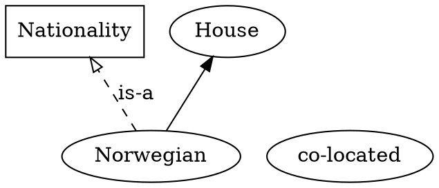
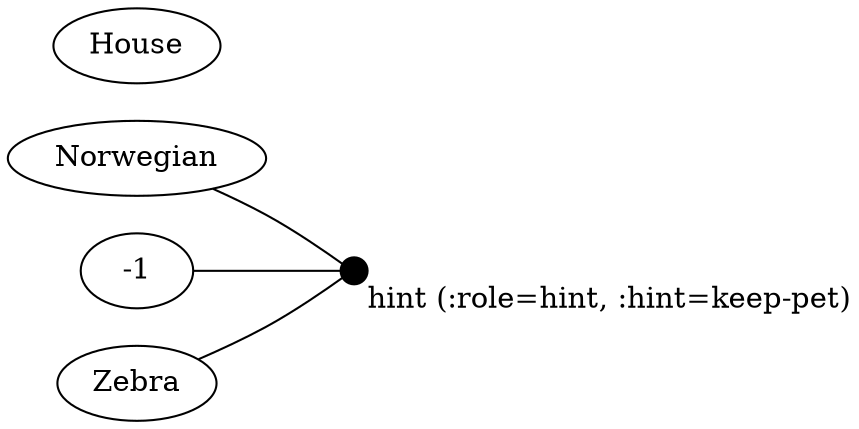
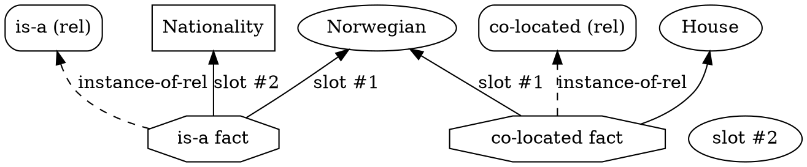
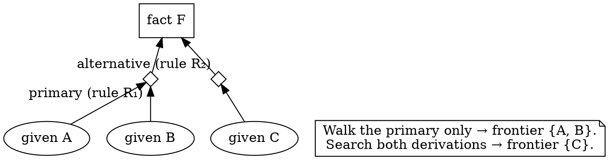
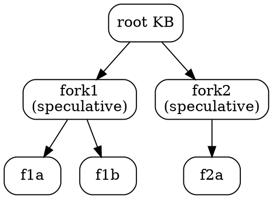
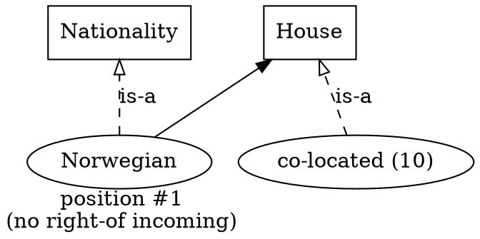
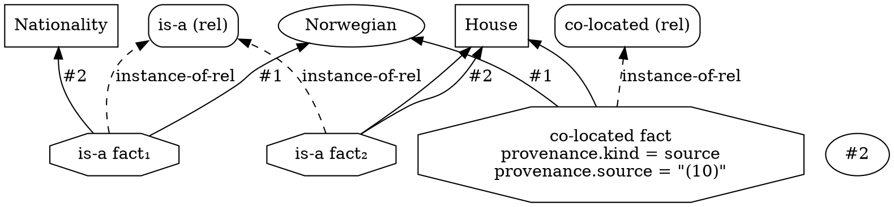

# Knowledge base — the graph

> **No language, no code here.** This document describes what
> Ein's knowledge base *is*, in graph terms. The S-expression
> surface that authors it is in [`../03-ein-lang/`](../03-ein-lang/);
> the in-memory records that hold it are in
> [`../02-data-model/`](../02-data-model/). Read those after this.

A **knowledge base** is a typed labelled hypergraph — the substrate
the engine reasons over. It has five kinds of nodes and one kind of
labelled hyperedge. There are two equivalent renderings of it: a
**compact** view for readability, and a **detailed** Levi-bipartite
view that is the canonical form.

---

## 1. Kinds of nodes

Every part of the knowledge base is a node. This is the load-bearing
design choice — relations, types, and rules are not *labels on
edges*, they're first-class graph nodes, equal in standing with the
objects they classify. See the project's [graph-canonical
principle](../../../../plans/ideas) and
[F4 Q34](../../../../plans/followups/f4_cross_cutting.md).

| kind         | what it represents                                                     | typical shape (compact view) |
|--------------|------------------------------------------------------------------------|-------------------------------|
| **Object**   | a concrete entity in the puzzle (Norwegian, House-1, Red)              | ellipse                       |
| **Type**     | a category that classifies objects (Nationality, House, Color)         | box                           |
| **Relation** | a named predicate that relates objects (`co-located`, `right-of`)      | round-rect (detailed view) / edge label (compact view) |
| **Rule**     | a graph rewriting rule (see [02_rules.md](02_rules.md))                | hexagon                       |
| **Fact**     | an *assertion* — an instance of a relation applied to specific objects | octagon (detailed view) / edge (compact view) |

The first three (objects, types, relations) populate the **ontology**
of the puzzle. Rules populate the engine's rewriting machinery.
Facts carry provenance saying where they came from (see §3).

## 2. Two views of the same graph

The same knowledge base can be drawn two ways, with different
trade-offs.

### 2.1 Compact view — for readers

In the compact view, **binary** facts collapse into single labelled
arrows. This is the rendering humans want when they're skimming a
puzzle: it looks like a small graph diagram, one node per object or
type, one arrow per relation instance.

```dot
digraph compact_view {
  rankdir=BT;
  Nationality [shape=box];
  Norwegian   [shape=ellipse];
  House-1     [shape=ellipse];
  Norwegian -> Nationality [label="is-a", style=dashed, arrowhead=empty];
  Norwegian -> House-1     [label="co-located"];
}
```

Rules of the compact view:

- **Objects** drawn as ellipses (`╭ ╮`).
- **Types** drawn as boxes (`┌ ┐`).
- **`is-a` / instance-of** edges are dashed with an open arrowhead.
- **Binary relation facts** are labelled solid arrows between
  participants. The label is the relation's name; the relation node
  itself is *implicit* — collapsed into the arrow.
- **Relations are not drawn as nodes** in this view, only as edge
  labels.
- **Provenance styling**: background = plain solid; given = solid
  coloured + the source-id badge ("(2)"); derived = dashed with the
  rule name as label.

#### Hyperedges (arity ≥ 3) — partial compact

Ternary and higher facts can't be a single arrow. The compact view
keeps the *direct* binary arrows but introduces a small intermediate
node for n-ary cases:

```dot
digraph nary_compact {
  rankdir=LR;
  Norwegian [shape=ellipse];
  House-1   [shape=ellipse];
  Zebra     [shape=ellipse];
  hint [shape=point, width=0.18, xlabel="hint (:role=hint, :hint=keep-pet)"];
  Norwegian -> hint [dir=none];
  House-1   -> hint [dir=none];
  Zebra     -> hint [dir=none];
}
```

Ein's M1 use-cases are predominantly binary; n-ary facts are
exceptional and the diagram falls back to the **detailed view**
when arity > 2.

### 2.2 Detailed view — Levi-bipartite, canonical

In the **detailed view**, everything is a node and every fact gets
its own hyperedge-node with numbered edges to its participants. This
is the form the engine actually reasons over. It's verbose but
canonical: hyperedge participation is uniform, relations are
manipulable as nodes, and rule patterns (matchings of subgraphs) are
trivially expressible.

The same `Norwegian co-located House-1` fact in the detailed view:

```dot
digraph levi_single_fact {
  rankdir=BT;

  // Relation declarations (round-rects — distinct from objects)
  rel_isa   [shape=box, style=rounded, label="is-a (rel)"];
  rel_coloc [shape=box, style=rounded, label="co-located (rel)"];

  // Types (boxes), objects (ellipses)
  Nationality [shape=box];
  Norwegian   [shape=ellipse];
  House-1     [shape=ellipse];

  // Fact nodes (octagons)
  isa_fact   [shape=octagon, label="is-a fact"];
  coloc_fact [shape=octagon, label="co-located fact"];

  // The is-a fact and its slots + relation link
  isa_fact -> Norwegian   [label="slot #1"];
  isa_fact -> Nationality [label="slot #2"];
  isa_fact -> rel_isa     [label="instance-of-rel", style=dashed];

  // The co-located fact and its slots + relation link
  coloc_fact -> Norwegian [label="slot #1"];
  coloc_fact -> House-1   [label="slot #2"];
  coloc_fact -> rel_coloc [label="instance-of-rel", style=dashed];
}
```

> **These diagrams are the encoding, not `ein render`'s output** — M1e
> S1e.4.6/S1e.4.7, `DO-L1`. The examples above drew relation declarations as
> **hexagons**, which is the shape §1's table assigns to `Rule`, so a reader
> learning the vocabulary here learned it wrong; they are round-rects now and
> the table decides. What the *renderer* does is a third thing, and it settles
> the question negatively: no shipped view draws a relation declaration as a
> node at all. `ein render` reaches four views (`rules`, `rule`, `constraints`,
> `lattice`), and `ein-render`'s whole shape vocabulary is `box` / `oval` /
> `rectangle` / `octagon` / `doublecircle` / `diamond` — the normative legend
> is [`04_dot_rendering.md` § Node-shape legend](../03-ein-lang/04_dot_rendering.md),
> where a **relation schema is a dashed labelled edge**. The two Levi-shaped
> views that would draw one are library-only: `ein ir dot` and `ein kb dot`
> were removed at P1.11 and nothing outside a test can ask for them
> ([Q-M1e.20](../../../../plans/m1e_review_processing/open_questions.md#q-m1e20--two-renderers-are-produced-tested-and-unreachable)).

Rules of the detailed view:

- **Every relation declaration** (`is-a`, `co-located`, `right-of`,
  …) is a node — round-rectangle, distinct from object nodes.
- **Every fact** is an **octagon** node. The fact's "head" — which
  relation it instantiates — is an edge from the fact-node to the
  relation node (the *instance-of-relation* edge, kept implicit in
  the compact view).
- **Each argument** of the fact is an edge from the fact-node to the
  argument's node, labelled by **slot number** (`#1`, `#2`, …) or by
  **role name** if the relation declares slot names.
- **Type membership** is itself a fact node (an `is-a` fact), with
  slot #1 = the object and slot #2 = the type.
- **Provenance** is a property of the fact node (a colour or a region
  in the layout), not of the edges.

The detailed view is the **Levi-bipartite encoding** of the typed
hypergraph: graph nodes are partitioned into "entities" (objects,
types, relations, rules) and "incidences" (facts), with edges only
crossing the partition.

### 2.3 The two views are projections of each other

The compact view is a **lossy projection** of the detailed view:
- Collapse every fact-node + its slot edges into a single labelled
  arrow when the fact's arity is 2.
- Hide the relation-declaration node; promote its name to the
  arrow's label.
- For arity > 2, keep the fact-node (now a small bullet) with
  slot-labelled edges.

The detailed view is **canonical** because:
- The collapse is well-defined only for binary facts; everything
  larger needs the fact-node anyway.
- Rule patterns (subgraph isomorphism over the fact-and-argument
  structure) are easier to state in the detailed view.
- The engine can attach data to fact-nodes (provenance, location, …);
  in the compact view there's no node to hang it on for binary cases.

The two views are **interchangeable** for binary-only fragments
(which is what most of Zebra is), and the engine renders either on
demand.

---

## 3. Where a fact came from — its provenance

Every fact carries a **provenance record** (§5) saying where it came
from. Reading it partitions the fact set three ways — and *only* for
presentation: the engine treats every fact alike.

| a fact whose provenance is…      | is…        | what's in it |
|----------------------------------|------------|--------------|
| absent, or `source` with no source id | **background** | implicit assumptions: relation/rule declarations, `is-a` enumerations, rule-application meta-facts, pairwise structural facts derived from background context |
| `source` with a source id (`:source "(N)"`) | **given** | explicit problem statements — the puzzle's numbered conditions |
| `rule` / `hypothesis` / `rejected` | **derived** | facts produced by rule firings + hypothesised facts in speculative branches |

A single proposition (e.g. *Norwegian is co-located with House-1*)
lives **once** in the graph. Its provenance records where it came from,
and the same nodes (objects, types, relations) participate whatever a
fact's origin.

> **The partition is read, not stored.** No field on a fact records which
> of the three populations it belongs to — the provenance record is the
> single source, and the table above is how to read it. In particular the
> contradiction detector does not consult it: an `(X, ¬X)` pair is a
> contradiction wherever its two halves came from.

### 3.1 Reading the partition

`Fact.is_given` and `Fact.is_derived` are the two derived predicates
(background is neither). The renderer uses them for styling —
background plain, given with its `(N)` source badge, derived dashed with
its rule name — and `kb.all_facts()` returns a `FactView` whose
`by_source` / `by_rule` filters select over the provenance directly.

## 4. Fact identity and dedup

The identity of a fact is its `(relation, args)` tuple. Two facts
with the same head and arguments are the *same* fact, regardless of
provenance. A puzzle that states `(co-located Norwegian House-1)` as a
clue and then derives the same proposition collapses them into one
node; the dedup rule is *first-seen provenance wins*.

This is what makes the graph **conservative**: no spurious duplication,
no ambiguity about which copy of a fact you mean.

Dedup collapses the *node*, not the *derivation*. When a later rule
firing re-derives a fact that is already present, the firing adds no
node — but the way it reached the fact is recorded alongside the way
the engine first reached it, as an **alternative justification** (§5).
One fact node, several ways to get there. The exception is a fact the
engine treats as **given**: a `source`- or `hypothesis`-kind fact is a
frontier terminal and takes no alternatives, so re-deriving the stated
`(co-located Norwegian House-1)` above leaves its provenance untouched
— a clue that happens to be re-derivable is still a clue.

## 5. Provenance — every fact knows where it came from

Each fact carries a **provenance record** with one of four shapes:

| kind         | typical content                                            | when                            |
|--------------|------------------------------------------------------------|---------------------------------|
| `source`     | a source-sentence id (e.g. "condition (10)") + IR location | at load — given if the id is present, background if not |
| `rule`       | the rule that fired + premise references + bindings        | a rule firing                   |
| `hypothesis` | a branch id                                                | a speculative commitment        |
| `rejected`   | a branch id (the assumption was contradicted)              | after retract                   |

Provenance is per **derivation**, not per fact: `Fact.provenance` is
the primary justification and `kb.justifications(fact)` returns every
recorded one, so a fact is an OR-node over AND-nodes — the proof
structure is an AND/OR graph. (Those two names are the data model's
rendering of it; see
[`../02-data-model/02_store.md` §7](../02-data-model/02_store.md).)

### 5.1 The AND/OR proof graph

- A **fact** is an **OR-node**: it holds if *any* of its recorded
  derivations holds.
- A **justification** is an **AND-node** over its premises: it holds
  only if *all* of them hold.
- The **primary** justification is the first one the engine recorded.
  It is the fact's own provenance record and the one every
  single-derivation view walks by default — the trace, the rendered
  derivation DAG. The others are **alternatives**, recorded when a
  later firing re-derives a fact that is already present (§4).
- **Terminals take no alternatives.** A `source`- or
  `hypothesis`-kind primary is the frontier: a given stays given. A
  `rule`-kind primary with *no* premises is a synthetic engine
  writeback (the reserved `<forced-positive>` family — see
  [`../../inference/reserved_engine_strings.md`](../../inference/reserved_engine_strings.md))
  whose contract is that provenance walks **ground out** on it.
- Alternatives are **capped per fact**, and the cap keeps the
  *shortest* derivations rather than the earliest ones — it biases
  towards the small explanations the frontier search below is after.

```dot
digraph and_or_provenance {
  rankdir=BT;

  // Frontier terminals — what the engine treats as given (ellipses)
  A [shape=ellipse, label="given A"];
  B [shape=ellipse, label="given B"];
  C [shape=ellipse, label="given C"];

  // Justifications — AND-nodes, one diamond each
  j1 [shape=diamond, width=.22, height=.22, label="", xlabel="primary (rule R₁)"];
  j2 [shape=diamond, width=.22, height=.22, label="", xlabel="alternative (rule R₂)"];

  // The derived fact — an OR-node over its justifications
  F [shape=box, label="fact F"];

  A -> j1;  B -> j1;   // AND: R₁ consumed both
  C -> j2;             // AND: R₂ consumed only C
  j1 -> F;  j2 -> F;   // OR: either derivation suffices

  note [shape=note, label="Walk the primary only → frontier {A, B}.\nSearch both derivations → frontier {C}."];
}
```

The result is a **graph, not a tree**, and legitimately a cyclic one:
once re-derivations are recorded, symmetric and transitive closure
make `(R a b)` and `(R b a)` justify each other in any ordinary
puzzle. Every walk over engine-recorded provenance must therefore be
cycle-safe; cycle *rejection* applies only to author-written
provenance, at load time, where a cycle really is an error.

### 5.2 The frontier — what a contradiction is reported as

The **derivation DAG** of a derived fact is recovered by following a
justification's premise references transitively until terminating at
`source` or `hypothesis` facts. Those terminals are the *frontier* —
what the engine treats as given. The frontier is what the
*contradictions* task class returns to the user when a clash is found.

Over an OR-node, *which* frontier is a choice, and the two answers
differ:

- **Union of one justification per fact.** Walk each fact's primary
  and union the terminals over every contradiction witness. Cheap, and
  the shape the trace renders — but it over-states the conflict (one
  cause fanning out into many witnesses), and it moves with the order
  the derivations happened to be recorded in.
- **Search across every recorded derivation.** Choose the
  *combination* of justifications — one per fact — whose terminals are
  fewest. This is the smallest contradiction frontier — a
  minimum-cardinality AND/OR search over every recorded derivation
  (provenance-based, NAF-safe, budgeted); **not** a subset-minimal
  MUS. It is independent of rule-firing order, and it is what the
  contradictions verdict reports.

The one place the verdict still unions is across *dead branches*: when
the hypothesis lattice is exhausted, no single dead branch explains
the unsatisfiability, so the report joins them — but each component is
the smallest frontier of its own branch (§6).

Three caveats hold wherever that minimality is claimed:

1. **Not a subset-minimal MUS** — no proper subset is checked for
   satisfiability.
2. **Recorded, not all, derivations** — alternatives are only the
   firings the saturator attempted, capped per fact; minimality is
   relative to the rule set and the saturation strategy.
3. **Budgeted** — the search is worst-case exponential and runs under
   an explicit budget that reports whether it ran to completion. A
   truncated search is still sound.

The search and its budget live in the inference engine
([`../../inference/`](../../inference/)); the walks and the DAG shape
are in [`../02-data-model/02_store.md`](../02-data-model/02_store.md).

## 6. Hypothesis branches — graph forks

A **hypothesis branch** is a *fork* of the knowledge base: the loaded
facts are shared (by reference); only the branch's own derivations are
isolated. Multiple forks can exist simultaneously (the search tree).
When a branch is contradicted, its additions are tagged `rejected` in
the trace; when a branch is committed, they promote into the parent.

Forking is **cheap**: it doesn't copy the loaded facts, so the cost is
proportional to the size of the branch's derivations (small).

The proof graph (§5.1) is **copied on fork, never shared**: a
derivation recorded inside a branch may rest on that branch's
hypothesis, which the parent never assumed, so the alternative
justifications a branch records stay in that branch.

```dot
digraph branch_tree {
  rankdir=TB;
  node [shape=box, style=rounded];
  root  [label="root KB"];
  fork1 [label="fork1\n(speculative)"];
  fork2 [label="fork2\n(speculative)"];
  f1a   [label="f1a"];
  f1b   [label="f1b"];
  f2a   [label="f2a"];
  root -> fork1;
  root -> fork2;
  fork1 -> f1a;
  fork1 -> f1b;
  fork2 -> f2a;
}
```

Branches form a tree because forks-of-forks are nested; the engine
walks the tree depth-first (lazy branching — saturate before
branching).

## 7. Equality classes — placeholder

Two object nodes that the engine concludes are "the same" merge
into a single **equality class**. M1 ships a placeholder union-find
over object names; the engine doesn't yet act on classes automatically.
The seam exists so a future *e-graph* promotion (equality saturation,
see [`docs/lib/06-graphs-rewrite-systems.md`](../../../lib/06-graphs-rewrite-systems.md))
can slot in without rework.

## 8. Compound / virtual node kinds — open class

The five node kinds (object, type, relation, rule, fact) are the
**base set** in M1. Higher-order rules and richer reasoning are
expected to need additional node kinds — none implemented in M1, all
parked at [M1 Q26](../../../../plans/open_questions.md#q26--compound--virtual-node-kinds-for-higher-order-rules):

- **Relation-set-of-object** — the set of all relations involving a
  given object.
- **Slot-projection** — the set of all objects connected to argument
  slot N of a given relation (e.g., all "subjects" of `is-a`).
- **Top / bottom of relation subgraph** — the maximal / minimal node
  under a relation (`T` in zebra2's is-a forest is an example).
- **Criterion-selected groups** — objects matching a structural
  predicate (e.g., houses with exactly two `next-to` neighbours).

The data model is designed to admit these *without rework* — see
[F4 Q26](../../../../plans/followups/f4_cross_cutting.md) for the
research thread.

## 9. Worked example — a small Zebra fragment

The proposition *"The Norwegian lives in the first house, and the
first house is to the right of no other house"* under the two views.

### Compact view

```dot
digraph zebra_fragment_compact {
  rankdir=BT;
  Nationality [shape=box];
  House       [shape=box];
  Norwegian   [shape=ellipse];
  House-1     [shape=ellipse];
  Norwegian -> Nationality [label="is-a", style=dashed, arrowhead=empty];
  House-1   -> House       [label="is-a", style=dashed, arrowhead=empty];
  Norwegian -> House-1     [label="co-located (10)"];
  House-1   [xlabel="position #1\n(no right-of incoming)", labeljust=l];
}
```

Five nodes, four edges. The `:source "(10)"` annotation rides on
the `co-located` edge — it is a given, one of the puzzle's clues.

### Detailed view (Levi-bipartite)

```dot
digraph zebra_fragment_levi {
  rankdir=BT;

  // Relation declarations
  rel_isa   [shape=box, style=rounded, label="is-a (rel)"];
  rel_coloc [shape=box, style=rounded, label="co-located (rel)"];

  // Types
  Nationality [shape=box];
  House       [shape=box];

  // Objects
  Norwegian   [shape=ellipse];
  House-1     [shape=ellipse];

  // is-a facts (octagons)
  isa_fact_1 [shape=octagon, label="is-a fact₁"];
  isa_fact_2 [shape=octagon, label="is-a fact₂"];
  isa_fact_1 -> Norwegian   [label="#1"];
  isa_fact_1 -> Nationality [label="#2"];
  isa_fact_2 -> House-1     [label="#1"];
  isa_fact_2 -> House       [label="#2"];
  isa_fact_1 -> rel_isa     [label="instance-of-rel", style=dashed];
  isa_fact_2 -> rel_isa     [label="instance-of-rel", style=dashed];

  // The propositional co-located fact
  coloc_fact [
    shape=octagon,
    label="co-located fact\nprovenance.kind = source\nprovenance.source = \"(10)\"",
  ];
  coloc_fact -> Norwegian [label="#1"];
  coloc_fact -> House-1   [label="#2"];
  coloc_fact -> rel_coloc [label="instance-of-rel", style=dashed];
}
```

Three octagon fact nodes (two `is-a`, one `co-located`), three
object nodes (Norwegian, House-1 — and the types Nationality,
House), two relation declaration nodes (is-a, co-located). The
detailed view makes manipulable everything the compact view hides
in arrow labels.

## See also

- [`02_rules.md`](02_rules.md) — graph rewriting rules over the KB.
- [`03_ein_model.md`](03_ein_model.md) — the **reflexive** view of
  this file: the five node kinds collapse into one self-instantiating
  algebra (instance-of-instance fixed point). Read after this for the
  unified framing.
- [`04_jack_drinks_coffee.md`](04_jack_drinks_coffee.md) — worked
  example exercising the type-as-relation-holder pattern from
  `03_ein_model.md` §5.
- [`../02-data-model/01_entities.md`](../02-data-model/01_entities.md) —
  the data-model mapping for the five node kinds.
- [`../02-data-model/02_store.md`](../02-data-model/02_store.md) —
  KB store with the fact view, fork, provenance (primary + recorded
  alternatives), derivation DAG, unsat core.
- [`../03-ein-lang/`](../03-ein-lang/) — the surface S-expression
  language that authors the KB.
- [`../../inference/`](../../inference/) — the rule firing engine
  that *derives* new facts.
