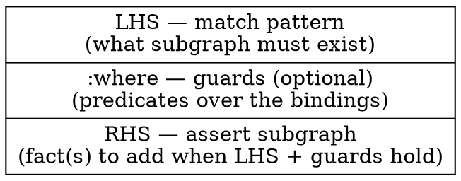
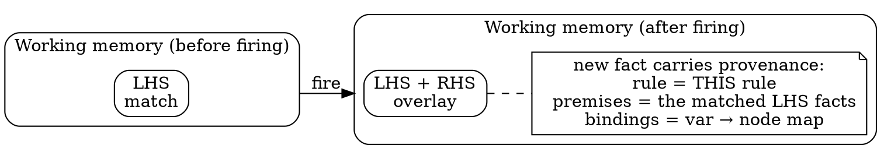
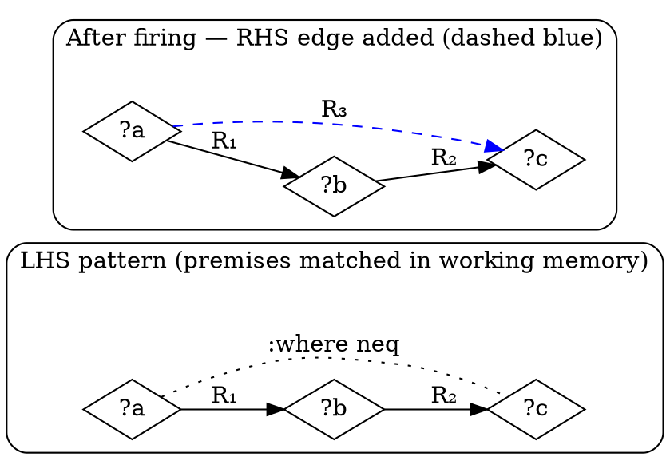
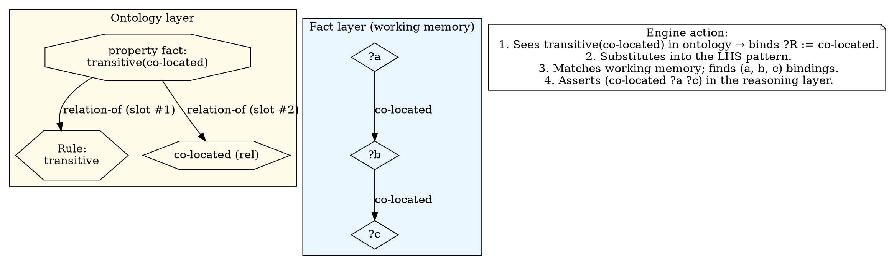
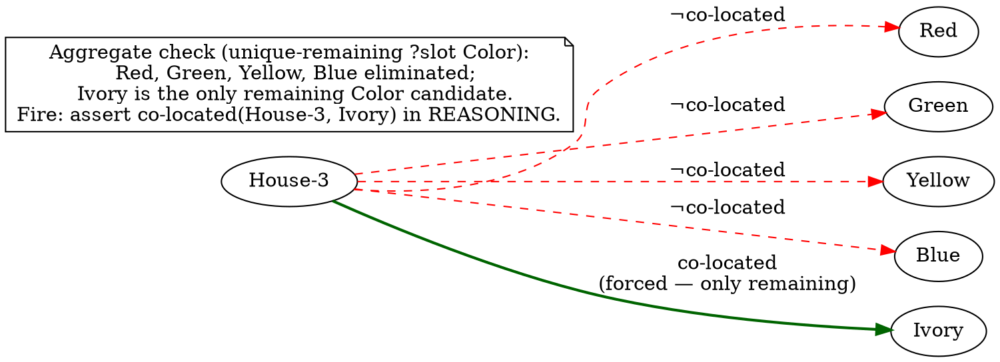
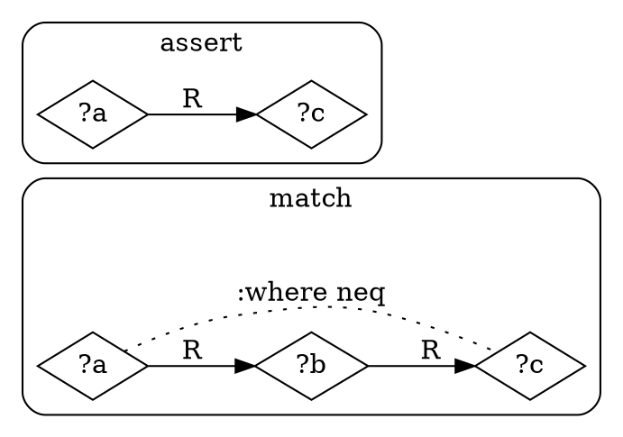
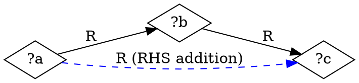
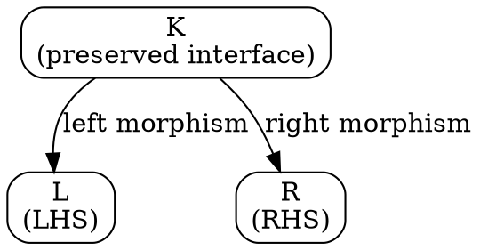

# Rules — graph rewriting

> **No language, no Python here.** This document describes rules in
> graph-rewriting terms. The S-expression syntax that declares rules
> is in [`../03-ein-lang/`](../03-ein-lang/); the Python `Rule` /
> `Pattern` dataclasses are in [`../02-data-model/`](../02-data-model/).

A **rule** is a graph rewriting rule over the knowledge base. The
engine fires rules when their **left-hand-side pattern** matches a
subgraph of working memory and adds the **right-hand-side
conclusion** as new fact(s) in the reasoning layer.

The graph is **monotonic** — rules add facts, they don't delete
nodes or existing facts. The closest thing to deletion is a
**negative fact** (`(not X)`), which is itself a fact node asserting
that some proposition does not hold. Removal of an entire reasoning
branch is the *fork* mechanism (see
[`01_kb.md` §6](01_kb.md), not a rule action).

---

## 1. Anatomy of a rule

Every rule has three parts:



The **LHS** is a *pattern* — a subgraph with some nodes labelled as
**variables**. Variables come in two flavours:

- **Object variables** (`?a`, `?b`, …) range over object nodes.
- **Relation variables** (`?R`, `?rel`, …) range over relation
  declaration nodes. Their presence is what makes a rule
  *higher-order*.

A **match** is a binding from each variable to a concrete graph node
such that, with the substitution applied, the LHS subgraph appears
literally in working memory.

The **:where** clause is a list of predicates that the bindings must
satisfy — distinctness (`(neq ?a ?b)`), structural properties
(`(transitive ?R)`), aggregates (`(unique-remaining ?slot ?type)`).
Guards are positive (the predicate must hold).

The **RHS** is a small graph fragment that *appends* to working
memory upon firing. RHS nodes that are variables are *resolved* to
their bound values from the match; new fact nodes are created with
provenance `kind='rule'` pointing back at the firing rule and at the
matched premise facts.



---

## 2. The three types

Rules in Ein fall into **three types** by *what their LHS
quantifies over* — what kinds of nodes the matcher must enumerate to
find a binding. The taxonomy is operational: it tells the engine
*how to search* for matches and tells the trace renderer *what to
name* in the firing.

| type | LHS quantifies over            | typical pattern shape                  | activation                       |
|------|--------------------------------|----------------------------------------|----------------------------------|
| **T1 — first-order**         | object variables only           | concrete relation names + `?a`, `?b`    | fires whenever the LHS matches    |
| **T2 — relation-polymorphic** | object AND relation variables   | `?R` as the relation in some pattern    | fires when activated by a *property fact* that binds the relation variable |
| **T3 — structural / aggregate** | the whole subgraph's shape    | uses an aggregate predicate (count, uniqueness, position) | fires when a global property of the graph changes |

The three types are not exclusive: a rule can mix flavours (a
relation variable + a `:where` aggregate). The taxonomy describes
the *primary* axis the rule extends along.

### 2.1 Type 1 — first-order rules

A T1 rule names **specific relations literally** in its LHS. All
variables range over objects. The matcher only enumerates object
bindings.

**Form** (sketch):

```text
   LHS:   ( R₁  ?a  ?b )       — `R₁` is a literal relation name
          ( R₂  ?b  ?c )       — same: `R₂` literal
   :where (neq ?a ?c)
   RHS:   ( R₃  ?a  ?c )       — `R₃` literal
```

The relation nodes `R₁`, `R₂`, `R₃` are fixed; the pattern is just
about how the object nodes connect. This is **classical first-order
graph rewriting** — the pattern is a fixed graph "shape" up to
relabelling of objects.

**Graph diagram** — LHS over a small slice of working memory:



**Examples in the project:** `triangle-composition` (when written
with `?r` as a *literal* relation rather than a variable — see Type
2 below for the contrasting version), `square-fwd` /
`square-bwd` over `co-located` once the relation pair is fixed.

**When the matcher uses T1:** index lookup by relation name is cheap
(one O(deg(relation)) iteration), so T1 rules fire fast. The trace
records them simply: *"by R₁ and R₂, the conclusion R₃ follows"*.

### 2.2 Type 2 — relation-polymorphic (higher-order) rules

A T2 rule has at least one **relation variable** (`?R`, `?P`, …) in
its LHS or RHS. The matcher must enumerate not only object bindings
but also which relation `?R` binds to.

**Form** (sketch):

```text
   LHS:   ( ?R  ?a  ?b )
          ( ?R  ?b  ?c )
   :where (neq ?a ?c)
   RHS:   ( ?R  ?a  ?c )
```

The relation variable `?R` ranges over **relation declaration nodes**
— with **gating**: the rule fires only for relations explicitly
marked as such. The marker is a **property fact** in the ontology
layer: a fact whose head is *the rule's name* and whose argument is
the target relation.

Example: the `transitive` rule above is activated by an ontology
fact `(transitive co-located)`. The engine reads "the relation
`co-located` has the `transitive` property" and uses that as the
binding `?R = co-located` when matching this rule's LHS.

**Graph diagram** — the rule + its activation:



The relation node and the rule node are *both first-class* — the
property fact is itself an octagon node with edges to both. This is
where the principle "**relations are nodes**" pays off: relations
participate in facts as themselves, not just as edge labels.

**Examples in the project:** `symmetric`, `transitive`, `implies`,
`asymmetric`, `sibling-exclusive`, `square-fwd`, `square-bwd`. Most
of the M1 rule library is T2. One generic rule replaces N
per-relation copies.

**When the matcher uses T2:** enumerate `?R` over the relations
that have a property fact for this rule, then proceed as T1 for the
remaining bindings. The trace records the property fact (the
*activation*) as a premise alongside the matched fact-layer facts.

### 2.3 Type 3 — structural / aggregate rules

A T3 rule's LHS uses an **aggregate predicate** — a predicate that
holds based on a *global property of the graph* rather than the
presence of a few specific nodes. Examples: *"this slot has exactly
one candidate value remaining"*, *"no other instance of this type
is co-located with that object"*, *"the count of facts matching
pattern P is N"*.

**Form** (sketch):

```text
   LHS:   ( unique-remaining ?slot ?type )   — aggregate predicate
   RHS:   ( = ?slot the-only-remaining-candidate )
```

The matcher cannot find `unique-remaining ?slot ?type` by scanning
for an edge or fact — it has to **compute** the predicate by walking
the graph (counting the candidates, checking uniqueness). The
predicate fires when the graph reaches a state where it holds.

**Graph diagram** — what's *not* visible directly:



The trace records: *"By exclusion of Red, Green, Yellow, Blue from
House-3's Color slot, only Ivory remains — therefore
co-located(House-3, Ivory)."*

**Examples in the project (planned for P1.3):**
`elimination-by-exhaustion`, `arc-consistency-propagate`,
`global-cardinality`, `forced-by-unique-position`.

**When the matcher uses T3:** the aggregate is a registered named
predicate in the matcher's library (the **structural predicate
registry**). The matcher consults the predicate's Python
implementation — but the rule itself stays declarative: the trace
sees a named firing of the aggregate, not a raw Python call.

T3 is the bridge between graph rewriting and classical CSP /
arc-consistency reasoning. It's also where Ein's engine gains
search-pruning power that pure T1/T2 wouldn't reach.

---

## 3. Negative conclusions

The RHS can assert a **negative** fact `(not X)`. This is *not* a
deletion — it's a positive fact whose proposition is the negation of
`X`. The reasoning layer accumulates both positive and negative
assertions; their *consistency* is what the contradiction detector
checks.

```text
   LHS:   ( instance ?a ?T )      — two distinct instances
          ( instance ?b ?T )      — of the same type
   :where ( neq ?a ?b )
   RHS:   ( not (co-located ?a ?b) )   — a NEGATIVE fact
```

This is the `type-exclusivity` rule. The negative fact `(not
(co-located A B))` is itself a fact node — an octagon — whose
`relation` is `not` and whose single argument is the negated
proposition. Its presence in working memory means *"the engine
asserts that A and B are NOT co-located"*.

A subsequent positive `(co-located A B)` would clash with the
negative fact: the contradiction detector sees the pair and reports
the conflict. The unsat-core walk traces both back to their source
frontiers and returns the minimal subset that produced the clash.

### 3.1 Three-state fact storage (S1.5.8c)

A potential fact `P` is at any moment in one of three states:

| state          | KB shape                            | matched by                          |
|----------------|-------------------------------------|--------------------------------------|
| **asserted**   | `P` stored as positive              | `(P)` pattern                       |
| **negated**    | `(not P)` stored as a fact          | `(not P)` pattern (matches the stored neg fact) |
| **open**       | neither in KB                       | `(open P)` pattern (sugar for `(and (absent P) (absent (not P)))`) |

The three pattern shapes parallel the three storage states.
`(not P)` in `:match` matches a stored `(not P)` fact, NOT NAF —
NAF must be written explicitly as `(absent P)` (S1.5.8c K-Δ.1).
`(open P)` is parser sugar for the conjunction of two absents,
giving rules a way to gate on "P is undecided" — useful for
hypothesis-generation rules that should only propose candidates
for slots that aren't yet committed either way.

### 3.2 Transitive closure as a 2-fact idiom

Transitive closure of a relation R is achieved by activating
`(transitive R)` and letting the saturator close R against
itself to fixpoint. After saturation, R IS its own transitive
closure — no separate relation needed.

When BOTH the direct R AND the transitively-closed R\* must
coexist (e.g., zebra2's direct `is-a` for sibling-exclusive and
transitively-closed `is-a*` for typecheck), declare a second
relation R\* and bridge it via the `includes` activator
(every direct R-edge lifts to R\*), plus `(transitive R*)`:

```lisp
(relation is-a  T T)
(relation is-a* T T)
(includes is-a is-a*)    ; the `includes` rule: every (is-a a b) → (is-a* a b)
(transitive is-a*)        ; the `transitive` rule on is-a*
```

After saturation, `is-a*` holds every ancestor edge while `is-a`
remains direct — the "two parallel relations" closure idiom.

## 4. The :where clause — predicate guards

Predicates allowed in `:where`:

- **Distinctness** — `(neq ?a ?b)`: bindings must refer to distinct
  graph nodes.
- **Type/structural** — `(transitive ?R)`, `(symmetric ?R)`,
  `(in-domain ?rel ?T)`: properties of the *bindings themselves*,
  often by consulting the ontology.
- **Aggregates** — `(unique-remaining ?x ?T)`,
  `(no-remaining-option ?x)`: same as the T3 family but used as
  guards (not conclusions).

Guards are evaluated *after* the LHS pattern matches but *before*
the RHS is asserted. They filter spurious matches; they don't
participate in unification.

## 5. Provenance — every rule firing leaves a trace

A rule firing produces zero or more **new fact nodes** in the
reasoning layer. Each new fact carries provenance:

- `kind = 'rule'`
- `rule = <firing rule's name>`
- `premises = <the matched LHS facts (+ activating property fact for
  T2)>`
- `bindings = <the var → node map used>`

The full **derivation DAG** of any derived fact is built by walking
each rule-kind fact's premises transitively until reaching `source`
or `hypothesis` terminals. See [`01_kb.md` §5](01_kb.md).

This is what makes the engine **explanation-complete**: every fact
in the reasoning layer has a recoverable "why", in the form of a
DAG of premises + rule names. The trace renderer (P1.6) walks this
DAG.

---

## 6. Rule rendering — three modes

The same rule can be drawn three ways depending on context.

### 6.1 LHS | RHS side-by-side (rule libraries)



For rule-library documentation; explicit and readable.

### 6.2 Overlay (trace output)



LHS in solid, RHS additions in dashed. Compact; the default when
showing a single firing inside a step-by-step trace.

### 6.3 DPO span (categorical reading)



For categorical analysis; deferred to F1 (the *categorical
formulation* followup). Not used in M1 traces.

---

## 7. Saturation — the firing loop

The **saturation loop** repeatedly fires rules until no new fact is
produced. At each step:

1. For each rule, find all matches in working memory.
2. For each match, check `:where` guards.
3. For each passing match, build the RHS substitution.
4. If the resulting fact(s) aren't already in working memory, add
   them in the reasoning layer with `rule`-kind provenance.

The order in which rules are tried is governed by
**priority** — a static integer per rule, with cheap-propagation
rules earlier. The saturation loop's design is in P1.3 S1.3.3.

When saturation stalls and the puzzle isn't yet solved, the engine
**branches**: pick an undetermined slot, hypothesise each candidate
in turn (a fork — see [`01_kb.md` §6](01_kb.md)), saturate each
branch, retract on contradiction, commit on uniqueness. This is the
**hypothesis loop**, designed in P1.5.

## 8. Where this lives in code

- **Rule nodes** are `Rule` dataclass instances in the KB.
- **Patterns** (LHS / RHS) are `Pattern` dataclass instances — for
  M1 they're structural-only views; the actual matcher lives in
  P1.3.
- **Property facts** (the T2 activators) are ordinary `Fact` nodes
  in the ontology layer, recognised by name match against the rule
  registry.
- **Saturation + branching** is the inference engine
  ([`../../inference/`](../../inference/)), stubbed for M1, fleshed
  out in P1.3 + P1.5.

The data-model mapping is detailed in
[`../02-data-model/`](../02-data-model/); the surface syntax for
authoring rules is in
[`../03-ein-lang/`](../03-ein-lang/) §pattern sub-language.

## See also

- [`01_kb.md`](01_kb.md) — the graph that rules operate over.
- [`../../inference/`](../../inference/) — the saturation /
  branching engine.
- [`../03-ein-lang/02_patterns.md`](../03-ein-lang/02_patterns.md) —
  the surface pattern language.
- [`../../../ideas/06-inference-rules-completeness.md`](../../../../plans/ideas/06-inference-rules-completeness.md) —
  the rule-family taxonomy that motivates the M1 rule registry.
- [`../../../ideas/07-categorical-formulation.md`](../../../../plans/ideas/07-categorical-formulation.md) —
  rules as DPO morphisms (F1 followup).
- [`../../../../plans/m1_core_graph_reasoning/p1.3_inference_rules/`](../../../../plans/m1_core_graph_reasoning/p1.3_inference_rules/) —
  the implementation plan for M1's ten rule families.
