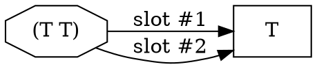

# Ein model — reflexive node algebra

This file extends [`01_kb.md`](01_kb.md) with the user's *reflexive*
framing of the ein model — the observation that every "kind of
thing" in the KB (object, type, relation, rule, fact, instance) is
itself a graph node, and that the *instance-of* relation is itself
an instance of itself.

It is the substrate from which the surface S-expression language
([`../03-ein-lang/`](../03-ein-lang/)) and the Python data model
([`../02-data-model/`](../02-data-model/)) are derived.

> **No language, no Python here.** Pure graph-algebraic claims.

---

## 1. Reflexive instance-of-instance

Recall the five "kinds" of node from
[`01_kb.md` §1](01_kb.md): object, type, relation, rule, fact. The
user's framing collapses them into one self-instantiating algebra:

```text
   instance of a type      is an object
   instance of a relation  is a fact

   relation                is a type   (relations have instances = facts)
   fact                    is an object (facts are nodes)
   relation                is an object (relations are nodes)
   type                    is an object (types are nodes)

   instance                is a relation   (it relates a leaf to a type)
   instance                is a fact       (an instance assertion is a proposition)
   instance                is an instance of instance   (homoiconic root)
```

The last line is the **fixed point** — `instance` itself participates
in the very relation it names. Stated plainly: the proposition *"X is
an instance of T"* is itself an *instance* of the *instance*
relation. Reading the seven lines top to bottom: nothing in the
language is exempt from being treated as data.

This is the project's **homoiconic root**. It pays off in three
ways:

1. **Rules can match rules** (followup [F5](../../../../plans/followups/f5_rules_as_data.md)).
2. **Traces can match traces** ([Q21](../../../../plans/m1_core_graph_reasoning/open_questions.md#q21)
   — the trace IR is the input IR).
3. **The grammar can mutate itself** (followup [F2](../../../../plans/followups/f2_self_modifying_language.md))
   without changing what *kind* of object the grammar is.

The same reflexive stack, read by *node kind* rather than by
self-instantiation, is the **four-level KB** (objects / facts /
relations / rules) — see [`05_four_level_kb.md`](05_four_level_kb.md).

## 2. The five foundational terms

The user-stated definitions, nailed down to avoid future drift (the
**atom** vs **object** split is S1.20.H1, 2026-05-24):

| term     | definition                                                                  |
|----------|-----------------------------------------------------------------------------|
| **atom** | a *name* — a lexical token that identifies a node. `rule`, `not`, `T`, `relation`, `Alice`, `co-located` are all atoms. The atom is the *name*; the node it denotes is the *thing named*. Two occurrences of the same atom across the KB denote the **same** node (the identity rule below). |
| **node** | a vertex in the graph. Has identity. Comes in two flavours (see §3).         |
| **arrow** *(= link, arc, pointer, reference)* | a directed edge from one node to another. The four English terms are synonymous — pick one for any given context. |
| **object** | a *node* named by an atom and pointed at by some arrow — a graph vertex with no outbound arrows and in-arrows from facts. Usually a *sink*. (Distinguish the **object** — the node — from the **atom** — its name.) |
| **relation** | a node *containing two or more outbound arrows*. Three sub-readings depending on context — see §4. |

**Identity rule** (load-bearing): **no copies**. A graph node is
either:

- a **named object** with a *single, globally-unique name* — two
  occurrences of the same name across the KB refer to the **same
  node**; TODO: here global means within context bounds, e.g. reasoning branches
- a **relation** with an *ordered list of links* — two relations
  with the same head + arg-list are the same node;
- a **`?variable`** with *local* (per-rule, per-pattern) uniqueness;
- a **`:keyword`** — positional-shorthand marker; not a node, but a
  slot-name on a relation.

The Python data model encodes this in `Fact.__eq__` (by `(rel,
args)` tuple) and in name-identity for named objects — the `NameRef`
index keyed by the atom (the former `Instance.__eq__`-by-name was
removed with the type/instance entity-view, S1.7.23); see
[`../02-data-model/01_entities.md` §1.5](../02-data-model/01_entities.md).

## 3. Two flavours of node

Every node is *either*:

| flavour      | example                | notation in ein-lang  |
|--------------|------------------------|------------------------|
| **named**    | `Norwegian`, `House-1` | bare atom              |
| **relational** | `(co-located Norwegian House-1)` | parenthesised list |

A **named** node is labelled by an **atom** (§2): the atom is the
lexical token you type, the node is the graph vertex it denotes.
The relational form is **just a node with N outgoing slot-edges to
its arguments**. Notably:

- `(Name)` — a one-element list with an atom head, often a free
  declaration node (e.g. `(Norwegian)` could appear as a declaration
  before any relation involves it).
- `(Name1 Name2)` — a two-slot node, with two arrows to the named
  nodes. Already a relation (in the graph-structural sense).
- `(rel1 objA objB)` — a three-slot node: arrows to `rel1`, `objA`,
  `objB`. The 3-hrel; the head's role is conventionally "which
  relation declaration this fact instantiates", but graph-
  structurally it's just another slot.

Two outgoing arrows from the **same relational node** to the **same
target node** are *valid* and *meaningful*:



That's how `(relation R T T)` works — both argument slots point at
the same type `T`. The two arrows are *distinguished by slot
number*, not by target.

## 4. The "relation" problem — disambiguation

The word "relation" carries **three** distinct meanings in Ein.
The four-term table above defines the **graph-structural** meaning;
the others are *uses* of it:

| sub-meaning             | example                       | which kind of node               |
|-------------------------|-------------------------------|-----------------------------------|
| **relation-as-type**    | `(relation co-located T T)`   | declaration node                  |
| **relation instance** = **fact** | `(co-located Norwegian Red)` | proposition node          |
| **multi-arrow node** (colloquial) | any `(A B C)`        | bare graph-structural sense       |

The Python data model picks one term per use:

- `Relation` entity ⟺ relation-as-type (the declaration).
- `Fact` entity ⟺ relation instance.
- "node with ≥ 2 outgoing arrows" — has no Python entity; it's the
  *category* the first two are subcases of.

In informal discussion, **prefer the precise term** (`Relation
declaration`, `Fact`, or `node-with-arrows`). When "relation" alone
is unambiguous from context, fine; otherwise default to one of the
three precise terms.

## 5. Types as common-relation holders

> *"Types are nodes that hold relations common for multiple instance
> nodes. So an instance of a type, an object, inherits the relations
> of a type."* — user, 2026-05-19

In graph terms: a **type** is a node `T` such that one or more
relations have `T` in their signature (specifically: in an argument
slot that other instance nodes also occupy). The "type system" is
the **closure of `is-a` propagation** over those signatures.

Worked example — the *Jack drinks coffee* fragment (full doc:
[`04_jack_drinks_coffee.md`](04_jack_drinks_coffee.md)):

```text
   (can-drink Human Drink)   ← declaration node: relates two types
   (is-a Jack Human)         ← Jack is an instance of Human
   (is-a Coffee Drink)       ← Coffee is an instance of Drink

   ⇒ inherited                  (can-drink Jack Drink)
   ⇒ inherited + instantiated   (can-drink Jack Coffee)
```

`Human` and `Drink` are *types* because each:

1. Has at least one `is-a` instance below them.
2. Appears in a relation declaration (`can-drink`) whose *meaning*
   carries over to those instances.

The full inheritance flow is the subject of
[`02_rules.md` §2](02_rules.md) — relation polymorphism (T2 rules)
mechanises this propagation.

**is-subtype vs is-instance.** Both look like is-a, but they carry
different propagation semantics:

| edge kind   | example                  | what propagates                     |
|-------------|--------------------------|-------------------------------------|
| **is-subtype** | `Dog is-a Mammal`     | the *relations* of `Mammal` lift to `Dog` |
| **is-instance** | `Rex is-a Dog`       | the *propositions* about `Dog` apply to `Rex` |

In zebra2.ein's unified `is-a` encoding, these are *the same edge*
(the engine doesn't distinguish them syntactically); the
distinction emerges from whether the target is a *leaf* (instance)
or an *internal node* (subtype) of the is-a forest.

The IR-encoding final call ([P1.7 T1.7.2.5](../../../../plans/m1_core_graph_reasoning/p1.7_bootstrapping_zebra/s1.7.2_dynamic_vs_hardcoded.md))
will decide whether to keep the distinction syntactic (classic
`zebra.ein`) or collapse it (unified `zebra2.ein`).

## 6. Reserved relation names

> **Authoritative lists (S1.7.25):** the full reserved vocabulary lives in
> two dedicated references — surface words in
> [`../03-ein-lang/06_reserved_names.md`](../03-ein-lang/06_reserved_names.md)
> and engine-internal strings in
> [`../../inference/reserved_engine_strings.md`](../../inference/reserved_engine_strings.md).
> This section keeps only the **graph-node declarators** (the names that
> introduce a node kind) plus the two `⊥` heads relevant to the graph
> model; everything else is in those docs.

| name         | role                                                            |
|--------------|-----------------------------------------------------------------|
| `relation`   | declares a relation-type node (`(relation co-located T T)`).    |
| `rule`       | declares a rewriting rule (head of a top-level `(rule …)` form). |
| `hrule`      | declares a hypothesis-generation rule (drives `hypgen`; never fired by the saturator). |
| `not`        | propositional negation; `(not X)` is an octagon fact whose single arg is the negated proposition. The contradiction detector pairs each `(not X)` against a same-layer positive `X`. |
| `false`      | direct ⊥ — a `(false)` fact asserts that the firing rule has reached a contradiction without needing the self-negation idiom. The contradiction detector treats every `(false …)` as a `kind="direct"` contradiction (see [`../02-data-model/02_store.md` §7.2 unsat-core](../02-data-model/02_store.md) for how the unsat-core walk handles it). Shipped S1.5.4a Part 2 (2026-05-21). |

`not` and `false` are reserved at the **engine** level — the
contradiction detector scans `_facts_by_relation["not"]` and
`_facts_by_relation["false"]` for the two contradiction shapes.
The grammar parses both as ordinary `generic_fact` forms; the
engine, not the parser, gives them meaning. (The full rule-body / ⊥
calculus — `and` `or` `absent` + `eq` `neq` — is declared in
`inference/primitives.py` / `predicates.py`; see the surface doc.)

**`is-a` and `T` are NOT reserved (S1.7.23).** The kernel imposes no
type system: it names no inheritance relation and keeps no universal-top
atom. `is-a` is an ordinary relation a puzzle declares with
`(relation is-a T T)`, and `T` is an ordinary capitalised atom a puzzle
uses to name its top type — both are plain data the puzzle's *own* rules
(transitivity, `sibling-exclusive`, a `guess` hrule's `:match`,
`typecheck-arg-*`) interpret in user space. The S1.7.23 execution deleted
every kernel site that *interpreted* them: `hypgen`'s type-compatibility
filter (`_type_compatible` / `_ancestor_names` / `INHERITANCE_RELATIONS`
and the `"T"` universal-top short-circuit), the candidate-object selector
(`_instance_like_objects` → name-free `_candidate_objects`), and the whole
`kb.types` / `kb.instances` type/instance entity-view (the registries, the
`_types_by_parent` / `_instances_by_type` / `_facts_by_instance` indexes,
and the `Type` / `Instance` entity classes). A puzzle that wants a
named-type *projection* computes it with an ein-lang rule over its own
inheritance relation. See
[S1.7.23](../../../../plans/m1_core_graph_reasoning/p1.7_bootstrapping_zebra/s1.7.23_retire_kernel_type_system.md);
its parent [S1.7.6](../../../../plans/m1_core_graph_reasoning/p1.7_bootstrapping_zebra/s1.7.6_kernel_minimization.md)
had already removed `type` / `instance` / `a-priori` from the kernel
forms.

**`symmetric` is NOT reserved either (S1.7.24)** — it is a plain
property tag exactly like `transitive` / `functional`. Symmetry lives
*entirely* in the user's positive rule `(rule symmetric (?R) :match
(?R ?a ?b) :assert (?R ?b ?a))`; the kernel keys on `is_symmetric` in
**no search path**. S1.7.24 deleted the three search-layer sites that
used to hardcode symmetric-awareness: generation's both-orderings emit
(`hypgen._fill_slot`), the on-death mirror (`back_prop`'s
`promote_symmetric` + the monotonic writeback; `back_prop` itself later
removed entirely, S1.9.E6a), and the open-set
canonicalisation (`solution.open_hypotheses`). Correct model counting
(`k`) is now recovered *generically* — the two orientations of an
undecided pair saturate (via the user's rule) to the same KB and
collapse at the `canon.state_hash` solution-node dedup; result-level
lattice records (gaps solutions, contradictions deads, the shuffle
snapshot) key on that state, not the commitment path. `store.is_symmetric`
/ `symmetric_relations` survive only as unprivileged property queries (no
search code calls them). This makes the kernel sound for a user-defined
or differently-named symmetric rule, and a precondition for sound rule
*induction* ([F7](../../../../plans/followups/f7_rule_induction.md)) — a
symmetric-aware kernel would presuppose the very property induction must
learn. See
[S1.7.24](../../../../plans/m1_core_graph_reasoning/p1.7_bootstrapping_zebra/s1.7.24_dehardcode_symmetric.md).

### `false` — direct ⊥ usage

Use `:assert (false)` from inside a rule whose conclusion is "the
state is contradictory" rather than "some specific proposition X
is false". Canonical example: the `functional` rule, which says
"if a relation has two distinct values for the same slot-0
binding, the state is contradictory":

```lisp
(rule functional (?R)
  :match  (and (?R ?a ?b) (?R ?a ?c) (neq ?b ?c))
  :assert (false)
  :why    "{?R} not functional: {?a} has {?b} and {?c}."
  :priority 250)
```

The `(false)` fact's `args` are empty by convention — multiple
firings within a single fork dedupe (`Fact` identity is
`(relation, args)`), so only the first firing's provenance is
preserved. That's enough for "is this branch dead?" and for
the unconditional-death analysis (`commitment._is_unconditional`, S1.5.7) to
identify the responsible hypothesis from the first firing's premise chain. Promote to `(false <witness>)`
with per-firing args if a future puzzle needs all parallel
contradictions individually addressable.

## 7. Open design seams

Three design choices remain explicitly **open** in the M1 kernel
model. Each has a parked open question; each closes when there's a
puzzle whose semantics force the call.

### 7.1 The `()` node — empty parens

```text
   ()   ← what does this mean?
```

Candidates:

- **Placeholder / hole** — a marker that "something belongs here but
  hasn't been determined yet". Useful in partially-derived facts.
- **Global singleton `⊥` (bottom)** — the impossible / empty type.
  Useful for negative-fact representation.
- **Global singleton `⊤` (top)** — the universal type that
  everything is-a. (zebra2.ein already uses an explicit `T` atom for
  this; an unnamed `()` would be the equivalent.)
- **Forbidden** — `()` is a parse error and there's no syntactic
  hole notation.

Parked at [M1 Q28](../../../../plans/m1_core_graph_reasoning/open_questions.md#q28--empty-parens-node-semantics).
The grammar currently parses `()` as a placeholder atom `@empty`
(see [`src/ein/ir/grammar.lark`](../../../../ein.py/src/ein/ir/grammar.lark));
no engine semantics are attached.

### 7.2 Relation declaration shape — body form and args grouping

Two related sub-questions about how `(relation …)` is written. Both
are **resolved in M1**; form (a) is admitted as future syntactic
sugar over the canonical form (b).

```lisp
;; (a) declaration with body — bundles properties into the relation
(relation is-a (A B) (transitive asymmetric sibling-exclusive))

;; (b) declaration + separate property-application facts (M1 form)
(relation is-a T T)
(transitive        is-a)
(asymmetric        is-a)
(sibling-exclusive is-a)
```

#### Property body — Q27 resolved 2026-05-20

M1 ships **form (b)**: properties are first-class graph nodes
(property-application facts), and rules can both match them
([T2 rule activation](02_rules.md)) and (in F5) modify them.

| dimension                  | (a) body form                            | (b) property-fact form                |
|----------------------------|-------------------------------------------|----------------------------------------|
| local readability          | strong — all properties in one place      | weaker — properties scattered          |
| graph structure            | nested — properties hidden inside `(…)`   | flat — each property a first-class fact |
| can rules match properties | requires unpacking the body               | yes (matching property-application facts) |
| can rules modify properties | requires rewriting the declaration       | yes (asserting new property facts in REASONING) |
| zebra2/zebra1 consistency  | needs a body-form spec across both        | M1's existing form; no new spec needed |

See [M1 Q27](../../../../plans/m1_core_graph_reasoning/open_questions.md#q27--relation-body-form).
Form (a) is admitted as a possible *future syntactic sugar* that
desugars into form (b) at load time.

#### Args grouping — resolved 2026-05-20 as a corollary of (b)

Under form (b), **nothing follows the args**. The inner `(…)` group
around the argument types exists in form (a) only to disambiguate the
args from the trailing property block; with no property block, the
wrapper is pure noise. M1's canonical form (b) is therefore **flat**:

```lisp
(relation R T1 T2)              ;; canonical M1 form
(relation R (T1 T2))            ;; rejected — inner group is empty noise
```

Tokens disambiguate without the wrapper: `R` and `Ti` lex as SYMBOL;
any trailing `:kw value` pairs lex as KEYWORD; a `(...)` trailing
group only appears under form (a) when properties are bundled.

The grammar/parser flattening + example/doc migration is owned by
[`P1.3 S1.3.0 R10`](../../../../plans/m1_core_graph_reasoning/p1.3_inference_rules/s1.3.0_review_and_revisions.md#r10--flatten-relation--a-priori-args-no-inner-group-when-no-body-follows).

### 7.3 The "many meanings of relation" disambiguation

Already discussed in §4; flagged here as a *style-guide* open seam
because the same disambiguation question recurs whenever a new
section uses "relation" without context.

Working rule: in kernel docs, prefer `Relation` (capitalised, ⟺ the
declaration entity), `Fact` (⟺ the instance), or "node with N
arrows" (the colloquial sense), in that priority. Lower-case
"relation" without qualification is *only* permitted when the
context is unambiguous.

## 8. Where this lives in code (M1 state)

The reflexive observations in this file are mostly **already true
of the M1 implementation** — they're recognised here as the *unifying
view*, not as new work.

| claim                          | already implemented                                              |
|--------------------------------|------------------------------------------------------------------|
| no copies — globally unique names | `KnowledgeBase.add_*` is idempotent on name; `Fact` identity by `(rel, args)` |
| relations are first-class nodes | `Relation` is an entity (S1.2.1); `Fact.relation` resolves to it |
| facts are first-class nodes    | `Fact` is an entity                                              |
| types are first-class nodes    | types are plain atoms/nodes (no `Type` entity since S1.7.23 — see §6); reachable via `is-a` + the `NameRef` index |
| rules are first-class nodes    | `Rule` is an entity; `Pattern` lifts `:match`/`:assert`            |
| property-application is a fact | open-world relation auto-vivification + `_rule_apps_by_rule` index |
| trace is same IR as input      | `(trace …)` reuses the parser ([Q21](../../../../plans/m1_core_graph_reasoning/open_questions.md#q21)) |

What's **not yet** implemented and what *might* warrant a follow-up
implementation phase (P1.2b):

| claim                                | open                                                          |
|--------------------------------------|---------------------------------------------------------------|
| `(rule …)` can produce `(rule …)`     | F5 (rules-as-data); P1.3 matcher needs an extension           |
| `()` empty paren has engine semantics | Q28 — no decision; grammar parses `@empty` as a no-op atom    |
| relation-args flat (no inner group)   | §7.2 resolved; grammar/example migration owned by [P1.3 R10](../../../../plans/m1_core_graph_reasoning/p1.3_inference_rules/s1.3.0_review_and_revisions.md#r10--flatten-relation--a-priori-args-no-inner-group-when-no-body-follows) |
| declaration body form (a) is sugar    | Q27 — form (b) ships in M1; form (a) reserved as future sugar |

**P1.2b audit** (closed 2026-05-19): the unified reflexive model
in this document does NOT require new implementation in M1. The
existing P1.2 (S1.2.1–S1.2.4) data model covers it; all 144 kb tests
pass; no acceptance criteria fail; no new entity / index / grammar
shapes are needed. Q27 (body-form sugar) and Q28 (`()` semantics)
remain parked as future-work seams, not blockers. Audit trail and
verdict in [plans/ideas.md](../../../../plans/ideas.md) → *Promoted /
pruned*.

## See also

- [`01_kb.md`](01_kb.md) — the five-node-kind model this extends.
- [`02_rules.md`](02_rules.md) — the rule-rewriting story over the
  reflexive substrate.
- [`04_jack_drinks_coffee.md`](04_jack_drinks_coffee.md) — the
  worked example illustrating type-as-relation-holder.
- [Idea 02](../../../../plans/ideas/02-graph-as-formal-substrate.md) — graph
  is the formal substrate.
- [Idea 10](../../../../plans/ideas/10-generic-self-modification.md) — what
  the reflexive root unlocks (F2 / F5 / F6).
- [F4 Q34](../../../../plans/followups/f4_cross_cutting.md) — the
  rule-property cartesian product.
