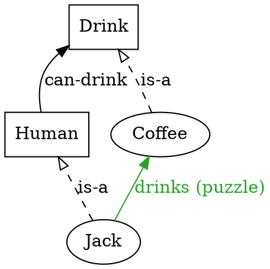
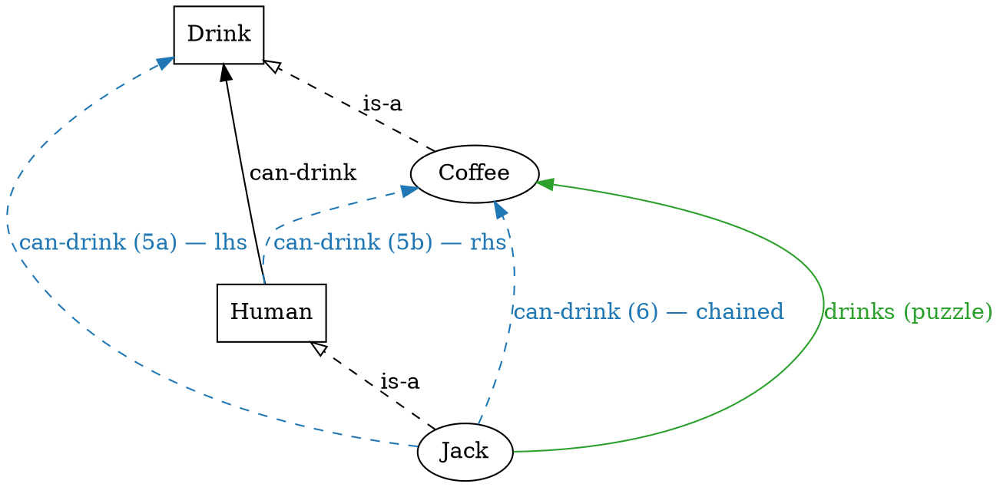

# Worked example — Jack drinks coffee

A small worked example illustrating the **type-as-common-relation-
holder** observation from
[`03_ein_model.md` §5](03_ein_model.md): an instance inherits the
relations of its type. Stated four ways — natural language, ein-
lang, compact graph (DOT), and detailed Levi-bipartite graph (DOT).

---

## 1. Natural language

We want the engine to conclude:

> *Jack drinks coffee.*

…from the following premises:

| # | claim                                           |
|---|-------------------------------------------------|
| 1 | Humans can drink drinks.                         |
| 2 | Coffee is a drink.                               |
| 3 | Jack is a human.                                 |
| 4 | Jack drinks coffee. *(the puzzle's explicit statement)* |

We want the engine to also conclude — *without* claim 4 — that:

| #  | claim                            | derivation                                          |
|----|----------------------------------|-----------------------------------------------------|
| 5a | Jack can drink drinks.           | LHS-inheritance: (1) + (is-a Jack Human)             |
| 5b | Humans can drink coffee.         | RHS-inheritance: (1) + (is-a Coffee Drink)           |
| 6  | Jack can drink coffee.           | chained — either (5a) + (is-a Coffee Drink) via RHS, or (5b) + (is-a Jack Human) via LHS |

The point of the example: **(5a), (5b), and (6) are derivable from the
ontology alone** (the type declarations and the is-a edges). The
explicit fact (4) is a separate assertion — *Jack drinks coffee* is
not the same as *Jack can drink coffee*; one is observed, the other
is a possibility entailed by the type structure.

(5a) and (5b) come from **two independent rules** — one per
argument slot of the binary `can-drink` relation. (6) is not its own
rule: it emerges from **saturation chaining** of the two. For an
N-ary relation the pattern generalises to N slot-indexed rules; the
"any × any × …" closure is always the chained fixpoint, never a
separate rule. See §2.

## 2. ein-lang

```lisp
;; T2 rule (LHS slot): inherit a relation through is-a on arg #1.
;; When a relation has type ?t in its left slot, the same relation
;; also holds with every instance of ?t in that slot.
(rule inherit-rel-lhs (?r)
  :match  (and (?r ?t ?other)
               (is-a ?inst ?t))
  :assert (?r ?inst ?other)
  :why    "{?inst} is-a {?t}, so {?inst} inherits {?r}'s left slot from {?t}."
  :priority 200)

;; T2 rule (RHS slot): same on arg #2.
(rule inherit-rel-rhs (?r)
  :match  (and (?r ?other ?t)
               (is-a ?inst ?t))
  :assert (?r ?other ?inst)
  :why    "{?inst} is-a {?t}, so {?inst} inherits {?r}'s right slot from {?t}."
  :priority 200)

;; "Any × any" — e.g. "any human can drink any drink" — is NOT a
;; separate rule. It emerges from saturation chaining: lhs over (any
;; human) then rhs over (any drink), or rhs first then lhs. The
;; chained fixpoint of the two single-slot rules is the closure. For
;; an N-arg relation the pattern generalises to N slot-indexed rules;
;; relation-inheritance / rule-polymorphism is parked at F4 Q36.

;; Schema + implicit assumptions (no :source → ONTOLOGY layer)
;; Types
(type Human)
(type Drink)

;; Instances
(instance Jack   Human)
(instance Coffee Drink)

;; Relation declarations — flat args (form b, no body follows;
;; see 03_ein_model.md §7.2).
(relation can-drink Human Drink)
(relation drinks    Human Drink)

;; Type-level fact (1): humans can drink drinks.
(can-drink Human Drink)

;; Activate both inheritance rules on can-drink.
(inherit-rel-lhs can-drink)
(inherit-rel-rhs can-drink)

;; Fact (4): the explicit puzzle statement (:source → FACT layer).
(drinks Jack Coffee :source "puzzle text")

(query :mode solve :goal (drinks Jack Coffee))
```

Note: this is a *sketch* of the rule library, not a tested M1 file
(the `inherit-rel-{lhs,rhs}` pair is a T2 generalisation that would
land in a future puzzle's rule library; M1's zebra rules use a
different inheritance pattern via `co-located` + `square-fwd/bwd`).
The shape — one rule per argument slot, with chaining for the
cartesian closure — is the canonical pattern for is-a inheritance
over N-ary relations.

The reasoning layer after saturation (claims (5a), (5b), (6), plus
the identity claim from (4)):

```lisp
;; Claim (5a): LHS inheritance — (can-drink Human Drink) + (is-a Jack Human)
(can-drink Jack  Drink  :rule inherit-rel-lhs
                        :using ((can-drink Human Drink) (is-a Jack Human)))

;; Claim (5b): RHS inheritance — (can-drink Human Drink) + (is-a Coffee Drink)
(can-drink Human Coffee :rule inherit-rel-rhs
                        :using ((can-drink Human Drink) (is-a Coffee Drink)))

;; Claim (6): chained — e.g. LHS on (can-drink Human Coffee) + (is-a Jack Human).
;; The reverse path (RHS on (can-drink Jack Drink) + (is-a Coffee Drink)) yields
;; the same conclusion; saturation produces whichever fires first.
(can-drink Jack  Coffee :rule inherit-rel-lhs
                        :using ((can-drink Human Coffee) (is-a Jack Human)))
```

## 3. Compact graph view

The puzzle as posed, before any reasoning fires. Types as boxes,
instances as ovals, relation declarations implicit (collapsed into
the labelled-arrow form).



After saturation, with the inherited edges (dashed-coloured to mark
reasoning-layer):



The three new edges (the reasoning-layer additions) are the
*inheritance closure* of the type-level `can-drink` relation across
the `is-a` edges — the cartesian product `{Human, Jack} × {Drink,
Coffee}` minus the seed fact. Notice that the compact view collapses
*two* separate relations (`can-drink` and `drinks`) onto the same
source-target pair (Jack→Coffee) — the labels distinguish them.

## 4. Detailed (Levi-bipartite) graph view

The same information with every fact rendered as its own octagon
node. The redundancy makes visible what the compact view hides:
*the `can-drink Human Drink` fact and the `can-drink Jack Coffee`
fact are distinct propositions about different argument tuples*,
even though they reuse the same relation declaration.

```dot
digraph jack_levi {
  rankdir=BT;

  // Relations (declarations) — shared across all facts of that name
  rel_isa   [shape=hexagon, label="is-a (rel)"];
  rel_can   [shape=hexagon, label="can-drink (rel)"];
  rel_drink [shape=hexagon, label="drinks (rel)"];

  // Types
  Human [shape=box];
  Drink [shape=box];

  // Instances
  Jack   [shape=ellipse];
  Coffee [shape=ellipse];

  // is-a facts (octagons)
  isa_jack [shape=octagon, label="is-a fact"];
  isa_jack -> Jack  [label="#1"];
  isa_jack -> Human [label="#2"];
  isa_jack -> rel_isa [style=dashed, label="instance-of-rel"];

  isa_coffee [shape=octagon, label="is-a fact"];
  isa_coffee -> Coffee [label="#1"];
  isa_coffee -> Drink  [label="#2"];
  isa_coffee -> rel_isa [style=dashed, label="instance-of-rel"];

  // Type-level can-drink fact
  can_HD [shape=octagon, label="can-drink fact"];
  can_HD -> Human [label="#1"];
  can_HD -> Drink [label="#2"];
  can_HD -> rel_can [style=dashed, label="instance-of-rel"];

  // Puzzle's explicit drinks fact (FACT layer)
  drinks_JC [
    shape=octagon,
    label="drinks fact\nlayer=FACT\nsource=puzzle text",
  ];
  drinks_JC -> Jack   [label="#1"];
  drinks_JC -> Coffee [label="#2"];
  drinks_JC -> rel_drink [style=dashed, label="instance-of-rel"];

  // Inherited (REASONING layer) — three derived facts, one per
  // closure cell. (5a) and (5b) fire from the seed; (6) chains through
  // either (5a) or (5b).
  can_JD [
    shape=octagon,
    label="can-drink fact (5a)\nlayer=REASONING\nby inherit-rel-lhs",
    style=dashed,
  ];
  can_JD -> Jack  [label="#1", style=dashed];
  can_JD -> Drink [label="#2", style=dashed];
  can_JD -> rel_can [style=dashed, label="instance-of-rel"];

  can_HC [
    shape=octagon,
    label="can-drink fact (5b)\nlayer=REASONING\nby inherit-rel-rhs",
    style=dashed,
  ];
  can_HC -> Human  [label="#1", style=dashed];
  can_HC -> Coffee [label="#2", style=dashed];
  can_HC -> rel_can [style=dashed, label="instance-of-rel"];

  can_JC [
    shape=octagon,
    label="can-drink fact (6)\nlayer=REASONING\nby inherit-rel-lhs (chained)",
    style=dashed,
  ];
  can_JC -> Jack   [label="#1", style=dashed];
  can_JC -> Coffee [label="#2", style=dashed];
  can_JC -> rel_can [style=dashed, label="instance-of-rel"];
}
```



This view shows the **homoiconic root** in action: the relation
declarations (`rel_isa`, `rel_can`, `rel_drink`) are *themselves
graph nodes*, and every fact has an explicit `instance-of-rel`
edge pointing at its declaration. The compact view from §3 hides
those edges; the Levi-bipartite view makes them inspectable.

## 5. What this example demonstrates

Each row of the §1 table maps onto a precise piece of the graph:

| claim                              | manifestation                                                                       |
|------------------------------------|--------------------------------------------------------------------------------------|
| (1) Humans can drink drinks.       | The fact `(can-drink Human Drink)` — type-level, layer=ONTOLOGY.                     |
| (2) Coffee is a drink.             | The fact `(is-a Coffee Drink)` — type-edge.                                          |
| (3) Jack is a human.               | The fact `(is-a Jack Human)` — type-edge.                                            |
| (4) Jack drinks coffee.            | The fact `(drinks Jack Coffee :source "puzzle text")` — layer=FACT.                  |
| (5a) Jack can drink drinks.        | Derived `(can-drink Jack Drink :rule inherit-rel-lhs)` — layer=REASONING.            |
| (5b) Humans can drink coffee.      | Derived `(can-drink Human Coffee :rule inherit-rel-rhs)` — layer=REASONING.          |
| (6) Jack can drink coffee.         | Derived `(can-drink Jack Coffee :rule inherit-rel-lhs)` — layer=REASONING (chained). |

The rules `inherit-rel-lhs` / `inherit-rel-rhs` (sketched in §2) are
**T2 relation-polymorphic**
([`02_rules.md` §2.2](02_rules.md)) — the relation variable `?r`
ranges over relations marked as inheritable via property facts. The
*structure* of each rule (match a relation with type ?t in one
specific slot + an is-a edge for ?t, assert the relation on the
instance in that same slot) is the **inheritance pattern**; the same
shape as the `transitive` rule in zebra.ein, just applied along is-a
rather than along the relation itself. One rule per argument slot of
the inherited relation; saturation chaining produces the full
cartesian closure.

## 6. What this example does NOT cover

- **Equivalent encodings.** This example uses the classic
  `(type …)` / `(instance …)` syntax. The same content could be
  expressed in zebra2.ein-style unified `is-a`:

  ```lisp
  (is-a Human   ⊤)
  (is-a Drink   ⊤)
  (is-a Jack    Human)
  (is-a Coffee  Drink)
  ```

  Both encodings produce the same logical content; the IR-encoding
  decision is [P1.7 T1.7.2.5](../../../../plans/m1_core_graph_reasoning/p1.7_bootstrapping_zebra/s1.7.2_dynamic_vs_hardcoded.md).

- **The relation between `can-drink` and `drinks`.** The example
  treats them as separate relations. In a real puzzle one would
  define `(drinks Jack Coffee) ⇒ (can-drink Jack Coffee)` (or vice
  versa) as a closure rule. That closure isn't part of *this*
  example's pedagogical scope.

- **Negation.** "Jack doesn't drink tea" would appear as `(not
  (drinks Jack Tea))` — a negative fact node. The closure rule
  would also have a negative form. Out of scope for this example.

## See also

- [`03_ein_model.md`](03_ein_model.md) — the reflexive algebra this
  example exercises.
- [`02_rules.md`](02_rules.md) — T2 rules (relation polymorphism)
  which the `inherit-rel` rule above is an instance of.
- [`../03-ein-lang/02_patterns.md`](../03-ein-lang/02_patterns.md) —
  the pattern sub-language for the `:match` clause.
