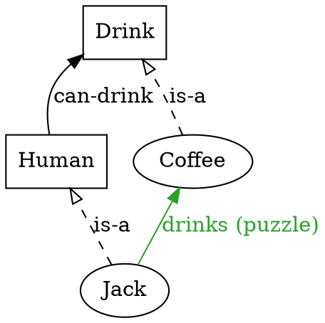
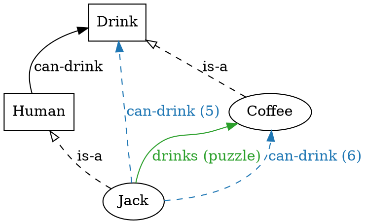

# Worked example — Jack drinks coffee

A small worked example illustrating the **type-as-common-relation-
holder** observation from
[`03_ein_model.md` §5](03_ein_model.md): an instance inherits the
relations of its type. Stated four ways — natural language, ein-
lang, compact graph (DOT), and detailed Levi-bipartite graph (DOT).

---

## 1. Natural language

We want the engine to conclude:

> *Jack drinks coffee.*

…from the following premises:

| # | claim                                           |
|---|-------------------------------------------------|
| 1 | Humans can drink drinks.                         |
| 2 | Coffee is a drink.                               |
| 3 | Jack is a human.                                 |
| 4 | Jack drinks coffee. *(the puzzle's explicit statement)* |

We want the engine to also conclude — *without* claim 4 — that:

| # | claim                                           |
|---|-------------------------------------------------|
| 5 | Jack can drink drinks.    *(inherited from 1 + 3)*  |
| 6 | Jack can drink coffee.    *(5 instantiated by 2)*    |

The point of the example: **(5) and (6) are derivable from the
ontology alone** (the type declarations and the is-a edges). The
explicit fact (4) is a separate assertion — *Jack drinks coffee* is
not the same as *Jack can drink coffee*; one is observed, the other
is a possibility entailed by the type structure.

## 2. ein-lang

```lisp
(rules
  ;; T2 rule: inherit relations through is-a — when a relation
  ;; mentions type T, the same relation mentions every instance of T.
  (rule inherit-rel (?r)
    :match  (and (?r ?t ?other)
                 (is-a ?inst ?t))
    :assert (?r ?inst ?other)
    :why    "{?inst} is-a {?t}, so {?inst} inherits {?r} from {?t}."
    :priority 4))

  ;; TODO: here should be 2 parts of inherit-rel rule: for LHS and RHS args
  ;; so any human can drink some drink
  ;; some human can drink any drink
  ;; so any human can drink any drink
  ;; does it make sense?

(ontology
  ;; Types
  (type Human)
  (type Drink)

  ;; Instances
  (instance Jack   Human)
  (instance Coffee Drink)

  ;; Relation declarations — `can-drink` is a Human × Drink relation.
  (relation can-drink (Human Drink))
  (relation drinks    (Human Drink))

  ;; Type-level fact (1): humans can drink drinks.
  (can-drink Human Drink)

  ;; Activate the inheritance rule on can-drink (and drinks).
  (inherit-rel can-drink)
)

(facts
  ;; Fact (4): the explicit puzzle statement.
  (drinks Jack Coffee :source "puzzle text"))

(query :mode solve :goal (drinks Jack Coffee))
```

Note: this is a *sketch* of the rule library, not a tested M1 file
(the `inherit-rel` rule above is a T2 generalisation that would land
in a future puzzle's rule library; M1's zebra rules use a different
inheritance pattern via `co-located` + `square-fwd/bwd`). The shape
is faithful; the exact rule names will differ.

The reasoning layer after saturation (claim (5), (6), plus the
identity claim from (4)):

```lisp
(reasoning
  ;; Claim (5): inherited from (can-drink Human Drink) + (is-a Jack Human)
  (can-drink Jack Drink   :rule inherit-rel :using ((can-drink Human Drink)
                                                     (is-a Jack Human)))

  ;; Claim (6): two-hop derivation through claim (5) + (is-a Coffee Drink)
  (can-drink Jack Coffee  :rule inherit-rel :using ((can-drink Jack Drink)
                                                     (is-a Coffee Drink))))
```

## 3. Compact graph view

The puzzle as posed, before any reasoning fires. Types as boxes,
instances as ovals, relation declarations implicit (collapsed into
the labelled-arrow form).



After saturation, with the inherited edges (dashed-coloured to mark
reasoning-layer):



The two new edges (the reasoning-layer additions) are the
*inheritance closure* of the type-level `can-drink` relation across
the `is-a` edges. Notice that the compact view collapses *two*
separate relations (`can-drink` and `drinks`) onto the same source-
target pair (Jack→Coffee) — the labels distinguish them.

## 4. Detailed (Levi-bipartite) graph view

The same information with every fact rendered as its own octagon
node. The redundancy makes visible what the compact view hides:
*the `can-drink Human Drink` fact and the `can-drink Jack Coffee`
fact are distinct propositions about different argument tuples*,
even though they reuse the same relation declaration.

```dot
digraph jack_levi {
  rankdir=BT;

  // Relations (declarations) — shared across all facts of that name
  rel_isa   [shape=hexagon, label="is-a (rel)"];
  rel_can   [shape=hexagon, label="can-drink (rel)"];
  rel_drink [shape=hexagon, label="drinks (rel)"];

  // Types
  Human [shape=box];
  Drink [shape=box];

  // Instances
  Jack   [shape=ellipse];
  Coffee [shape=ellipse];

  // is-a facts (octagons)
  isa_jack [shape=octagon, label="is-a fact"];
  isa_jack -> Jack  [label="#1"];
  isa_jack -> Human [label="#2"];
  isa_jack -> rel_isa [style=dashed, label="instance-of-rel"];

  isa_coffee [shape=octagon, label="is-a fact"];
  isa_coffee -> Coffee [label="#1"];
  isa_coffee -> Drink  [label="#2"];
  isa_coffee -> rel_isa [style=dashed, label="instance-of-rel"];

  // Type-level can-drink fact
  can_HD [shape=octagon, label="can-drink fact"];
  can_HD -> Human [label="#1"];
  can_HD -> Drink [label="#2"];
  can_HD -> rel_can [style=dashed, label="instance-of-rel"];

  // Puzzle's explicit drinks fact (FACT layer)
  drinks_JC [
    shape=octagon,
    label="drinks fact\nlayer=FACT\nsource=puzzle text",
  ];
  drinks_JC -> Jack   [label="#1"];
  drinks_JC -> Coffee [label="#2"];
  drinks_JC -> rel_drink [style=dashed, label="instance-of-rel"];

  // Inherited (REASONING layer)
  can_JD [
    shape=octagon,
    label="can-drink fact (5)\nlayer=REASONING\nby inherit-rel",
    style=dashed,
  ];
  can_JD -> Jack  [label="#1", style=dashed];
  can_JD -> Drink [label="#2", style=dashed];
  can_JD -> rel_can [style=dashed, label="instance-of-rel"];

  can_JC [
    shape=octagon,
    label="can-drink fact (6)\nlayer=REASONING\nby inherit-rel",
    style=dashed,
  ];
  can_JC -> Jack   [label="#1", style=dashed];
  can_JC -> Coffee [label="#2", style=dashed];
  can_JC -> rel_can [style=dashed, label="instance-of-rel"];
}
```



This view shows the **homoiconic root** in action: the relation
declarations (`rel_isa`, `rel_can`, `rel_drink`) are *themselves
graph nodes*, and every fact has an explicit `instance-of-rel`
edge pointing at its declaration. The compact view from §3 hides
those edges; the Levi-bipartite view makes them inspectable.

## 5. What this example demonstrates

Each row of the §1 table maps onto a precise piece of the graph:

| claim                              | manifestation                                                                |
|------------------------------------|------------------------------------------------------------------------------|
| (1) Humans can drink drinks.       | The fact `(can-drink Human Drink)` — type-level, layer=ONTOLOGY.             |
| (2) Coffee is a drink.             | The fact `(is-a Coffee Drink)` — type-edge.                                  |
| (3) Jack is a human.               | The fact `(is-a Jack Human)` — type-edge.                                    |
| (4) Jack drinks coffee.            | The fact `(drinks Jack Coffee :source "puzzle text")` — layer=FACT.           |
| (5) Jack can drink drinks.         | Derived `(can-drink Jack Drink :rule inherit-rel)` — layer=REASONING.        |
| (6) Jack can drink coffee.         | Derived `(can-drink Jack Coffee :rule inherit-rel)` — layer=REASONING.       |

The rule `inherit-rel` (sketched in §2) is a **T2 relation-
polymorphic** rule
([`02_rules.md` §2.2](02_rules.md)) — the relation variable `?r`
ranges over relations marked as inheritable via property facts. The
*structure* of the rule (match a relation on a type + an is-a edge,
assert the relation on the instance) is the **inheritance pattern**;
it's the same shape as the `transitive` rule in zebra.ein, just
applied to a different relation algebra.

## 6. What this example does NOT cover

- **Equivalent encodings.** This example uses the classic
  `(type …)` / `(instance …)` syntax. The same content could be
  expressed in zebra2.ein-style unified `is-a`:

  ```lisp
  (is-a Human   ⊤)
  (is-a Drink   ⊤)
  (is-a Jack    Human)
  (is-a Coffee  Drink)
  ```

  Both encodings produce the same logical content; the IR-encoding
  decision is [P1.7 T1.7.2.5](../../../../plans/m1_core_graph_reasoning/p1.7_bootstrapping_zebra/s1.7.2_dynamic_vs_hardcoded.md).

- **The relation between `can-drink` and `drinks`.** The example
  treats them as separate relations. In a real puzzle one would
  define `(drinks Jack Coffee) ⇒ (can-drink Jack Coffee)` (or vice
  versa) as a closure rule. That closure isn't part of *this*
  example's pedagogical scope.

- **Negation.** "Jack doesn't drink tea" would appear as `(not
  (drinks Jack Tea))` — a negative fact node. The closure rule
  would also have a negative form. Out of scope for this example.

## See also

- [`03_ein_model.md`](03_ein_model.md) — the reflexive algebra this
  example exercises.
- [`02_rules.md`](02_rules.md) — T2 rules (relation polymorphism)
  which the `inherit-rel` rule above is an instance of.
- [`../03-ein-lang/02_patterns.md`](../03-ein-lang/02_patterns.md) —
  the pattern sub-language for the `:match` clause.
