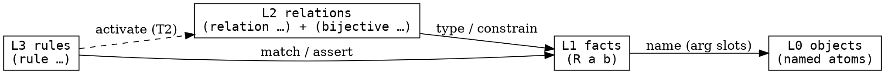

# Four-level KB representation

Every node in the KB belongs to one of **four levels** — objects,
facts, relations, rules. This file names the levels and the *consumes*
relation between them, extending the reflexive algebra of
[`03_ein_model.md`](03_ein_model.md). It is the schema that
[`06_self_describing.md`](06_self_describing.md) then expresses *in
ein-lang itself*.

> **Levels ≠ layers.** The four **levels** here (L0–L3, by *what kind
> of node*) are orthogonal to the three **layers** (ontology / fact /
> reasoning, by *where a fact came from* — see [`01_kb.md` §3](01_kb.md)
> and the [glossary](../../glossary.md)). A single L1 fact node sits at
> exactly one layer; the level says *what it is*, the layer says *where
> it came from*.

## 1. The four levels

| level             | what lives here                                              | ein-lang example |
|-------------------|-------------------------------------------------------------|------------------|
| **L0 — objects**  | Named atoms standing for entities (instances *and* types — S1.7.23 unified them). | `Red`, `House-1`, `Englishman`, `Color` |
| **L1 — facts**    | Propositions over objects: a relational node `(R a b …)`.   | `(color-loc Red House-1)` |
| **L2 — relations**| Relation declarations + property tags that *type* and *constrain* the facts. | `(relation color-loc Color House)`, `(bijective color-loc)` |
| **L3 — rules**    | First-class rewriting machinery: `:match` → `:assert`.      | `(rule symmetric (?R) :match (?R ?a ?b) :assert (?R ?b ?a))` |

Each level is just **nodes** in the one graph ([`03_ein_model.md` §2](03_ein_model.md));
"level" classifies those nodes by role — it is not a separate store.

## 2. Each level consumes the levels below

The levels form a (mostly — see §4) downward-consuming stack:

- **L3 rules** pattern-match **L1 facts** (and, for T2 activation, the
  **L2** property/relation facts) and assert new **L1 facts**.
- **L2 relations** *type* the **L1 facts**: a fact's head names an L2
  relation whose signature constrains the args' L0 types.
- **L1 facts** *name* **L0 objects** in their argument slots.
- **L0 objects** are the leaves — atoms, named by themselves.

Worked through zebra2:

| level | zebra2 instance |
|-------|-----------------|
| L0    | `Red`, `House-1`, `Englishman` |
| L1    | `(color-loc Red House-1)` — names the L0 objects `Red`, `House-1` |
| L2    | `(relation color-loc Color House)` + `(bijective color-loc)` — type/constrain every `color-loc` L1 fact |
| L3    | `(rule co-located …)` — matches L1 `co-located` activator facts, asserts L1 `*-loc` facts |

## 3. The consumption diagram

## 4. Reflexive edge cases — where the strict stack breaks

The downward-consuming stack is a clean DAG *only* for M1's rule
library. Two cases bend it:

- **Rules that match rules** (F5 rules-as-data) — an L3 node whose
  `:match` ranges over other L3 nodes. The arrow points L3→L3, breaking
  the strict reads-only-below shape. M1 forbids it (the
  [M1 invariant](../../inference/README.md#m1-invariant--alive-set-soundness):
  rules don't assert new relations or rules).
- **Rules that declare relations dynamically** — an L3 node asserting an
  `(relation …)` L2 node. Same break; same M1 prohibition.

Both are **F5** territory; the level model survives, but "consumes only
below" relaxes to "consumes any level, including its own". The
[reflexive root](03_ein_model.md) (§1 — *instance is-an instance of
instance*) is the L-level statement of this: the schema can describe
itself. What an **L4** (rules over rules) would be is left open —
[`06_self_describing.md`](06_self_describing.md) sketches it; F5
implements it.

## See also

- [`03_ein_model.md`](03_ein_model.md) — the reflexive node algebra
  (atoms, objects, the five foundational terms) this stratifies.
- [`06_self_describing.md`](06_self_describing.md) — expresses this
  L0–L3 schema *in ein-lang* (`(meta …)`); design-only for M1.
- [`01_kb.md` §3](01_kb.md) — the three knowledge **layers**
  (orthogonal to these levels).
- [F5 — rules as data](../../../../plans/followups/f5_rules_as_data.md)
  — implements the reflexive edge cases (§4).
