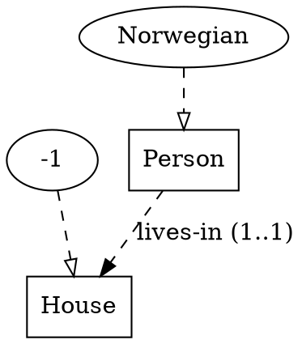
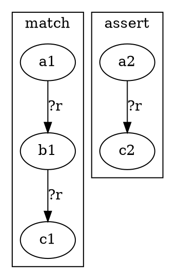
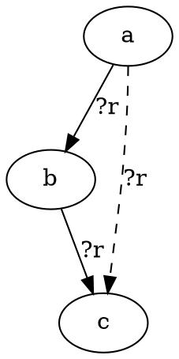
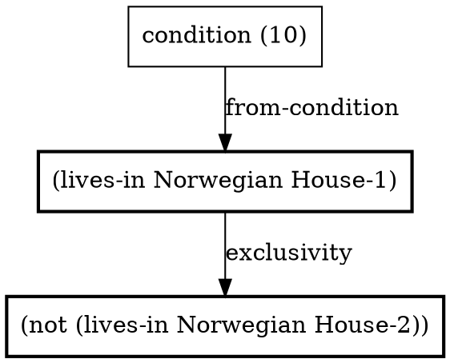
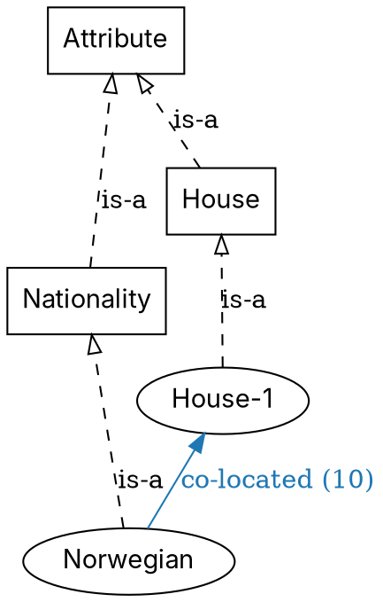
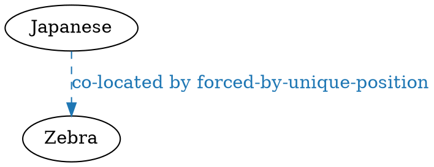

# IR ↔ DOT rendering

Every kernel IR form has a **fixed DOT shape**. Only **graph
structure** is fixed by this schema; layout (positions, rank,
unspecified style choices) is free — `random_layout` is permitted.

Per [Q21](../../../../plans/m1_core_graph_reasoning/open_questions.md#q21),
render is mandatory (`ein.ir.to_dot`,
[S1.1.4](../../../../plans/m1_core_graph_reasoning/p1.1_ir_language/s1.1.4_ir_to_dot.md));
reverse parse (`ein.ir.from_dot`) is a P1.2 deliverable
alongside the typed-hypergraph data model.

This was [`docs/ir.md` §6](../../README.md) before the kernel-
documentation split. The conceptual content overlaps with the
**detailed (Levi-bipartite) view** in
[`../01-ein-graph/01_kb.md` §2.2](../01-ein-graph/01_kb.md) —
this document specifies the *concrete DOT encoding*.

---

## Node-shape legend

| IR element                | DOT shape                          |
|---------------------------|------------------------------------|
| `type` declaration        | `box`                              |
| `instance` declaration    | `oval` (ellipse)                   |
| ground atom               | `rectangle`                        |
| hyperedge (Levi-bipartite) | `octagon`                          |
| equality class            | `doublecircle`                     |
| pattern variable `?x`     | `diamond`                          |
| wildcard `_`              | `diamond` with `style=dashed`      |
| relation schema           | dashed labelled edge               |
| derived edge (fact)       | solid labelled edge                |
| hypothetical edge         | solid edge with `style=dashed`     |

## Hyperedge encoding — Levi-bipartite

DOT has no native hyperedges. Every n-ary relation fact `(name a b c)`
is encoded **Levi-bipartite**: one `octagon` node for the hyperedge
itself, with directed edges to each participant labelled by role index
(or role name when declared). The hyperedge's node identity is what
[Q18](../../../../plans/m1_core_graph_reasoning/open_questions.md#q18)
provenance tuples reference; this anchors
[Q1](../../../../plans/open_questions.md#q1--what-kind-of-graph-is-the-ir)'s
typed-hypergraph + equality-class-ID answer visually.

The Levi-bipartite scheme is the *canonical* form — see
[`../01-ein-graph/01_kb.md` §2.2](../01-ein-graph/01_kb.md). For
binary facts, the compact rendering (collapsed labelled arrow) is
also permitted; see
[`../01-ein-graph/01_kb.md` §2.1](../01-ein-graph/01_kb.md).

**Default = compact (S1.6.0).** Faithful as it is, the
list-node-per-relation Levi view is unreadable as a default. So
`ein.ir.to_dot` renders **compact** by
default: a binary fact `(rel a b)` collapses to one labelled,
relation-coloured arrow `a → b [label="rel"]` (the colour is the
shared per-relation palette — see §Unified KB view). n-ary facts stay
Levi-bipartite (no native hyperedge to collapse). The canonical
Levi-bipartite view of *every* relation is opt-in via
`to_dot(…, levi=True)` / `EIN_RENDER_LEVI=1`.

## Ontology — UML-ish



## Rule rendering — modes, configurable

**Default = (a) side-by-side, `rankdir=TB` (S1.6.0).** The previous
cross-product (rule-mode × trace-view) collapsed to one diagram per
rule: the side-by-side LHS|RHS view, the most readable for rule
libraries. The overlay variant (c) is opt-in via
`render_rule(…, mode="overlay")`
(the legacy single-letter names `"a"` / `"c"` are still accepted).
**(b)** is opt-in.

The renderer lives in
[`ein.render.rules`](../../../../ein.py/src/ein/render/rules.py)
(`ein render rules|rule …`); `ir.to_dot` delegates to it.

**(a) Side-by-side LHS | RHS** — explicit; readable for rule libraries.



**Faithful pattern rendering (S1.6.1).** Within each panel the renderer
distinguishes the three things that can appear in a `:match` / `:assert`:

- **Relations** `(R a b)` → a labelled arrow `a → b` (relation-coloured;
  `R` may be a `?var`); n-ary `(R a b c …)` → a Levi octagon.
- **Guard predicates** `(neq ?a ?b)` / `(eq …)` → a *dotted, undirected*
  `≠` / `=` link with `constraint=false` — they are computed, not data,
  so they are never drawn as a relation arrow.
- **NAF guards** `(absent (and …))` → a `cluster_absent` subgraph (∄):
  inner conjuncts render *inside* it, the binder-local variables are
  declared inside while shared variables stay outside, so the
  "no such match exists" reading survives. `(not P)` renders red with a
  `¬` prefix.

Node ids carry a per-panel `_L`/`_R` suffix so the `match` and `assert`
copies of a variable are distinct nodes (the panels don't collapse),
but the **label** is always the clean name — both panels show `?a`.
Variables are diamonds, ground atoms rectangles (the shape legend).

**(b) DPO span `L ← K → R`** — categorical reading
([idea 07](../../../../plans/ideas/07-categorical-formulation.md)). Three
sub-clusters share the interface graph K (the bindings preserved by
the rule); the left morphism deletes nothing for our pattern
language (positive conjunctive), the right morphism adds the RHS.

**(c) Overlay** — most compact; LHS in solid, RHS additions in dashed.
Default at rule-firing time inside traces:



## Trace rendering — three views, configurable

Default: **(a)** — matches
[M1 acceptance §2](../../../../plans/m1_core_graph_reasoning/README.md)'s
`zebra/` snapshot folder.

**(a) Per-step DOT** — one file per step under
`<trace-name>/sNN.dot`; each shows working memory immediately after
the step's `:derives` is committed.

**(b) Aggregate** — single file, final state, edges coloured by step
number (early = blue, late = red). For overviews and paper figures.

**(c) Derivation DAG** (alias `dag`; **implemented S1.6.3 T1.6.3.3**) —
nodes are derived facts (one per `:derives`), edges connect each
derived fact to its `:using` premises (chaining through earlier steps),
the edge labelled by the firing `:rule`. The natural "explanation
graph" view per
[idea 08](../../../../plans/ideas/08-human-style-deductive-trace.md):



The view names accept friendly aliases: `per-step` (a), `aggregate`
(b), `dag` (c).

## Branch rendering — the commitment lattice (S1.6.3)

The P1.5 ordered search tree was removed with the tree solver
(2026-05-29); the engine now produces a **set-indexed commitment
lattice**. [`ein.render.lattice_dag`](../../../../ein.py/src/ein/render/lattice_dag.py)
renders it as a DAG (`render_lattice(proof | snapshot, view=)`):

- `rankdir=LR`, ranked by **layer** (= commitment-set size); layer 0
  (root saturation) at the left, layers flowing rightward.
- One node per visited commitment / `state_hash`; when several
  commitments collapse to one post-saturation state the node is a
  multilabel ("+N ≡ same state").
- Colour by verdict — **alive** grey, **dead** red, **solution** green.
  Dead nodes carry their `unsat_core` in the tooltip and a dashed
  back-edge labelled with the lifted `learned_clause` (no-good).
- Two views: `full` (every commitment; needs `store_lattice=True`) and
  `solution` (survivors + pruned siblings — the small sub-DAG the trace
  embeds).

Fed a `LatticeSnapshotV1`
([`snapshot.py`](../../../../ein.py/src/ein/inference/monotonic/snapshot.py))
the diagram is **order-stable across `lattice_order_seed`** (reuses the
S1.5b.31 shuffle-invariance guarantee).

## Markdown trace (S1.6.4)

The capstone output — what makes Ein *not just a solver* (idea 08)
— is not DOT but a **markdown narrative** that threads the diagrams
together. [`ein.trace`](../../../../ein.py/src/ein/trace/)
(`ein solve <file> --trace=out.md`):

- `linearize(verdict)` turns the *unordered* commitment lattice into a
  depth-ordered story: the primary solution's firings as numbered
  steps (smallest commitment first; `()` = unconditional root
  saturation), and each refuted `DeadCommitment` as a reductio.
- `render_markdown(trace)` emits one section per step — rule name,
  English `:why` (`render_why(rule.why, firing.bindings)`), premises
  with their quoted `:source` sentences, and an inline `dot` derivation
  slice (S1.6.2). Refuted hypotheses fold into `<details>` blocks
  (closed by their lifted no-good); the file closes with the
  lattice-DAG (S1.6.3) + solution grid. `--no-diagrams` suppresses the
  `dot` blocks; `--reorder` clusters steps by target entity; round-trips
  through the parser as a `(trace …)` form (`trace.ast.TraceStep`).

Every diagram is an inline fenced `dot` block — no SVG. The trace is
the **M1 acceptance artefact** (criterion #3): every named move in the
[idea-08 walkthrough](../../../../plans/ideas/08-human-style-deductive-trace.md)
must surface as a named rule firing (P1.7 / S1.6.5 enforce this).

## Unified KB view (S1.2.4)

When the renderer has the full :class:`KnowledgeBase` (not just a
single-form AST), it produces a **unified graph** where node
identity is fused across forms — `Norwegian` (instance) appears
**once** and participates in:

- its `is-a` edge to `Nationality` (ontology layer),
- its `(co-located Norwegian House-1)` fact edge (fact layer),
- any derived edges that mention it (reasoning layer).

This is the 2021 prototype's *linked.svg* aesthetic — all the entity
types on one canvas, related by labelled arrows, coloured by relation. See
[S1.2.4](../../../../plans/m1_core_graph_reasoning/p1.2_typed_hypergraph/s1.2.4_graph_representation.md)
for the design plan; the implementation is
[`src/ein/kb/render.py`](../../../../ein.py/src/ein/kb/render.py).

### Schema

| graph element                       | DOT shape / style                              |
|-------------------------------------|------------------------------------------------|
| type-role node (from `is-a`/`type` facts) | `shape=box`                              |
| instance/object node (leaf)         | `shape=oval`                                   |
| Binary `Fact(rel, a, b)`            | direct edge `a → b [label=rel ...]`            |
| n-ary `Fact` (arity ≠ 2)            | `shape=octagon` Levi node + n slot-edges       |
| Instance-of (type-edge)             | `style=dashed, arrowhead=empty, label="is-a"`  |
| `is-a` fact (zebra2 encoding)       | same as instance-of (dashed empty arrow)        |
| ONTOLOGY-layer fact                 | `style=solid`, plain                            |
| FACT-layer fact                     | `style=solid`, label includes `(N)` short source id |
| REASONING-layer fact                | `style=dashed`, label includes `by <rule-name>` |
| per-relation colour (default)       | SHA1(`rel.name`) mod palette                    |
| per-layer colour (opt-in)           | ontology grey, fact black, reasoning blue       |

**Suppressed by default**:

- **Rule-application meta-facts** like `(symmetric co-located)` —
  they're meta, not data. (Their structural effect — making the
  `symmetric` rule fire on `co-located` — is visible in the
  derivation DAG, not in the unified KB view.)
- **`instance` / `type` schema facts** — the
  `(instance Norwegian Nationality)` proposition is already shown as a
  dashed type-edge derived from the fact itself (S1.7.23 —
  `render._schema_nodes` reads `is-a` / `(type …)` / `(instance …)`
  facts directly; there is no `Instance.type_name` entity). Including
  it again as a labelled edge would duplicate.
- **`not`-headed facts** with collapsed arg structure — current
  loader limitation (S1.2.3 T1.2.3.4 deferral). Revisit when the
  loader preserves nested SForm args.

### Worked Zebra fragment

For the proposition *"The Norwegian lives in the first house"*
(condition (10)) the unified renderer produces:



(The actual `co-located` colour is whatever
``SHA1("co-located") mod palette`` picks — stable across runs.)

A reasoning-layer derivation `(co-located Japanese Zebra :rule
forced-by-unique-position)` would render as a dashed edge:



### From Python

The `kb dot` CLI subcommand was removed; render the unified KB graph via
`KnowledgeBase.to_dot` (the same renderer), which takes `layers=`,
`colour_by=`, `include_instances=`, … as keyword arguments:

```python
from pathlib import Path
from ein.ir import parse
from ein.kb import KnowledgeBase, Layer
p = Path("examples/zebra2.ein")
kb = KnowledgeBase.from_ir(parse(p.read_text()), base_dir=p.parent)
print(kb.to_dot())                                   # all layers
print(kb.to_dot(layers=(Layer.ONTOLOGY, Layer.FACT)))  # no reasoning
print(kb.to_dot(colour_by="layer"))                  # 3 layer colours
print(kb.to_dot(include_instances=False))            # types-only
```

`utils/render_examples.sh` produces `_unified.dot` + `_unified.svg`
per example, rendered with `fdp` (force-directed) for the 2021
prototype's spread-out aesthetic.

### Encoding-agnostic

The renderer derives node shapes by reading the puzzle's `is-a` /
`(type …)` / `(instance …)` facts directly (`render._schema_nodes`,
S1.7.23 — there is no `logical_types` / `kb.types` entity-view to
consult), so `zebra2.ein` (unified `is-a`) renders to the same visual
shapes as `zebra.ein` (classic `(type …)` / `(instance …)`). `is-a`
facts get the type-edge styling rather than the regular coloured-arrow
styling.

### 2021-prototype comparison (T1.2.4.5 — deferred)

The 2021 prototype's *linked.svg* is the visual target. A
checklist of deliberate divergences (new reasoning-layer dashed
styling, per-relation colour-palette change) lands when the
renderer's output is reviewed visually.

## Derivation slices + KB snapshots (S1.6.2)

The trace ([S1.6.4](../../../../plans/m1_core_graph_reasoning/p1.6_rendering_and_trace/s1.6.4_markdown_trace.md))
does not embed the whole KB per step — it embeds a **provenance cone**:
[`ein.render.slice`](../../../../ein.py/src/ein/render/slice.py).

- `render_slice(commitment, firings, kb)` — one hypothesis's cone: the
  hypothesis fact(s) (red seeds), the premises each firing consumed,
  the firings as rule-nodes (labelled with the rendered `:why`), and
  the derived facts (bold). **Only cone facts appear**, never the whole
  KB. Negative / eliminated-alternative facts are greyed. Fed a
  `DeadCommitment`'s `contradiction=(unsat_core, learned_clause)` it
  becomes the refuted-branch slice terminating in a `⊥` node tagged
  with the lifted no-good.
- `render_state(kb, *, layer_filter=, since=)` — the whole-KB snapshot
  (the §Unified KB view), flag-gated in the trace behind
  `--full-kb-snapshots`. `since=<kb_before>` thickens (`penwidth=3`) the
  facts a step added — the transition highlight.
- `render_solution(kb)` — the solved-state view for the closing section.

All three emit inline `dot` (the Python layer emits DOT; rasterising
stays in shell).

## Reverse parse (`from_dot`)

Required by Q21 but not blocking on P1.1. The schema fixed by this
chapter is the contract `from_dot` will follow when implemented in
P1.2. Generic DOT files outside this schema are NOT round-trippable;
the API will reject non-conforming inputs rather than guess.

## See also

- [`../01-ein-graph/01_kb.md` §2](../01-ein-graph/01_kb.md) —
  conceptual compact vs detailed views; this document gives the
  concrete DOT encoding.
- [`../02-data-model/02_store.md`](../02-data-model/02_store.md) —
  `DerivationDAG.to_dot()` and (S1.2.4) `KnowledgeBase.to_dot()`.
- Grammar: [`src/ein/ir/grammar.lark`](../../../../ein.py/src/ein/ir/grammar.lark).
