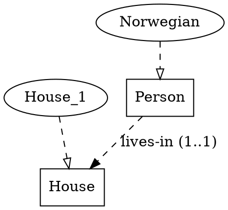
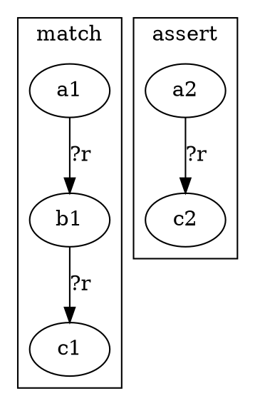
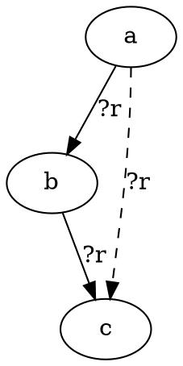
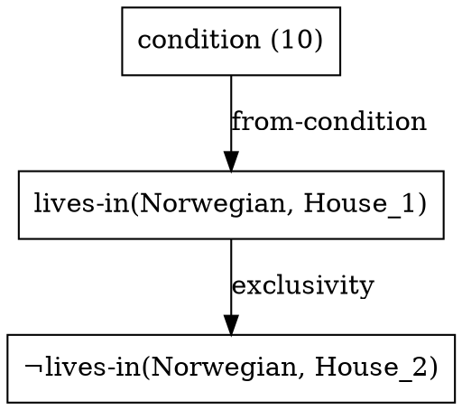
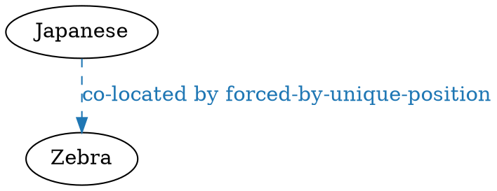

# IR ↔ DOT rendering

Every kernel IR form has a **fixed DOT shape**. Only **graph
structure** is fixed by this schema; layout (positions, rank,
unspecified style choices) is free — `random_layout` is permitted.

Per [Q21](../../../../plans/m1_core_graph_reasoning/open_questions.md#q21),
render is mandatory (`ein_bot.ir.to_dot`,
[S1.1.4](../../../../plans/m1_core_graph_reasoning/p1.1_ir_language/s1.1.4_ir_to_dot.md));
reverse parse (`ein_bot.ir.from_dot`) is a P1.2 deliverable
alongside the typed-hypergraph data model.

This was [`docs/ir.md` §6](../../../ir.md) before the kernel-
documentation split. The conceptual content overlaps with the
**detailed (Levi-bipartite) view** in
[`../01-ein-graph/01_kb.md` §2.2](../01-ein-graph/01_kb.md) —
this document specifies the *concrete DOT encoding*.

---

## Node-shape legend

| IR element                | DOT shape                          |
|---------------------------|------------------------------------|
| `type` declaration        | `box`                              |
| `instance` declaration    | `oval` (ellipse)                   |
| ground atom               | `rectangle`                        |
| hyperedge (Levi-bipartite) | `octagon`                          |
| equality class            | `doublecircle`                     |
| pattern variable `?x`     | `diamond`                          |
| wildcard `_`              | `diamond` with `style=dashed`      |
| relation schema           | dashed labelled edge               |
| derived edge (fact)       | solid labelled edge                |
| hypothetical edge         | solid edge with `style=dashed`     |

## Hyperedge encoding — Levi-bipartite

DOT has no native hyperedges. Every n-ary relation fact `(name a b c)`
is encoded **Levi-bipartite**: one `octagon` node for the hyperedge
itself, with directed edges to each participant labelled by role index
(or role name when declared). The hyperedge's node identity is what
[Q18](../../../../plans/m1_core_graph_reasoning/open_questions.md#q18)
provenance tuples reference; this anchors
[Q1](../../../../plans/open_questions.md#q1--what-kind-of-graph-is-the-ir)'s
typed-hypergraph + equality-class-ID answer visually.

The Levi-bipartite scheme is the *canonical* form — see
[`../01-ein-graph/01_kb.md` §2.2](../01-ein-graph/01_kb.md). For
binary facts, the compact rendering (collapsed labelled arrow) is
also permitted; see
[`../01-ein-graph/01_kb.md` §2.1](../01-ein-graph/01_kb.md).

## Ontology — UML-ish



## Rule rendering — three modes, configurable

Default: **(a)** for `rules.ein` documentation, **(c)** for trace
output. **(b)** is opt-in.

**(a) Side-by-side LHS | RHS** — explicit; readable for rule libraries.



**(b) DPO span `L ← K → R`** — categorical reading
([idea 07](../../../ideas/07-categorical-formulation.md)). Three
sub-clusters share the interface graph K (the bindings preserved by
the rule); the left morphism deletes nothing for our pattern
language (positive conjunctive), the right morphism adds the RHS.

**(c) Overlay** — most compact; LHS in solid, RHS additions in dashed.
Default at rule-firing time inside traces:



## Trace rendering — three views, configurable

Default: **(a)** — matches
[M1 acceptance §2](../../../../plans/m1_core_graph_reasoning/README.md)'s
`zebra/` snapshot folder.

**(a) Per-step DOT** — one file per step under
`<trace-name>/sNN.dot`; each shows working memory immediately after
the step's `:derives` is committed.

**(b) Aggregate** — single file, final state, edges coloured by step
number (early = blue, late = red). For overviews and paper figures.

**(c) Derivation DAG** — nodes are derived facts (one per `:derives`),
edges connect each derived fact to its `:using` premises. The natural
"explanation graph" view per
[idea 08](../../../ideas/08-human-style-deductive-trace.md). The
DAG is also what
[`../02-data-model/02_store.md` §provenance](../02-data-model/02_store.md)'s
`kb.derivation_dag(fact).to_dot()` produces directly:



## Branch rendering

- **Search-tree view** (P1.5 forward-reference): nodes are states
  bracketed by `branch-open` / `branch-close`; edges are `:choices`.
  Default for the `--search-tree` flag.
- **Per-state snapshots**: each branch becomes a `cluster_branch_<id>`
  sub-graph inside the working-memory DOT. Maps onto
  [`../02-data-model/02_store.md`](../02-data-model/02_store.md)'s
  `kb.fork()` semantics — each fork gets a distinct DOT cluster.

## Unified KB view (S1.2.4)

When the renderer has the full :class:`KnowledgeBase` (not just a
single-form AST), it produces a **unified graph** where node
identity is fused across forms — `Norwegian` (instance) appears
**once** and participates in:

- its `is-a` edge to `Nationality` (ontology layer),
- its `(co-located Norwegian House_1)` fact edge (fact layer),
- any derived edges that mention it (reasoning layer).

This is the PoC's *linked.svg* aesthetic — all the entity types on
one canvas, related by labelled arrows, coloured by relation. See
[S1.2.4](../../../../plans/m1_core_graph_reasoning/p1.2_typed_hypergraph/s1.2.4_graph_representation.md)
for the design plan; the implementation is
[`src/ein_bot/kb/render.py`](../../../../src/ein_bot/kb/render.py).

### Schema

| graph element                       | DOT shape / style                              |
|-------------------------------------|------------------------------------------------|
| `Type` (or logical type)            | `shape=box`                                    |
| `Instance` (or logical instance)    | `shape=oval`                                   |
| Binary `Fact(rel, a, b)`            | direct edge `a → b [label=rel ...]`            |
| n-ary `Fact` (arity ≠ 2)            | `shape=octagon` Levi node + n slot-edges       |
| Instance-of (type-edge)             | `style=dashed, arrowhead=empty, label="is-a"`  |
| `is-a` fact (zebra2 encoding)       | same as instance-of (dashed empty arrow)        |
| ONTOLOGY-layer fact                 | `style=solid`, plain                            |
| FACT-layer fact                     | `style=solid`, label includes `(N)` short source id |
| REASONING-layer fact                | `style=dashed`, label includes `by <rule-name>` |
| per-relation colour (default)       | SHA1(`rel.name`) mod palette                    |
| per-layer colour (opt-in)           | ontology grey, fact black, reasoning blue       |

**Suppressed by default**:

- **Rule-application meta-facts** like `(symmetric co-located)` —
  they're meta, not data. (Their structural effect — making the
  `symmetric` rule fire on `co-located` — is visible in the
  derivation DAG, not in the unified KB view.)
- **`instance` kernel facts** — the `(instance Norwegian Nationality)`
  proposition is already shown as a dashed type-edge derived from
  `Instance.type_name`. Including it again as a labelled `instance`
  edge would duplicate.
- **`not`-headed facts** with collapsed arg structure — current
  loader limitation (S1.2.3 T1.2.3.4 deferral). Revisit when the
  loader preserves nested SForm args.

### Worked Zebra fragment

For the proposition *"The Norwegian lives in the first house"*
(condition (10)) the unified renderer produces:


(The actual `co-located` colour is whatever
``SHA1("co-located") mod palette`` picks — stable across runs.)

A reasoning-layer derivation `(co-located Japanese Zebra :rule
forced-by-unique-position)` would render as a dashed edge:



### CLI

```sh
ein-bot kb dot examples/zebra.ein                              # all layers
ein-bot kb dot examples/zebra.ein --layers=ontology,fact       # no reasoning
ein-bot kb dot examples/zebra.ein --colour-by=layer            # 3 layer colours
ein-bot kb dot examples/zebra.ein --no-instances                # types-only
```

`utils/render_examples.sh` produces `_unified.dot` + `_unified.svg`
per example, rendered with `fdp` (force-directed) for the PoC's
spread-out aesthetic.

### Encoding-agnostic

The renderer uses :func:`logical_types` / :func:`logical_instances`
(S1.2.2) to pick node shapes — so `zebra2.ein` (unified `is-a`
encoding) renders to the same visual shape as `zebra.ein` (classic
`(type …)` / `(instance …)` encoding), even though
``zebra2_kb.types`` and ``zebra2_kb.instances`` are empty. `is-a`
facts get the type-edge styling rather than the regular coloured-
arrow styling.

### PoC comparison (T1.2.4.5 — deferred)

The PoC's *linked.svg* is the visual target. Side-by-side
comparison images live under [`docs/PoC/`](../../../PoC/); a
checklist of deliberate divergences (new reasoning-layer dashed
styling, per-relation colour-palette change) lands when the
renderer's output is reviewed visually.

## Reverse parse (`from_dot`)

Required by Q21 but not blocking on P1.1. The schema fixed by this
chapter is the contract `from_dot` will follow when implemented in
P1.2. Generic DOT files outside this schema are NOT round-trippable;
the API will reject non-conforming inputs rather than guess.

## See also

- [`../01-ein-graph/01_kb.md` §2](../01-ein-graph/01_kb.md) —
  conceptual compact vs detailed views; this document gives the
  concrete DOT encoding.
- [`../02-data-model/02_store.md`](../02-data-model/02_store.md) —
  `DerivationDAG.to_dot()` and (S1.2.4) `KnowledgeBase.to_dot()`.
- Grammar: [`src/ein_bot/ir/grammar.lark`](../../../../src/ein_bot/ir/grammar.lark).
