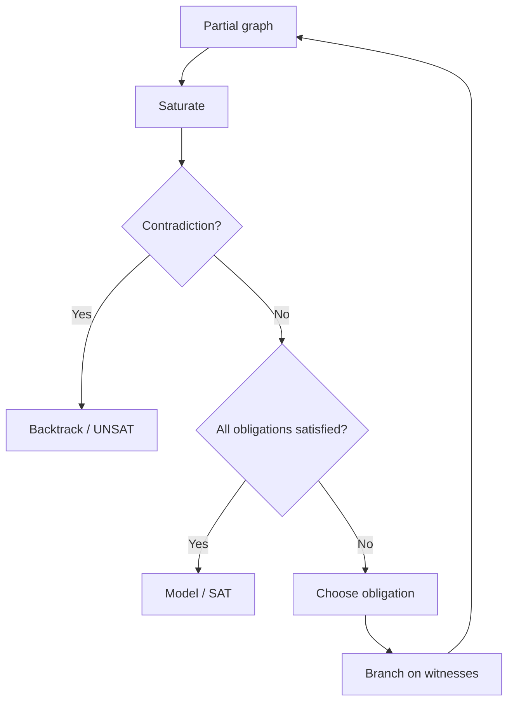

Не нужно работать с кодом. Никаких изменений. Тут только читаем и обсуждаем идеи.

saturation in ein и satisfiability в общем смысле

чего не хватает saturation чтобы стать satisfiability?

есть правила такие как bijective ≡ functional ∧ injective ∧ total ∧ surjective
в ein сейчас они задают только половину своих свойств - они запрещают создание лишних фактов отношений
сейчас только бинарные отношения, но вообще это касается любых
т.е. по умолчанию, без правил, любой объект может стоять в любой позиции отношения, тоесть стрелка может идти из а может в объект, а может не идти вообще - три валидных состояния
правила с одной стороны задают условия для emit/induction стрелки, а с другой ограничивают например условием что может быть только одна стрелка (с определенным именем, т.е. определенного типа, т.е. конкретного relation) выходящая из объекта.
Но сейчас правила никак не описывают требования, например что должна быть хотя бы одна стрелка, или точно одна и т.д.
Т.е. учитывая что правила описывают как бы или задают финальное состояние графа - решение, они должны квантифицировать стрелки и объекты. Т.е. если по умолчанию условий нет то может быть а может не быть. А если условие есть оно должно описывать требование, например одно из: объект не может быть на месте 1, или должен быть на месте 1 именно один раз, или каким-то другим способом задачать количество, но точно не просто числом а каким то условием. Также и с местом 2 в отношении: либо запрещено или требуется.
Таким образом saturation доходит до fixed point - не индуцирует больше новых фактов, и видит есть ли еще "свободные слоты" для отношений у объектов, заданные требованиями. И соответственно видим сразу это уже решение или еще только промежуточная fixed point и нужно генерить гипотезы.
Сейчас этот пробел - отсутствие требований закрывается просто генератором гипотез. Это работает, но есть нюанс - в случае множества решений невозможно их найти не перебрав все гипотезы.

Да. Ты довольно точно локализовал разрыв: текущий saturation в Ein, судя по описанию, в основном отвечает на вопрос:

> Какие факты обязательно следуют из уже выбранных фактов и правил?

А satisfiability отвечает на другой вопрос:

> Существует ли хотя бы один полный граф, удовлетворяющий всем требованиям?

Fixed point saturation — это замыкание известного состояния относительно детерминированных следствий. Но fixed point ещё не означает ни полноту состояния, ни существование его допустимого завершения.

## Что именно отсутствует

Текущие ограничения вроде functional и injective задают в основном верхние границы:

$$
\operatorname{functional}(R)
\quad\equiv\quad
\forall x:; \#\{y\mid R(x,y)\} \le 1
$$

$$
\operatorname{injective}(R)
\quad\equiv\quad
\forall y:; \#\{x\mid R(x,y)\}\le 1
$$

Они способны сказать: «вторая стрелка здесь запрещена».

Но total и surjective требуют нижних границ:

$$
\operatorname{total}(R)
\quad\equiv\quad
\forall x\in D:; \#\{y\mid R(x,y)\}\ge 1
$$

$$
\operatorname{surjective}(R)
\quad\equiv\quad
\forall y\in C:; \#\{x\mid R(x,y)\}\ge 1
$$

И тогда:

$$
\operatorname{bijective}(R)
\equiv
\forall x\in D:\#R(x,-)=1
;\land;
\forall y\in C:\#R(-,y)=1
$$

То есть bijective — не просто запрет лишних стрелок. Это одновременно:

* не больше одной;
* не меньше одной.

Сейчас Ein, видимо, хорошо выражает первую половину, но не имеет декларативного представления второй.

## Это не просто «свободные слоты»

Я бы уточнил терминологию. Свободный слот может означать две разные вещи:

1. Стрелка ещё возможна.
2. Стрелка ещё обязана появиться.

Это принципиально разные состояния.

Например, если для (a) пока нет ни одной (R)-стрелки:

* при `functional(R)` это уже допустимое завершённое состояние;
* при `total(R)` это неудовлетворённое обязательство;
* при `bijective(R)` это неудовлетворённое обязательство, причём выбрать можно не более одной цели.

Поэтому после saturation нужно искать не просто незаполненные позиции, а outstanding obligations — требования существования, которые ещё не имеют свидетеля.

Удобная общая форма:

$$
L \le
\#\{\bar y\mid R(\bar x,\bar y)\land \varphi(\bar x,\bar y)\}
\le U
$$

Где:

* (L) — сколько подходящих фактов как минимум требуется;
* (U) — сколько максимум разрешено;
* (\varphi) — условие на допустимые объекты;
* часть аргументов может быть фиксирована, а остальные квантифицируются.

Например:

$$
\forall x:;
1\le\#\{y\mid R(x,y)\land Person(y)\}\le1
$$

Это «для каждого (x) существует ровно один человек (y), связанный через (R)».

## Три состояния нужно разделить аккуратнее

Ты описываешь три состояния потенциальной стрелки:

1. обязана присутствовать;
2. запрещена;
3. может присутствовать или отсутствовать.

Но это состояния не самой стрелки в модели. В полной классической модели для каждого ground-факта только два варианта:

$$
R(a,b)\in M
\quad\text{или}\quad
R(a,b)\notin M
$$

Третье состояние — это состояние знания или пространства решений:

$$
\text{unknown}=\text{в одних допустимых моделях true, в других false}
$$

Поэтому полезно различать:

* `present` — факт истинен во всех текущих продолжениях;
* `absent`/`forbidden` — ложен во всех продолжениях;
* `open` — оба продолжения пока возможны.

Saturation работает прежде всего с этими трёхзначными частичными состояниями. Satisfiability спрашивает, существует ли их двузначное полное продолжение.

## Когда fixed point является решением

Нужно разделить как минимум три результата saturation:

### 1. Contradiction

Какое-то ограничение уже нарушено:

$$
\#S>U
$$

либо нижняя граница больше недостижима:

$$
\#present(S)+\#open(S)<L
$$

Это `UNSAT` для данной ветви.

### 2. Incomplete fixed point

Нарушений нет, но остаются обязательства:

$$
\#present(S)<L
$$

при этом:

$$
\#present(S)+\#open(S)\ge L
$$

То есть решение существует потенциально, но нужно выбрать свидетелей — построить гипотезы.

### 3. Complete solution

Все нижние границы выполнены, верхние не нарушены и все остальные глобальные ограничения удовлетворены.

Но здесь возникает важный вопрос: обязательно ли назначать значение каждому возможному факту?

Если действует closed-world completion, все оставшиеся `open` считаются отсутствующими. Тогда получаем одну полную модель.

Если open-world semantics, насыщенный граф может представлять сразу семейство моделей, и необязательные стрелки можно не перечислять.

## Что нужно saturation, чтобы стать satisfiability procedure

Одних количественных требований недостаточно. Нужны следующие компоненты.

### 1. Положительные обязательства

Не только правила вида «если факты есть, emit новый факт» и «такое сочетание запрещено», но и требования:

$$
\forall x;\exists y:R(x,y)
$$

$$
\exists!y:R(x,y)
$$

$$
\#\{\bar y\mid R(\bar x,\bar y)\land\varphi\}\in C
$$

Где (C) может быть не просто интервалом, а условием: `odd`, `equal-to`, `same-count-as`, `at-least-one-of`, зависимость от другого множества и т. п.

### 2. Явная область квантификации

Чтобы проверить:

$$
\forall x\in D;\exists y\in C:R(x,y)
$$

движок должен знать:

* что входит в (D);
* что входит в (C);
* закрыты ли эти множества;
* могут ли появляться новые объекты.

Без этого отсутствие свидетеля ещё не означает UNSAT: возможно, разрешено создать новый объект.

### 3. Семантика отсутствия

Нужно различать:

* факт не выведен;
* факт запрещён;
* факт признан ложным по closed-world assumption;
* факт пока неизвестен.

Иначе невозможно корректно проверять нижние границы и достижимость обязательств.

### 4. Генерация свидетелей или выбор кандидатов

Из

$$
\forall x;\exists y:R(x,y)
$$

saturation сам по себе обычно не может вывести конкретное (R(a,b)), если подходят несколько (b).

Он может вывести дизъюнкцию:

$$
R(a,b_1)\lor R(a,b_2)\lor R(a,b_3)
$$

Но чтобы получить одну модель, всё равно необходим выбор:

* branching;
* constraint solving;
* SAT/SMT-style decision;
* создание fresh witness, если домен открыт.

Иначе это уже не обычное множество фактов, а символическое множество моделей.

### 5. Поиск и backtracking

Детерминированный saturation становится процедурой satisfiability только вместе с циклом:

Это по сути архитектура многих constraint solvers:

$$
\text{propagation}+\text{decisions}+\text{backtracking}
$$

Saturation в этой картине соответствует propagation, а не всему solver.

### 6. Гарантии завершения

Чтобы получить не просто semi-decision procedure, а решатель, который всегда отвечает `SAT` или `UNSAT`, нужны ограничения вроде:

* конечный домен;
* конечное число возможных ground-фактов;
* конечное ветвление;
* монотонный saturation;
* отсутствие неограниченного создания новых объектов;
* разрешимый язык количественных и иных ограничений.

Если правила могут генерировать бесконечно новые объекты или выражать достаточно мощную логику, satisfiability в общем случае может быть неразрешима.

## Главная тонкость с несколькими решениями

Ты прав:

> генератор гипотез закрывает отсутствие требований операционально, но для множества решений приходится перебирать гипотезы.

Однако здесь есть два разных результата.

### Найти одно решение

Для SAT достаточно найти одну ветвь. Все решения перебирать не нужно.

### Описать множество всех решений

Если требуется вывести каждую модель явно, перебор в общем случае неизбежен просто из-за размера ответа. Если решений (2^n), их явный список имеет экспоненциальный размер.

Но необязательно перечислять их явно. Можно вернуть компактное символическое описание:

$$
(R(a,b_1)\lor R(a,b_2))
\land
\neg(R(a,b_1)\land R(a,b_2))
$$

Такое состояние представляет сразу две модели.

В зависимости от структуры можно использовать:

* дизъюнктивные constraints;
* sets of alternatives;
* BDD/ZDD;
* SAT-формулу;
* граф решений с разделяемыми поддеревьями;
* projected model counting;
* частичную модель с `open`-фактами, если они независимы.

Поэтому saturation можно расширять в двух разных направлениях:

1. **model search** — saturation плюс гипотезы и backtracking;
2. **symbolic solution saturation** — fixed point над ограничениями, представляющими множество моделей.

Второе концептуально ближе к твоей идее «увидеть, решение это или промежуточный fixed point», потому что итогом может быть не один граф, а насыщенное описание целого пространства допустимых графов.

## Короткая формулировка

Чего не хватает saturation до satisfiability:

$$
\boxed{
\text{satisfiability}
=

\text{saturation}
+
\text{existential/cardinality obligations}
+
\text{domain semantics}
+
\text{decisions}
+
\text{search}
}
$$

А если хочется работать без полного перебора всех решений:

$$
\boxed{
\text{all solutions compactly}
=

\text{saturation over symbolic constraints}
}
$$

Самая важная архитектурная мысль для Ein: требования существования лучше считать не генераторами конкретных стрелок, а first-class obligations. Saturation может сокращать множество их возможных свидетелей, автоматически закрывать обязательство при единственном оставшемся кандидате и обнаруживать UNSAT при отсутствии кандидатов. Только когда кандидатов остаётся несколько, действительно возникает гипотеза.

