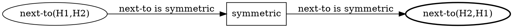

# S1.6.4 — Markdown trace renderer

**Phase:** P1.6 (rendering + trace).
**Estimate:** 4-5 days.
**Depends on:** S1.6.1, S1.6.2, S1.6.3 (now the lattice-DAG diagram);
P1.5b `LatticeProof` + `Verdict.trace`.
**Resolves question:** [M1 Q20 — trace reordering](../../open_questions.md#q20--trace-reordering).
**Implements idea:** [08 §Target trace](../../../docs/ideas/08-human-style-deductive-trace.md#the-target-trace-paraphrased)
+ [08 §What the implementation needs](../../../docs/ideas/08-human-style-deductive-trace.md#what-the-implementation-needs-implied-by-the-trace).

> **Re-aimed 2026-05-29 (P1.5b).** Input is `Verdict.trace` /
> `SolutionRecord.firings` + the `LatticeProof`, not a search tree.
> The new core task is **linearizing the commitment lattice into a
> depth-ordered story** (T1.6.4.0). Two prerequisite gaps — `:why`
> plumbing (T1.6.4.4) and the dead-commitment firing chain (T1.6.4.6)
> — are flagged in
> [README §Net-new prerequisites](README.md#net-new-prerequisites-surfaced-by-the-p15b-audit).
>
> **Output:** diagrams are inline fenced `dot` blocks (no SVG, no
> diagram dir); each section embeds an S1.6.2 derivation slice (default
> on, `--no-diagrams`). See
> [README §Output format](README.md#output-format--inline-dot-no-svg).

## Context

The trace renderer is the project's main output — what makes
Ein *not just a solver*. It threads the engine's Firings into
a markdown narrative interleaved with DOT snapshots, structured to
match the [target walkthrough](../../../docs/ideas/08-human-style-deductive-trace.md#the-target-trace-paraphrased).

Per [M1 Q20](../../open_questions.md#q20--trace-reordering):
emit *engine-order* by default, with an opt-in `--reorder` flag
that clusters by entity. Full human-template fitting moves to M2
where an LLM is available.

## Tasks

### Task T1.6.4.0 — Linearize the lattice into a story

The engine emits an *unordered* commitment lattice; the narrative
needs a linear sequence. Produce the step ordering:

1. **Layer 0 (unconditional).** Emit the root-saturation firings — the
   "By condition (n) … it follows that X" chain. Source:
   `Solution.trace` (monotonic) or the layer-0 `SolutionRecord.firings`.
2. **Layer k ≥ 1 (hypotheses).** For each commitment of size `k`, in
   `lattice_order` (`lex` or `score-sum`, S1.5b.26), emit its block: a
   `solution` commitment as a continuation, a `dead` commitment as a
   "Suppose X. Then ⊥." reductio (T1.6.4.6) terminated by its
   `learned_clause` (the lifted no-good).

This maps the human `(d, hypothesis)` framing onto `(layer,
commitment-set)`. Order need only be *recognisably equivalent* to the
human walkthrough (idea-08 §acceptance), not identical — the lattice
imposes no intrinsic hypothesis order.

### Task T1.6.4.1 — Trace AST

`src/ein/trace/ast.py`. A trace is itself IR — a list of
`(step …)` forms with rule name, premises, derived edge, source
sentence, and a generated explanation string.

```python
@dataclass(frozen=True, slots=True)
class TraceStep:
    n:           int
    rule:        str
    premises:    tuple[EdgeId, ...]
    derived:     EdgeId
    bindings:    dict[str, str]
    why:         str                   # rendered :why template
    diagram:     str | None            # inline DOT for this step's slice (S1.6.2)
    section:     str | None            # for clustered reordering
```

Round-trips through P1.1's parser as `(trace …)`.

### Task T1.6.4.2 — Engine-order renderer

`src/ein/trace/render.py::render_trace(steps, *, mode)`:

```markdown
# Solution trace

> Zebra puzzle solved in 23 steps + 3 hypotheses (1 retraction).

_(initial state: whole-KB snapshot omitted by default — `--full-kb-snapshots`)_

## Step 1 — `triangle-composition`

> "From condition (10) and (15), since `next-to` is symmetric,
> `House-1 next-to House-2` ⇒ `House-2 next-to House-1`."

Premises: condition (10), condition (15).

_(inline `dot` derivation slice for step 1 — rendered in place; example below)_

## Step 2 — `arc-consistency-propagate`
...
```

Each step embeds its inline `dot` derivation slice (S1.6.2), default
on — `--no-diagrams` suppresses all blocks, `--full-kb-snapshots` adds
whole-KB graphs. A slice looks like:



Final section: the lattice/proof DAG `dot` block (S1.6.3) and the
solution grid (S1.6.2 T1.6.2.4).

### Task T1.6.4.3 — Clustered (reorder) renderer

`--reorder` flag. Group steps by *target entity* (which node the
step is about) and emit a `## About <Norwegian>` heading per
cluster. Mirrors human walkthroughs that finish one entity's
attributes before moving on. The engine still computes in
topological order; reordering is a presentation pass.

### Task T1.6.4.4 — `:why` template rendering

> **Gap (P1.5b audit):** `Rule.why` threads into `JoinPlan.why`
> (`inference/compile.py`) but `fire()` drops it — `Firing` carries no
> `why`. Resolve first: render here via
> `render_why(rule.why, firing.bindings)` (`inference/why.py`, looking
> the rule up in the kb by `firing.rule`), or add `why: str` to
> `Firing`. The former keeps `Firing` lean. See
> [README §Net-new prerequisites](README.md#net-new-prerequisites-surfaced-by-the-p15b-audit).

Each rule has a `:why "From {p0} and {p1}, ..."` template
(P1.3 S1.3.2). Renderer substitutes:

- `{p0}`, `{p1}`, ... — premise descriptions (the source sentence
  if `kind='source'`, else the previous step's `derived` summary).
- `{a}`, `{b}`, ... — bound variable names (using puzzle entity
  names, not internal ids; per
  [idea 08 §Naming](../../../docs/ideas/08-human-style-deductive-trace.md#why-this-is-a-hard-problem)).

### Task T1.6.4.5 — Source-sentence quoting

When a premise has `Provenance(kind='source', sentence='condition (10)')`,
the trace says exactly that. Loaders preserve the puzzle's numbered
conditions as `:source "condition (10)"` strings on the IR facts.

### Task T1.6.4.6 — Hypothesis + retraction formatting

> **Gap (P1.5b audit):** `DeadCommitment` carries `unsat_core` but not
> the firing chain that reached ⊥. To render "the steps that led to
> the contradiction", either read the dumper's
> `enterings/<slug>/firings.jsonl` or add `firings` to
> `DeadCommitment`. The retracted hypothesis is now a `dead`
> commitment; its `learned_clause` is the no-good that closes the
> branch.

A retracted hypothesis renders as a foldable section:

```markdown
<details>
<summary>Attempted: Lucky Strike in House-2 — contradicts (3)</summary>

(steps that led to the contradiction)

</details>
```

So the survivor narrative reads cleanly while the attempted
branches stay accessible.

### Task T1.6.4.7 — Tests

`tests/trace/test_render.py`:

- A 3-step synthetic trace renders to markdown matching a golden
  fixture.
- `--reorder` produces a cluster-grouped output with the same
  steps in different order.
- Hypothesis steps render as `<details>` blocks.
- each step carries an inline `dot` slice in its `diagram` field that
  parses as valid DOT.

## Acceptance

- `pytest tests/trace/` green; golden fixture committed.
- The Zebra trace produced by P1.7 reads coherently as Markdown
  rendered by `mdcat` / GitHub preview.
- Engine-order vs `--reorder` produce semantically equivalent
  traces (same set of steps, different grouping).
